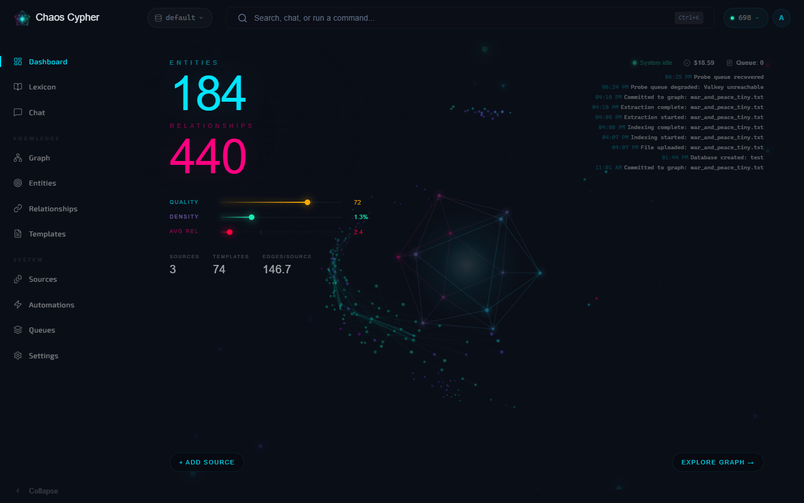
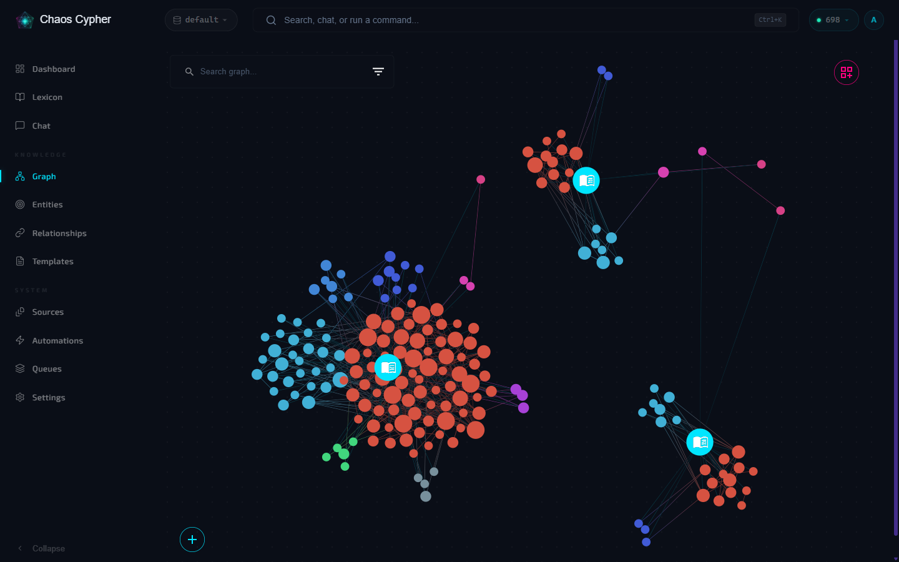
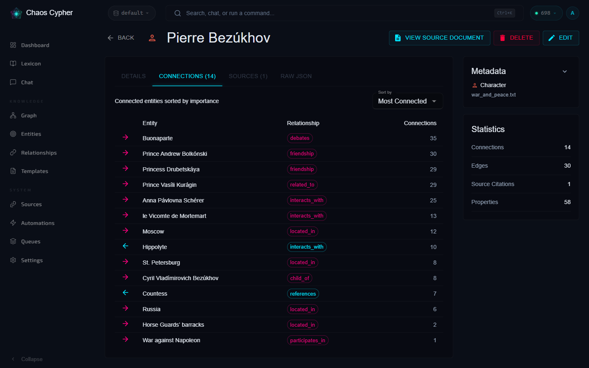
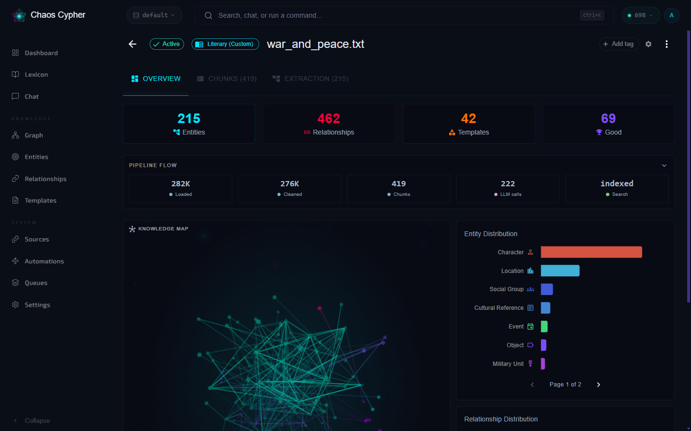
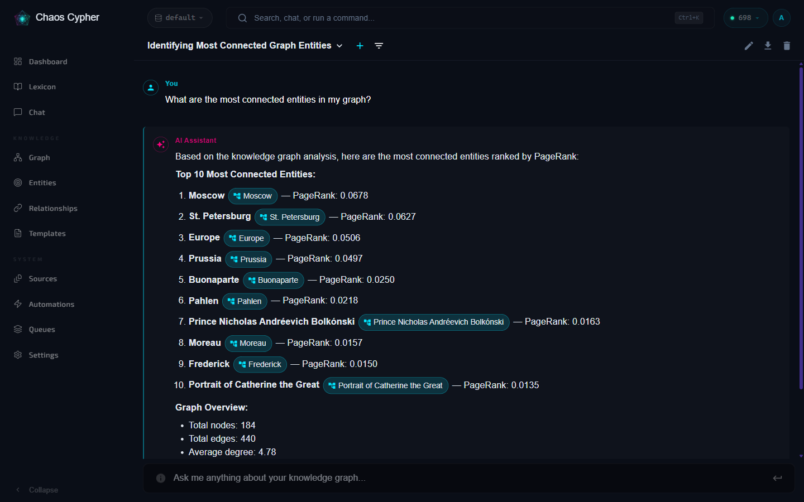

# Chaos Cypher Knowledge Engine

**Turn your documents into a knowledge graph you can inspect, search, chat with, and take with you — all running on your own machine.**

Chaos Cypher is a local-first GraphRAG platform — knowledge you can **see,
trust, and own**. Point it at your sources (documents, audio, video, images,
pasted text, web pages — 30+ formats, auto-detected), and it extracts entities
and relationships into a **knowledge graph you can actually see and explore** —
not a black-box vector blob. Search it, chat with it, refine it, and export the
result as a portable **Lexicon knowledge package** (`.ccx`) you can back up,
share, or load into another instance.

### Why Chaos Cypher

- **Local-first GraphRAG** — sources → extraction → graph → search & chat, with
  embeddings generated on your own system. Bring your own LLM, or run fully offline
  with [Ollama](https://ollama.com/).
- **Inspectable knowledge graphs** — every entity and relationship is visible
  and traceable back to its source. You can correct extractions, not just trust
  them.
- **Portable knowledge packages** — import and export your graph as a
  self-contained package. Your knowledge is yours to move, version, and keep.
- **MCP server built in** — plug Claude Desktop, Cursor, or any
  [MCP](https://modelcontextprotocol.io/) client straight into your graph:
  [31 tools](https://chaoscypher.com/docs/user-guide/mcp) for search,
  traversal, and graph building.
- **Self-hosted control** — you choose where data lives and which models touch
  it. The all-in-one container runs the whole stack on hardware you control.

### Feature highlights

**Core intelligence**

- **[Knowledge graph canvas](https://chaoscypher.com/docs/user-guide/knowledge-graph)** —
  typed, filterable, zoomable from corpus overview down to a single entity and
  its sources
- **[GraphRAG search](https://chaoscypher.com/docs/user-guide/search)** — graph
  traversal fused with vector search (Personalized PageRank + Reciprocal Rank
  Fusion), plus keyword, semantic, and hybrid modes
- **[AI chat with citations](https://chaoscypher.com/docs/user-guide/chat)** —
  answers grounded in your content, traceable back to the sources that produced
  them

**Data foundation**

- **[Quality analysis](https://chaoscypher.com/docs/user-guide/quality)** —
  score graph richness on a 0–100 scale, with breakdowns that flag weak sources
- **[30+ source formats](https://chaoscypher.com/docs/user-guide/sources)** —
  PDF, DOCX, Markdown, HTML, EPUB, audio (MP3/WAV/FLAC), video (MP4/MKV/MOV),
  images, ZIP archives, and more
- **[Mix-and-match LLMs](https://chaoscypher.com/docs/getting-started/configuration)** —
  Ollama, OpenAI, Anthropic, or Gemini, configurable per operation

**Automation & integration**

- **[Automations](https://chaoscypher.com/docs/user-guide/automations)** —
  visual workflow builder with triggers and conditional logic
- **[MCP server](https://chaoscypher.com/docs/user-guide/mcp)** — 31 tools for
  Claude Desktop, Cursor, ChatGPT, and other MCP clients
- **[Plugin system](https://chaoscypher.com/docs/user-guide/domains)** —
  drop-in Python document loaders, extraction domains, and workflow tools

### What data leaves your machine?

By default, **nothing leaves your machine except the LLM calls you configure.**
Embeddings are computed locally; your documents, graph, and exports stay on disk
in a Docker volume you own. If you point Chaos Cypher at a hosted LLM provider
(OpenAI, Anthropic, Gemini), the text sent for extraction and chat goes to that
provider — choose a local model like Ollama to keep everything on-device.

> Read the [Self-Hosted Threat Model](packages/docs/docs/security/self-hosted-threat-model.md)
> for exactly what Chaos Cypher defends against, what it accepts by design, and
> how to harden a LAN or internet-facing deployment.

---

## 📸 See It in Action

A quick tour — from dropping in a document to asking a question and tracing the
answer back to the exact highlighted sentence in your source:


> ▶️ Watch the full tour (with audio-free narration captions) on
> [chaoscypher.com](https://chaoscypher.com).

**Dashboard** — your knowledge base at a glance: entity and relationship counts,
quality and density scores, and a live graph preview.



**Knowledge graph** — every source becomes an explorable, color-coded graph.
Pan, zoom, search, and filter to see exactly what was extracted.



**Entities** — inspect any extracted entity: typed, directional relationships
ranked by importance, with stats and provenance back to the source document.



**Sources** — each document gets a transparent pipeline view: loaded → cleaned →
chunked → extracted → indexed, plus per-source entity distribution.



**Chat** — ask questions in plain language and get GraphRAG answers with inline
entity citations you can click through to the graph.



---

## 🚀 Quick Start

**Prerequisites:** Docker (with Compose). That's it for end users — embeddings
run locally on CPU. You'll also want an LLM provider; [Ollama](https://ollama.com/)
keeps everything on-device.

### Run the published container (recommended)

The recommended install path is the all-in-one image published to the GitHub
Container Registry:

```bash
docker run -d --name chaoscypher \
  -p 80:80 \
  -p 443:443 \
  -v chaoscypher-data:/data \
  ghcr.io/chaoscypherinc/chaoscypher:latest

# Then open http://localhost  (443 is published so HTTPS works if you enable TLS)
```

Prefer Compose? Save this as `docker-compose.yml` and run `docker compose up -d`:

```yaml
name: chaoscypher
services:
  chaoscypher:
    image: ghcr.io/chaoscypherinc/chaoscypher:latest
    container_name: chaoscypher
    ports:
      - "80:80"
      - "443:443"
    volumes:
      - chaoscypher-data:/data
    restart: unless-stopped
volumes:
  chaoscypher-data:
```

> The image is built and pushed on every `vX.Y.Z` release by
> [`.github/workflows/publish-ghcr.yml`](.github/workflows/publish-ghcr.yml).

### Install the CLI from PyPI

Terminal-first? The standalone CLI installs with
[pipx](https://pipx.pypa.io/) (or plain pip):

```bash
pipx install chaoscypher-cli
chaoscypher setup                 # wizard: pick an LLM provider
chaoscypher source add paper.pdf
```

All four Python packages (`chaoscypher-core`, `-cortex`, `-neuron`,
`-cli`) are published to [PyPI](https://pypi.org/project/chaoscypher-core/) on
every release — `chaoscypher-core` gives you the same extraction and search
engine as an embeddable library. See the
[developer quickstart](https://chaoscypher.com/docs/developer-guide/quickstart).

### Build from source (alternative / development)

Clone and build the all-in-one image locally — no published image required:

```bash
git clone https://github.com/chaoscypherinc/chaoscypher.git
cd chaoscypher
make docker-up      # builds + starts the all-in-one container
# Open http://localhost
```

### Try it in about 5 minutes

The [quickstart](https://chaoscypher.com/docs/getting-started/quickstart)
covers this in detail — import and search work within about 5 minutes;
extraction and chat come online once your LLM provider is set up (for Ollama,
after a one-time model download).

1. **Start the app** with one of the paths above and open <http://localhost>.
2. **Create your single-user login** on the first-run setup page.
3. **Pick an LLM provider** in Settings — point at a local
   [Ollama](https://ollama.com/) model to stay fully offline, or add an API key
   for OpenAI / Anthropic / Gemini.
4. **Add a source** — upload a document or paste text. Chaos Cypher extracts
   entities and relationships in the background (watch progress in the Queue
   Monitor).
5. **Explore the graph** — open the knowledge graph view to see what was
   extracted, search across it, and chat with your sources.
6. **Export a knowledge package** when you're happy with the result, so you can
   back it up or load it elsewhere.

### Development setup (with hot-reload)

For contributors who need per-service hot-reload (requires Python 3.14+,
Node.js 22+, and [uv](https://docs.astral.sh/uv/) 0.11+ — uv replaces pip and
reads the committed `uv.lock`):

```bash
make install      # First-time setup (packages + hooks + Docker test image)
make docker-dev   # Start multi-container dev environment
# Frontend: http://localhost:3000
# Cortex API: http://localhost:8080
```

---

## 📦 Monorepo Structure

```
chaoscypher/
├── packages/
│   ├── core/      # 🧠 Core (Brain) - Business logic & domain models
│   ├── cortex/    # 🎛️ Cortex (Processing Center) - Full backend API
│   ├── neuron/    # ⚡ Neuron (Worker Cells) - Background task processing
│   ├── interface/ # 💻 Interface (Interaction Layer) - Web UI
│   ├── cli/       # 🔧 CLI - Command-line tools
│   ├── docker/    # 🐳 Docker - Orchestration
│   └── docs/      # 📚 Docs - Docusaurus documentation site
├── e2e/           # Public end-to-end test suite
├── scripts/       # Public build/test helper scripts
└── tools/         # Public lint/license tooling
```

---

## 🛠️ Common Commands

### Docker

```bash
make docker-up       # Start all-in-one container (http://localhost)
make docker-rebuild  # Rebuild and restart all-in-one
make docker-dev      # Start multi-container dev environment (hot-reload)
make docker-prod     # Start multi-container production
make docker-down     # Stop all Docker services
```

### View Logs

```bash
# All-in-one
docker logs -f chaoscypher

# Multi-container
cd packages/docker/multi-container
docker compose -f docker-compose.dev.yml logs -f cortex
```

### Testing

```bash
make docker-test     # Run tests in Docker (isolated)
make lint            # Run all linters
make ci              # Full CI pipeline
```

### Individual Packages

```bash
cc-cortex start              # Backend API
cc-neuron                    # Unified worker
cd packages/interface && npm run dev  # Frontend UI
chaoscypher --help           # CLI
```

---

## 📖 Documentation

- **[Published Docs Site](https://chaoscypher.com)** - Full user and developer documentation
- **[Contributor Guide](./CONTRIBUTING.md)** - Contribution workflow, PR checklist, and review expectations
- **[AI Contributor Guide](./CLAUDE.md)** - Public guidance for AI coding assistants
- **[Core Architecture](./packages/core/README.md)** - Hexagonal architecture deep dive
- **[Documentation source](./packages/docs/)** - Docusaurus documentation site source
- **[Architecture Decisions](./packages/docs/docs/architecture/adrs/)** - Public ADRs
- **[Self-Hosted Threat Model](./packages/docs/docs/security/self-hosted-threat-model.md)** - What data stays local, and how to harden exposure

### Documentation Site (Docusaurus)

```bash
cd packages/docs && npm run build    # Build static site
cd packages/docs && npm start        # Dev server (http://localhost:3000)
```

---

## 🏗️ Architecture Highlights

Chaos Cypher is organized using a **brain-inspired metaphor**, with each package
mapped to a specialized role:

```
┌─────────────────────────────────────────────────────────────┐
│                      Interface (UI)                          │
│                  React + TypeScript + Vite                   │
└─────────────────────────┬───────────────────────────────────┘
                          │
                 ┌────────▼────────┐
                 │  Cortex (API)   │
                 │  FastAPI + VSA  │
                 └────────┬────────┘
                          │
                 ┌────────▼────────┐
                 │   Core (Brain)  │
                 │    Hexagonal    │
                 └────────┬────────┘
                          │
           ┌──────────────┼──────────────┐
  ┌────────▼────────┐    │    ┌────────▼────────┐
  │ Neuron LLM      │    │    │ Neuron Ops      │
  │ (1 concurrent)  │    │    │ (8 concurrent)  │
  └─────────────────┘    │    └─────────────────┘
                         │
                ┌────────▼────────┐
                │ Storage Adapters│
                │ SQLite / Files  │
                └─────────────────┘
```

- **🧠 Core** (`packages/core/`) — framework-agnostic business logic (hexagonal architecture)
- **🎛️ Cortex** (`packages/cortex/`) — FastAPI backend with vertical-slice architecture
- **⚡ Neuron** (`packages/neuron/`) — background workers for LLM and operations processing
- **💻 Interface** (`packages/interface/`) — React + TypeScript web UI
- **🔧 CLI** (`packages/cli/`) — standalone command-line interface
- **🐳 Docker** (`packages/docker/`) — orchestration (docker-compose files)

> **In plain English:** the UI talks to one API, the API delegates all the real
> work to a framework-agnostic core, and slow jobs (extraction, exports) run in
> background workers so the app stays responsive.

### Vertical Slice Architecture (Cortex Backend)

Features are **self-contained vertical slices** with complete functionality from API → Service → Repository → Database.

```
packages/cortex/src/chaoscypher_cortex/features/{feature}/
├── __init__.py        # Barrel exports
├── models.py          # Pydantic DTOs (Request/Response)
├── repository.py      # Data access (SQLModel entities)
├── service.py         # Business logic
└── api.py             # REST endpoints + factory DI
```

### Hexagonal Architecture (Core Library)

The `packages/core/` library uses **Hexagonal Architecture** for maximum flexibility and reusability.

- **Ports:** Protocol definitions (contracts)
- **Adapters:** Storage implementations (SQLite, file, LLM, web)
- **Services:** Business logic (framework-agnostic)
- **Repositories:** Domain repositories using storage adapters

### Queue System

- **LLM Worker** (1 concurrent) - Chat, embeddings, tool LLM calls
- **Operations Worker** (8 concurrent) - Source processing, exports, workflows

Monitor: http://localhost/queues (all-in-one; dev stack: http://localhost:3000/queues)

---

## 🔄 Development Workflow

```bash
# Make changes in any package
cd packages/cortex
# Edit code...

# Changes are immediately available (editable install)
# If using Docker, hot-reload will restart services

# Run tests
pytest

# Commit changes (Conventional Commits — see CONTRIBUTING.md)
git add .
git commit -m "feat(cortex): add new feature"
git push
```

---

## 🤝 Contributing

1. Fork the repository
2. Create a feature branch (`git checkout -b feature/amazing-feature`)
3. Make changes and add tests
4. Ensure all tests pass
5. Commit your changes following [Conventional Commits](CONTRIBUTING.md#commit-convention) (`git commit -m 'feat(scope): add amazing feature'`)
6. Push to the branch (`git push origin feature/amazing-feature`)
7. Open a Pull Request

---

## 📄 License

Chaos Cypher is licensed under the **GNU Affero General Public License v3.0 only
(AGPL-3.0-only)** — see the root [`LICENSE`](LICENSE) file. A separate
proprietary enterprise edition is available; external contributions are accepted
under the project [CLA](CLA.md).

---

## 🔗 Links

- [Published Docs Site](https://chaoscypher.com)
- [Blog](https://chaoscypher.com/blog)
- [Documentation source](./packages/docs/)
- [Issue Tracker](https://github.com/chaoscypherinc/chaoscypher/issues)
- [Contributor Guide](./CONTRIBUTING.md)
- [AI Contributor Guide](./CLAUDE.md)
