# Core — Hexagonal Architecture

The Core package (`chaoscypher-core`) is the brain of the system. It contains all business logic, domain models, and storage abstractions using hexagonal architecture (ports and adapters).

## Architecture

```mermaid
graph TB
    subgraph "Ports (Protocols)"
        SP["Storage Protocols"]
        GP["Graph Protocol"]
        SRP["Search Protocol"]
        CP["Chunking Protocol"]
        IP["Indexing Protocol"]
    end

    subgraph "Core Services"
        SS["Source Service"]
        WS["Workflow Service"]
        GS["Graph Service"]
        QS["Quality Scorer"]
        CS["Chat Service"]
        XS["Search Service"]
        ES["Export Service"]
    end

    subgraph "Adapters & Repositories"
        SQLITE["SQLite Adapter"]
        GRAPH["Graph Repository"]
        SEARCH["Search Repository"]
        LLM["LLM Adapter"]
        WEB["Web Adapter"]
    end

    SS --> SP
    SS --> CP
    SS --> IP
    WS --> SP
    GS --> GP
    QS --> SP
    CS --> SP
    XS --> SRP

    SQLITE -.->|implements| SP
    GRAPH -.->|implements| GP
    SEARCH -.->|implements| SRP

    style SP fill:#12121e,stroke:#ff2d95,color:#e0e0f0
    style GP fill:#12121e,stroke:#ff2d95,color:#e0e0f0
    style SRP fill:#12121e,stroke:#ff2d95,color:#e0e0f0
    style CP fill:#12121e,stroke:#ff2d95,color:#e0e0f0
    style IP fill:#12121e,stroke:#ff2d95,color:#e0e0f0
    style SQLITE fill:#12121e,stroke:#ff6d00,color:#e0e0f0
    style GRAPH fill:#12121e,stroke:#ff6d00,color:#e0e0f0
    style SEARCH fill:#12121e,stroke:#ff6d00,color:#e0e0f0
    style LLM fill:#12121e,stroke:#ff6d00,color:#e0e0f0
    style WEB fill:#12121e,stroke:#ff6d00,color:#e0e0f0
```



## Structure

```
packages/core/src/chaoscypher_core/
├── ports/             # Protocol definitions (contracts)
├── adapters/          # Implementations
│   ├── sqlite/        # SQLite storage adapter
│   ├── llm/           # LLM provider adapter
│   ├── embedding/     # Multi-provider embedding service
│   └── web/           # Web adapter
├── services/          # Business logic
│   └── vision/        # Vision processing (image description via LLM)
├── streaming/         # Chat streaming subsystem
│   └── chat/          # Shared chat tool loop, sinks, approval broker, cancellation, citations
├── operations/        # Queue operation handlers (importing/indexing, extraction, confirmation gate, exports)
├── queue/             # Valkey queue client + pub/sub
├── llm_queue/         # LLM-queue wrapper (enqueue + wait-for-result helpers)
├── database/          # Database engine + Alembic migrations
├── app_config/        # Application settings (settings.yaml) — distinct from settings.py engine config
├── analytics/         # Framework-agnostic analytics and aggregations
├── factories/         # Shared service factories (tools, triggers, workflows)
├── repo_factories/    # Repository factories
├── templates/         # Template utilities (defaults, visuals)
├── vision/            # Vision pipeline state enums
├── plugins/           # Plugin system base
├── mcp/               # MCP server (tools, bridge, server factory)
├── models.py          # Pure Pydantic DTOs
├── settings.py        # Engine configuration
├── utils/             # Cross-cutting utilities
└── exceptions.py      # Exception hierarchy
```

### Chat Streaming Subsystem

The chat tool loop lives in Core (`streaming/chat/loop.py`): it runs conversation history assembly, RAG/GraphRAG retrieval, LLM streaming, tool calls, and citation finalization. Both chat surfaces consume the same loop through surface-specific adapters — the Neuron worker (web chat) plugs in a Valkey pub/sub sink and approval broker, while the CLI (terminal chat) plugs in terminal-rendering sink and approval adapters. This keeps chat behavior identical across the web UI and the CLI.

## Ports (Protocols)

Ports are Python `Protocol` classes that define contracts for external dependencies. Services depend on ports, not implementations.

### Storage Protocols

| Protocol | Purpose |
|----------|---------|
| `WorkflowStorageProtocol` | Workflow CRUD, steps, statistics |
| `WorkflowExecutionStorageProtocol` | Execution tracking and state |
| `ToolStorageProtocol` | Tool registry persistence |
| `SourceStorageProtocol` | Source file metadata and status |
| `ChatStorageProtocol` | Conversation history |
| `TriggerStorageProtocol` | Event trigger definitions |
| `LLMMetricsStorageProtocol` | LLM usage and cost metrics |
| `ExtractionSubmissionStorageProtocol` | MCP extraction partial results |

### Domain Protocols

| Protocol | Purpose |
|----------|---------|
| `GraphRepositoryProtocol` | Knowledge graph operations (nodes, edges, templates) |
| `SearchRepositoryProtocol` | Full-text and vector search |
| `ChunkingProtocol` | Document chunking strategies |
| `IndexingProtocol` | Chunk indexing and embeddings |
| `DatabaseProtocol` | Database metadata and paths |

## Adapters

The storage layer is **pluggable** — any class that implements the storage protocols in `chaoscypher_core.ports` can replace the default SQLite adapter.

### SQLite Adapter (Default)

The default storage adapter. Implements the storage protocols (15 `storage_*` port modules) through a mixin-based architecture with ~26 specialized mixins:

- Source management (files, chunks, citations, tags)
- Chat and message storage
- Workflow and trigger persistence
- LLM metrics tracking
- Extraction task lifecycle

### Graph Repository

Separate from the SQLite Adapter. Implements `GraphRepositoryProtocol` for knowledge graph operations (nodes, edges, templates). CRUD and 1-hop neighbor queries run as direct indexed SQL with no in-memory cache. Multi-hop analytics (shortest path, PageRank, components, centrality) bulk-load nodes and edges into a [rustworkx](https://www.rustworkx.org/) compiled-Rust graph and run there. Dashboard summaries read a precomputed `graph_snapshots` row.

For full schema, traversal patterns, and trade-offs, see [Knowledge Graph Storage](./graph-storage.md).

### Search Repository

Separate from the SQLite Adapter. Implements `SearchRepositoryProtocol` by combining full-text search (FTS5) and vector search (sqlite-vec) into a unified interface. All search indices are stored in `app.db`.

### LLM Adapter

Provider factory pattern with multiple LLM backends:

| Provider | Chat | Extraction |
|----------|------|------------|
| **Ollama** | Yes | Yes |
| **OpenAI** | Yes | Yes |
| **Anthropic** | Yes | Yes |
| **Gemini** | Yes | Yes |

Features: load balancing across Ollama instances, cost tracking, error classification, model registry.

### Embedding Service

Multi-provider embedding service with a factory and registry pattern. Supports multiple providers — configurable via `embedding.provider` in `settings.yaml`:

- **Local** (default) — [sentence-transformers](https://www.sbert.net/) on CPU. No API keys, no network calls, works fully offline.
- **Ollama** — Embedding via local Ollama instances.
- **OpenAI** — Remote embedding via the OpenAI API.
- **Gemini** — Remote embedding via the Google Gemini API.

Common features across all providers:

- **Default model (local):** Qwen/Qwen3-Embedding-0.6B (1024 dimensions)
- **Lazy loading:** Model/client initializes on first use, cached for subsequent calls
- **Async:** All encoding runs on background threads to keep the event loop responsive
- **Batch support:** Efficient batch embedding with configurable batch size

### MCP Module

Built-in [Model Context Protocol](https://modelcontextprotocol.io/) server that exposes 31 tools for AI assistants (plus 2 maintenance-mode tools advertised only during a pending schema upgrade). The Core module provides the server factory, tool definitions, tool bridge, and document processor. Transport binding (stdio or HTTP) is handled by the CLI and Cortex packages respectively.

### Web Adapter

Web content extraction for URL imports using trafilatura.

## Data Type Boundaries

A critical rule: **storage protocols always return `dict[str, Any]`**, not ORM entities.

```python
# Correct — dict access
source = storage.get_source(source_id)  # Returns dict
name = source["name"]
status = source.get("status")

# Wrong — attribute access on dict
source = storage.get_source(source_id)
name = source.name  # AttributeError!
```

This ensures framework-agnostic portability. SQLModel entities are only used inside the SQLite adapter internals and Cortex VSA repositories.

## Key Design Decisions

**Why dicts instead of entities?** Core must work without SQLModel, FastAPI, or any web framework. Plain dicts are universally portable.

**Why protocols instead of abstract classes?** Structural subtyping (duck typing) — any object matching the protocol works, no inheritance required.

**Why mixins for the SQLite adapter?** The adapter implements 7+ protocols. Mixins keep each protocol's implementation in its own file while composing into a single adapter class.

**Why pluggable storage?** Core defines storage contracts as protocols. Any backend (SQLite, PostgreSQL, etc.) that satisfies the protocol interface can be swapped in without changing business logic.
