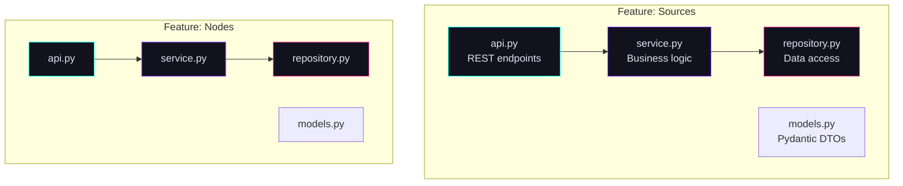

# Cortex — Vertical Slice Architecture

The Cortex package (`chaoscypher-cortex`) is the processing center — a FastAPI backend organized using Vertical Slice Architecture (VSA).

## What is VSA?

Each feature is a self-contained **vertical slice** with its own models, repository, service, and API layer. Instead of horizontal layers (all controllers in one folder, all services in another), each feature owns its entire stack.



## Feature Structure

Each feature follows this canonical shape; larger features split the layers into multiple modules (e.g. `nodes/graph_repository.py` + `sql_repository.py`, `sources/upload_service.py` + `tag_service.py`), and some omit a dedicated repository module, calling shared repositories or Core directly:

```
features/{feature}/
├── __init__.py        # Barrel exports
├── models.py          # Pydantic request/response DTOs
├── repository.py      # SQLModel data access
├── service.py         # Business logic
└── api.py             # REST endpoints + factory DI
```

## Features

Cortex has 31 feature modules:

| Feature | Description |
|---------|-------------|
| `admin_plugins` | User plugin management and trust control |
| `backup` | Database backup, restore, and scheduled snapshots |
| `chats` | Conversations and AI chat |
| `counts` | Statistics and counting |
| `dashboard` | Aggregated cross-feature read projections for the UI dashboard |
| `databases` | Multi-database management |
| `diagnostics` | Diagnostic ZIP export with system info, logs, and stats |
| `edges` | Graph edge CRUD |
| `edition` | Database edition and run mode management |
| `export` | CCX package export/import |
| `graph` | Graph operations |
| `graph_snapshot` | Point-in-time graph snapshots for analytics |
| `health` | System health checks and subsystem diagnostics |
| `lexicon` | Lexicon Hub integration |
| `llm` | LLM provider management |
| `local_auth` | nginx-gated single-user authentication |
| `logs` | Container log viewing and service status |
| `mcp` | [Model Context Protocol](https://modelcontextprotocol.io/) (MCP) server (Streamable HTTP transport) |
| `nodes` | Graph node CRUD |
| `pause` | Source and system processing pause/resume |
| `quality` | Quality scoring |
| `queue` | Job queue management |
| `search` | Search operations |
| `settings` | Configuration management |
| `settings_public` | Public (unauthenticated) settings subset for the frontend |
| `sources` | Document processing |
| `templates` | Node/edge template management |
| `tools` | Tool registry |
| `triggers` | Event triggers |
| `upgrade` | In-place version upgrade orchestration |
| `workflows` | Workflow definitions |

## Three-Layer Pattern

### Repository Layer

- Uses SQLModel entities directly
- Manages database sessions
- No business logic — pure data access
- Returns SQLModel entities (attribute access OK here)

### Service Layer

- Receives and returns dicts (not entities)
- Orchestrates business logic
- Calls repositories and Core services
- Never accesses `session` directly

### API Layer

- Defines REST endpoints with FastAPI decorators
- Uses Pydantic models for request/response validation
- Contains the factory function for dependency injection
- No business logic

## Factory Functions

Each feature has a factory function that wires dependencies:

```python
def get_source_service(
    repos: Annotated[RepositoryBundle, Depends(get_repositories)],
    settings: Annotated[Settings, Depends(get_settings)],
) -> SourceService:
    """Create SourceService with RepositoryBundle."""
    engine_service = EngineSourceService(
        repository=repos.adapter,
        database_name=repos.database_name,
        settings=build_engine_settings(settings),
    )
    return SourceService(
        engine_service,
        database_name=repos.database_name,
        settings=settings,
        storage_adapter=repos.adapter,
        graph_repository=repos.graph,
        search_repository=repos.search,
    )
```

**Naming convention:** `get_<feature>_service()` — usually the singular form of the feature name (`sources` → `get_source_service`, `nodes` → `get_node_service`), with a few exceptions (e.g. `get_databases_service`).

## Shared Infrastructure

```
shared/
├── adapters/        # Shared adapters
├── api/             # Shared API helpers and dependencies
├── auth/            # Authentication and permissions
├── database/        # Session management, models
├── errors/          # Shared error types and handlers
├── health/          # Health-check primitives
├── kernel/          # Application kernel and lifecycle
├── middleware/      # ASGI middleware
├── models/          # Shared SQLModel/Pydantic models
├── repositories/    # Shared repository factories
├── service_factory.py  # Service factory helpers
└── utils/           # Shared utilities
```
