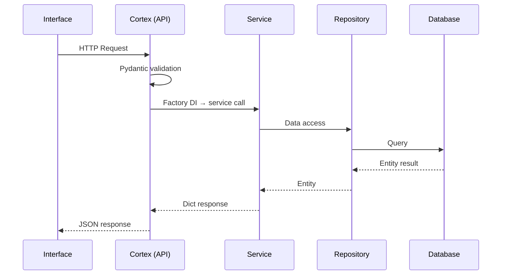
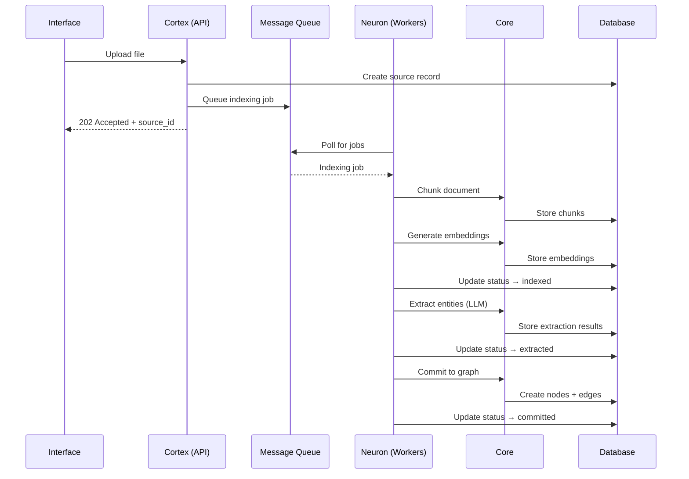
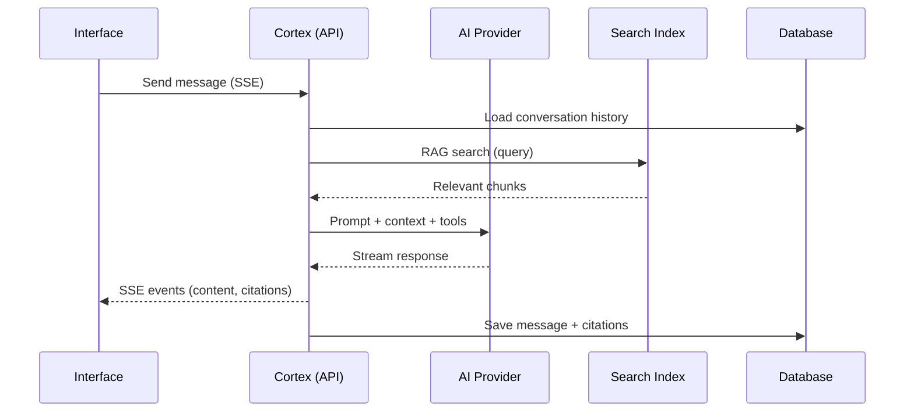
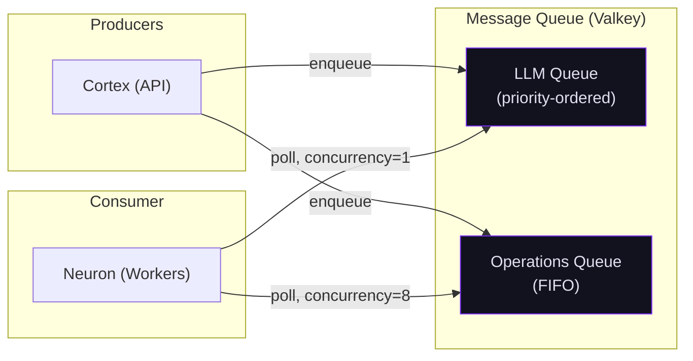
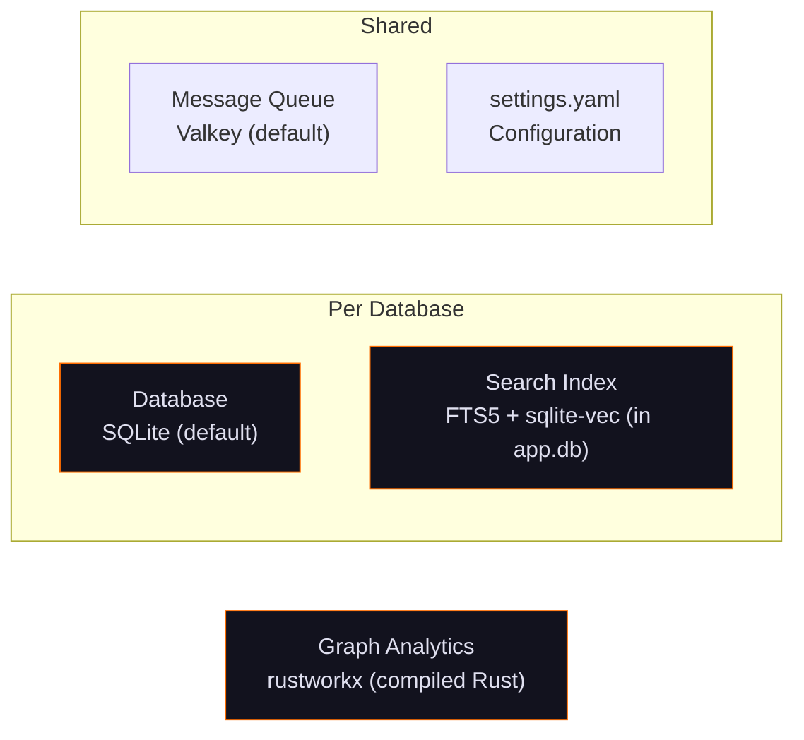

# Data Flow

How requests and data flow through the Chaos Cypher system.

## API Request Lifecycle



Every request follows this path:

1. **Interface** sends HTTP request to the API
2. **Cortex (API)** validates input with Pydantic models
3. **Factory function** creates service with injected dependencies
4. **Service** orchestrates business logic, calls repository
5. **Repository** queries the database
6. **Response** flows back as dicts, serialized to JSON

## Document Processing Pipeline



### Stage Details

**Upload (synchronous)**

1. File received via multipart upload
2. Source record created in database with `pending` status
3. Indexing job queued to Operations queue
4. 202 response returned immediately

**Indexing (Operations queue)**

1. Worker picks up job
2. Loader plugin parses file format → raw text
3. Content normalized (optional)
4. Text chunked into segments (~900 chars default)
5. Each chunk embedded via LLM provider
6. Chunks and embeddings stored
7. Status updated to `indexed`

**Extraction (LLM queue)**

1. Content filtering strips non-essential content (TOC, legal, boilerplate) from chunk copies — originals preserved for RAG
2. Filtered chunks grouped by token budget and sent to LLM for entity extraction
3. Template matching applied
4. Extraction limits enforced (per-entity degree cap, same-pair cap, total ratio cap)
5. Entities deduplicated (exact or semantic)
6. Relationships mapped between entities
7. Entity embeddings generated
8. Results stored as JSON
9. Status updated to `extracted`

**Commit (Operations queue)**

1. Entities created as graph nodes in the database
2. Relationships created as graph edges in the database
3. Templates created for new entity types
4. Document node linked to source
5. Status updated to `committed`

## Chat / RAG Flow



### RAG Details

1. User message received
2. Conversation history loaded (with token budget management)
3. RAG search executed against indexed chunks
4. GraphRAG analysis via Personalized PageRank over the knowledge graph (when enabled) — seed entities are matched by vector similarity, then graph context is assembled from high-rank neighbors
5. Reciprocal Rank Fusion (RRF) merges vector search and graph context results into a unified ranking
6. Relevant chunks assembled as context
7. LLM called with system prompt + context + chat history + tools
8. Response streamed via SSE
9. LLM may call tools (search nodes, get relationships, graphrag_search) during response
10. Final message and citations saved

## Queue Processing Flow



- **LLM queue** — Priority-ordered (`ZPOPMAX` semantics, higher = first). Interactive requests (priority 100) run before background tasks (priority 50).
- **Operations queue** — FIFO with 8 concurrent slots for I/O-bound work.
- Both queues are polled by the same worker process with independent concurrency limits.
- **Cancellation** — Both queued and running tasks can be cancelled. Running tasks use a cooperative Valkey flag that workers check between processing batches.

## Storage Architecture



Each database has isolated storage:

| Storage | Default | Contents |
|---------|---------|----------|
| **Database** | SQLite | Sources, chunks, chats, workflows, tools, triggers, metrics, graph nodes, edges, templates |
| **Credentials** | JSON (`credentials.json`) | Users, API keys, password hashes (bcrypt), session epoch |
| **Search Index** | FTS5 + sqlite-vec | Fulltext index + vector similarity index (in app.db) |
| **Graph Analytics** | rustworkx (compiled Rust) | On-demand in-memory loading of graph subsets for analytics (PageRank, community detection, centrality). See [Knowledge Graph Storage](./graph-storage.md). |

The storage layer is pluggable via Core's hexagonal architecture. SQLite is the default backend — additional backends (PostgreSQL, etc.) can be added by implementing the storage protocols.

Analytics operations load relevant subsets of the graph into memory on-demand with configurable limits (default 1.5M nodes, 4M edges). Override in `settings.yaml`:

```yaml
batching:
  graph_analysis_node_limit: 1500000   # increase for larger graphs
  graph_analysis_edge_limit: 4000000   # increase for larger graphs
```

**Memory sizing guide:** Use the table below to estimate RAM usage and set limits based on available memory. Each node uses ~670 bytes and each edge uses ~200 bytes when loaded for analytics.

| Nodes | Edges | Approximate RAM |
|-------|-------|-----------------|
| 100,000 | 250,000 | ~120 MB |
| 500,000 | 1,000,000 | ~540 MB |
| 1,000,000 | 2,000,000 | ~1.1 GB |
| 1,500,000 | 4,000,000 | ~1.8 GB |
| 3,000,000 | 8,000,000 | ~3.6 GB |

The message queue and `settings.yaml` are shared across all databases.
