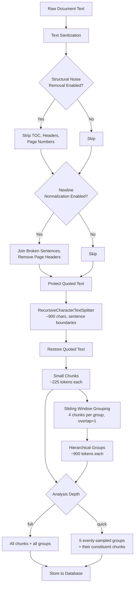

# Chunking

The `ChunkingService` is the single source of truth for all document chunking in Chaos Cypher. It implements a **hierarchical two-level** chunking strategy designed around the insight that RAG retrieval and entity extraction have fundamentally different optimal chunk sizes.

**Source:** `packages/core/src/chaoscypher_core/utils/chunk.py`

## Why Hierarchical Chunking?

RAG retrieval works best with small, focused chunks (~225 tokens) that match a user's query precisely. Entity extraction, however, needs broader context (~900 tokens) to detect relationships between entities that span multiple paragraphs. Rather than compromise on one size, Chaos Cypher produces both levels from a single splitting pass.

Research basis (cited in the implementation):

- **GraphRAG paper** and RAG best practices (2025) establish ~900-character small chunks (~225 tokens) as the sweet spot for balanced retrieval and extraction.
- Entity extraction groups of 4 small chunks (~900 tokens after overlap) are optimal for entity detection.
- 150-character overlap (~16%) falls within the recommended 10--20% range.

## Architecture



## Two Chunk Levels

### Small Chunks (RAG Retrieval)

Small chunks are the atomic unit. Each chunk is approximately **900 characters (~225 tokens)** and is split at sentence boundaries. These are used directly for RAG search -- when a user queries the knowledge base, the system matches against small chunks.

| Parameter | Default | Range | Description |
|-----------|---------|-------|-------------|
| `small_chunk_size` | 900 | >= 100 | Target chunk size in characters |
| `small_chunk_overlap` | 150 | >= 0 | Overlap between consecutive chunks |
| `min_chunk_size` | 100 | >= 0 | Coalesce threshold — chunks below this are merged into a neighbor (set to 0 to disable) |
| `max_chunk_size` | 1100 | >= 100 | Hard upper limit |

Each small chunk carries metadata:

- `chunk_index` -- sequential position in the document
- `char_start` / `char_end` -- character offsets in the original text (**NULLABLE** as of Phase 5a; `null` when offset cannot be established — see Citation Offset Method below)
- `token_count` -- estimated tokens (characters / 4)
- `sentence_offsets` -- character offsets of individual sentences within the chunk, used for citation highlighting
- `citation_offset_method` -- how offsets were computed: `exact`, `fuzzy`, or `none` (Phase 5a; see below)
- `status` -- lifecycle state (`staged` -> `indexed` -> `committed`)

:::note[No embeddings at chunk time]

Small chunks are created **without** embeddings. Embedding generation happens later in the [indexing stage](indexing.md), keeping chunking fast and decoupled from embedding generation.

:::

### Hierarchical Groups (Entity Extraction)

Groups combine multiple small chunks using a **sliding window** to provide the broader context that entity extraction needs.

| Parameter | Default | Description |
|-----------|---------|-------------|
| `group_size` | 4 | Small chunks per group |
| `group_overlap` | 1 | Overlap between consecutive groups (sliding window) |

With the defaults, groups form like this:

```
Group 0: chunks [0, 1, 2, 3]
Group 1: chunks [3, 4, 5, 6]    <- overlap of 1 chunk
Group 2: chunks [6, 7, 8, 9]
Group 3: chunks [9, 10, 11, 12]
```

Each group stores:

- `combined_content` -- the concatenated text of its constituent small chunks (joined by double newlines)
- `small_chunk_ids` -- references back to the small chunks it contains
- `token_count` -- sum of constituent chunk token counts (~900 tokens for 4 chunks)

The overlap ensures entities that appear near a group boundary still have enough context in at least one group for the LLM to extract them.

## Text Preprocessing Pipeline

Before splitting, text passes through several preprocessing stages. Each stage is independently configurable.

### 1. Sanitization (Always Active)

Runs unconditionally on all documents:

- **BOM removal** -- strips UTF-8/UTF-16 byte order marks
- **Blank line collapse** -- reduces 3+ consecutive newlines to 2, preserving paragraph breaks without wasting chunk space

### 2. Structural Noise Removal

Controlled by `normalize_remove_structural_noise` (default: `True`). A series of deterministic regex passes that strip artifacts common in books and PDFs:

| Pass | What It Removes | Example |
|------|----------------|---------|
| 1. Page numbers | Standalone lines with only digits | `- 42 -` |
| 2. Structural markers | `CHAPTER IV`, `BOOK 2`, `PART III:` | `CHAPTER IV` |
| 3. TOC blocks | 3+ contiguous lines with dotted leaders, Roman numeral lists, or section headers | `Chapter I ........... 1` |
| 4. Repeated headers/footers | Lines appearing identically in 3+ page-like segments (form-feed or triple-newline delimited) | Running headers/footers |

### 3. Text Normalization

Controlled by `normalize_newlines` (default: `True`). Optimizes text for sentence-based splitting:

1. **PDF page header removal** -- strips standalone paragraphs like `8 Introduction` or `42 The Kybalion`
2. **Broken sentence joining** -- reconnects paragraphs that were split mid-sentence (common in PDF extraction), detected when text before `\n\n` ends with a lowercase letter and the next character is also lowercase
3. **Line wrap conversion** -- replaces single `\n` with a space (preserving `\n\n` paragraph breaks)
4. **Multiple space cleanup** -- collapses runs of spaces

### 4. Quoted Text Protection

Before the splitter runs, sentence-ending punctuation inside quoted text is temporarily replaced with Unicode placeholder characters. This prevents the splitter from breaking chunks in the middle of dialogue:

```
"Hello! How are you?" -> "Hello\u2757 How are you?"
```

After splitting, placeholders are restored to their original characters. The placeholders are single characters, so string length and character positions remain accurate through the protect/restore cycle.

## Sentence-Aware Splitting

The actual splitting uses LangChain's `RecursiveCharacterTextSplitter` with a carefully ordered separator hierarchy:

```python
separators=[
    ". ",   # Sentence ends (highest priority)
    "! ",
    "? ",
    "\n\n", # Paragraphs (secondary)
    "\n",   # Lines
    "; ",
    ", ",
    " ",    # Words
    "",     # Characters (fallback)
]
```

The key design decision is that **sentences have higher priority than paragraphs**. The splitter tries sentence boundaries first, which means chunks end at complete sentences rather than being split mid-sentence at a paragraph break. The `keep_separator="end"` setting ensures periods stay at the end of a chunk, not the start of the next one.

## Depth-Based Filtering

Not all chunks and groups are stored -- the `analysis_depth` parameter controls how much of the document is processed:

| Depth | Groups Selected | Use Case |
|-------|----------------|----------|
| `full` | All groups | Complete extraction, production use |
| `quick` | 5 evenly-distributed groups | Fast preview, testing, cost-sensitive runs |

The `quick` strategy uses **even distribution** (every Nth group) rather than just the first 5, ensuring representative coverage across the entire document. The small chunks belonging to unselected groups are also excluded from storage.

:::info[Filtering affects both levels]

When `quick` depth filters groups, only the small chunks referenced by selected groups are stored. This keeps the database lean for quick-mode runs while preserving the bidirectional references between chunks and groups.

:::

## Configuration

All chunking parameters are defined in `ChunkingSettings` (in `packages/core/src/chaoscypher_core/settings.py`) and can be overridden via `settings.yaml`:

```yaml
chunking:
  small_chunk_size: 900
  small_chunk_overlap: 150
  min_chunk_size: 100
  max_chunk_size: 1100
  respect_boundaries: true
  group_size: 4
  group_overlap: 1
  normalize_newlines: true
  normalize_remove_structural_noise: true
  preserve_original_text_for_citations: true  # Phase 5a
```

:::info[`min_chunk_size` / `max_chunk_size` / `respect_boundaries` are wired]

These three knobs were defined on `ChunkingSettings` for some time but
were silently ignored — the splitter used hardcoded defaults regardless
of what was configured. As of May 2026 they are threaded through to
`RecursiveCharacterTextSplitter` so changing them in `settings.yaml`
actually changes splitting behaviour.

:::

### `min_chunk_size` is a coalesce threshold, not a drop filter

Chunks shorter than `min_chunk_size` are **coalesced (merged into a
neighbor)** rather than dropped. The chunker holds a sub-threshold
fragment and folds it into the next chunk that brings the combination
over the threshold (joined by `\n\n` so the paragraph break is
preserved). If merging would exceed `max_chunk_size`, the pending
fragment is flushed as its own chunk instead. A trailing
sub-threshold fragment is always emitted so the tail of the document
is never lost.

**Worked example.** Given `small_chunk_size=900`, `min_chunk_size=500`,
and a document of long-paragraph + 100-char dialogue + long-paragraph:

1. Splitter emits three raw chunks: `~700`, `~100`, `~700`.
2. The 700 chunk passes through and is emitted.
3. The 100 chunk is below threshold and held as `pending`.
4. The next 700 chunk is combined: `100 + "\n\n" + 700 ≈ 802` chars,
   below `max_chunk_size=1100`, so we emit the merged chunk and
   record one merge event in `chunks_coalesced_count` (the column was
   renamed from `chunks_filtered_count` in Phase 7 to reflect the
   merge-not-drop semantics).

**Rationale.** Pre-2026-05-08 the chunker dropped sub-threshold
chunks. On natural prose this lost real content (dialogue, transitions,
short paragraphs) — observed on `war_and_peace.txt` where 80 chunks
of Tolstoy prose vanished after the W5 filter was introduced. The
coalesce behaviour matches the operator's mental model that the
chunker "re-organizes content to fill chunks near the target size",
which is what was always intended.

Set `min_chunk_size=0` to disable coalescing entirely — every raw
split survives as its own chunk.

## Citation Offset Method (Phase 5a, 2026-05-08)

Citation correctness requires that `char_start` / `char_end` offsets on
each chunk point into the **original file text**, not the post-normalization
text. Before Phase 5a these offsets were computed against the normalized
string, which could disagree with the raw file by thousands of characters
after encoding fixes, whitespace collapse, and OCR artifact removal.

### How it works

When `ChunkingSettings.preserve_original_text_for_citations` is `True`
(the default), the indexing handler persists the raw pre-normalization
text to:

```
<data_dir>/sources/<source_id>/original.txt
```

The chunker then **recomputes** character offsets by locating each chunk
in `original.txt` using a two-step search:

1. **Exact substring match** — the chunk text is searched as a literal
   substring of `original.txt`. When found, `char_start` / `char_end`
   are set and `citation_offset_method` is tagged `exact`.
2. **Fuzzy alignment** — when exact search fails (e.g., whitespace was
   collapsed during normalization), the chunker uses
   `rapidfuzz.fuzz.partial_ratio_alignment` with a threshold of 80 to
   locate the best-matching window. On success `citation_offset_method`
   is tagged `fuzzy`.
3. **No match** — if neither method succeeds, `char_start` and
   `char_end` are set to `null` and `citation_offset_method` is tagged
   `none`. The `CITATIONS_SPLIT_SKIPPED` counter is incremented.

### Configuration

| Setting | Default | Description |
|---------|---------|-------------|
| `ChunkingSettings.preserve_original_text_for_citations` | `True` | Persist `original.txt` and recompute offsets against it. Set `False` to revert to offset-against-normalized-text behaviour (smaller disk footprint, less accurate citations). |

### Schema change

`char_start` and `char_end` are now **NULLABLE** columns. Pre-Phase-5a
data retains its non-null values (computed against the normalized
string). New extractions fill these only when a match is found.

## Zero-chunk sources

When chunking produces zero chunks for a non-empty document — typically
when an aggressive structural-noise filter strips the entire content —
the indexing handler raises `ValidationError` with an actionable hint:

> "Document produced no chunks after normalization and chunking. The
> cleaners or structural-noise filter consumed all content. Try
> re-uploading with `enable_normalization=False` or disabling
> `chunking.normalize_remove_structural_noise`."

Pre-W5 a zero-chunk source committed silently with no embeddings and
no graph entities. The error makes the misconfiguration visible at
upload time so the user can fix the setting and retry. Note that
`min_chunk_size` can no longer be the cause: coalesce always emits
the trailing fragment, so a non-empty post-cleanup document always
yields at least one chunk.
