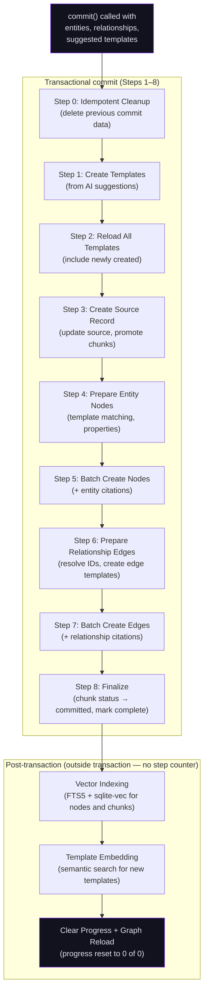
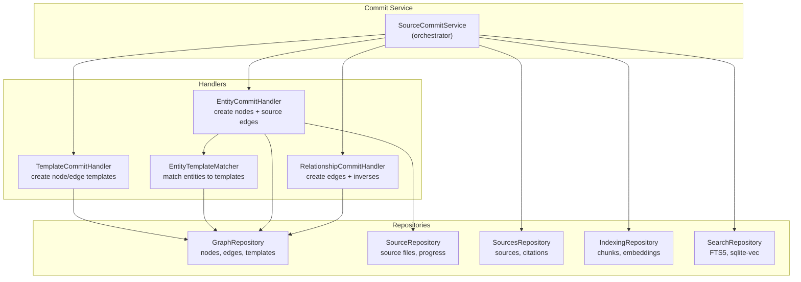

# Commit to Graph

The commit phase is the final stage of document source processing. It transforms deduplicated extraction results -- entities, relationships, and template suggestions -- into permanent graph structures: nodes, edges, and templates stored in the knowledge graph database.

Commit is orchestrated by `SourceCommitService`, which coordinates four specialized handlers:

| Handler | Responsibility |
|---------|---------------|
| `TemplateCommitHandler` | Create node templates from AI suggestions |
| `EntityTemplateMatcher` | Match entities to templates |
| `EntityCommitHandler` | Create entity nodes with source tracking |
| `RelationshipCommitHandler` | Create relationship edges with inverse generation |

## Commit Flow

The commit executes an 8-step transactional pipeline with progress reporting for UI display, followed by post-transaction work that runs after the database `COMMIT`:



Each transactional step updates a progress indicator (`step N of 8`) that the UI polls to show real-time commit status. Post-transaction work runs after the database commit and carries no step number.

Source provenance is tracked via entity properties (`source_document_id`, `source_document_name`) and `SourceCitation` records rather than separate graph nodes and edges.

## Orphan Entity Filter

Before Step 0, when the active filtering mode enables orphan filtering,
`drop_orphan_entities()` removes entities that survived deduplication
but have zero relationships. The helper takes the entity list and the
relationship list (relationships are keyed by integer indices into
the entity list — no graph IDs exist yet at this stage) and returns:

```python
def drop_orphan_entities(
    entities: list[dict],
    relationships: list[dict],
    *,
    enabled: bool,
) -> tuple[list[dict], list[dict], int]:
    """Returns (kept_entities, remapped_relationships, dropped_count)."""
```

The third element of the tuple drives the
`orphan_entities_filtered` quality counter on the source row. The
helper preserves input order and remaps surviving relationships to the
new index positions so downstream consumers (`commit/relation.py`,
`commit/service.py`) can keep using integer-indexed references.

## Idempotent Cleanup (Step 0)

Before creating any new graph data, the commit deletes any data from a **previous commit** of the same source. This makes re-commit safe and idempotent -- if a commit fails partway through or a user re-extracts a document, the old data is cleanly removed first.

Cleanup deletes:

- Graph nodes, edges, and templates linked to the source ID
- Search index entries for deleted nodes
- Entity and relationship citations for the source
- Resets chunk status back to `"indexed"` for re-promotion

## Template Generation and Matching

### Template Creation (Steps 1-2)

During extraction, the AI suggests **node templates** -- typed categories for the entities it discovered (e.g., "Person", "Organization", "Research Paper"). The commit phase creates these as actual graph templates.

**Per-source isolation:** Each source gets its own templates. There is no cross-source template reuse. This ensures:

- Sources can be independently deleted without orphaning shared templates.
- Template definitions are scoped to the document's domain context.
- Cascade deletion works cleanly.

Templates with invalid names (`unknown`, `untitled`, `n/a`, `none`) are skipped. Each template includes:

- **Name:** The entity type label (e.g., "Character", "Location")
- **Description:** AI-generated explanation of what the type represents
- **Properties:** List of `PropertyDefinition` objects (name, display name, type, required flag)
- **Source ID:** Links the template to its originating source

**Implementation:** `TemplateCommitHandler.create_suggested_templates()` in `commit/template.py`

### Template Matching (Step 4)

When preparing entity nodes, each entity's type is matched to a template from the current source's templates using `EntityTemplateMatcher`:

1. **Exact match:** The entity's lowercased type is looked up in the `template_name_to_id` mapping built during template creation.
2. **Fallback:** If no match is found, the entity is assigned `system_template_item` (the default system node template).

The matcher uses a per-run cache keyed on `(entity_type, template_mapping_hash)` to avoid redundant lookups.

:::note[No cross-source matching]

The matcher intentionally ignores any `template_id` from the extraction phase because those could reference templates from other sources. Only templates created for the current source are considered.

:::

**Implementation:** `EntityTemplateMatcher.match()` in `commit/matcher.py`

## Node Creation (Steps 3-5)

### Source Record and Chunk Promotion (Step 3)

The source record is updated with commit-related fields (`total_content_length`, `enabled`). Chunks fetched in the prep phase are promoted from `"indexed"` to active status so they remain visible for RAG/search.

### Entity Node Preparation (Step 4)

For each entity in the extraction results, the commit handler:

1. **Resolves the template** via `EntityTemplateMatcher`
2. **Loads pre-computed embeddings** from the extraction phase (stored by entity index)
3. **Builds properties:**
    - Copies extracted properties from the entity
    - Preserves lists for `aliases`, `nicknames`, `tags`, `also_known_as`, `descriptors` (useful for search)
    - Normalizes other list values to comma-separated strings
    - Ensures required properties exist for the matched template (e.g., `definition` for system_template_item, `title`/`content` if required by template)
    - Adds source tracking: `source_document_id`, `source_document_name`, `source_type`, `ingested_at`
4. **Creates a `NodeCreate` object** with label, template ID, properties, embedding, and source ID

### Batch Node Creation (Step 5)

All prepared nodes are created in a single batch operation via `graph_repository.create_nodes_batch()` (with events suppressed for performance during import).

After creation, the handler:

1. **Builds index mappings:**
    - `entity_index_to_node_id` -- maps extraction entity index to the created graph node ID
    - `entity_name_to_node_id` -- maps entity name to node ID (for name-based relationship resolution)
    - `entity_index_to_node` -- maps to full Node objects (used for citation creation without redundant lookups)
2. **Creates entity citations** -- one citation per entity node linking it back to the source chunk it was extracted from (Step 5b)
3. **Queues nodes for search indexing** -- node FTS5/sqlite-vec indexing is deferred to the post-transaction phase to avoid self-deadlocking on the writer lock held by the transaction

**Implementation:** `EntityCommitHandler` in `commit/entity.py`

## Edge Creation (Steps 6-7)

### Edge Template Creation (Step 6)

Unique relationship types from the extraction results need edge templates. The handler:

1. Collects all unique edge type names (including inverse types from domain configuration)
2. Batch creates templates for all types via `graph_repository.create_templates_batch()`
3. Builds an `edge_type_to_template_id` mapping for edge creation

Edge template descriptions come from domain-aware `suggested_edge_templates` in the extraction results. If no description is available, the type name is title-cased (e.g., `"located_in"` becomes `"Located In"`).

Per-source isolation applies to edge templates too -- each source creates its own edge templates.

### Relationship Edge Preparation (Step 6 continued)

For each relationship, the handler:

1. **Resolves node IDs** from entity references:
    - **Index-based** (standard workflow): Uses `entity_index_to_node_id` to map `source`/`target` integer indices to node IDs
    - **Name-based** (NLP workflow): Uses `entity_name_to_node_id` to map `from`/`to` entity names to node IDs
    - Relationships with unresolvable references are skipped with a warning
2. **Looks up the edge template ID** from the pre-created mapping
3. **Builds edge properties** from the relationship metadata: `confidence`, `justification`, `sent_ref`, `chunk_index`, plus any custom properties
4. **Creates an `EdgeCreate` object** with template ID, source/target node IDs, label, properties, and source ID

### Inverse Edge Generation

For each relationship that has a domain-defined **inverse type** (e.g., `parent_of` has inverse `child_of`), an additional edge is automatically created with:

- **Swapped source and target** node IDs
- The inverse type's template ID
- Same confidence and justification as the original
- An `inverse_of` property set to the original edge type

Symmetric relationships (where the type equals its own inverse, e.g., `interacts_with`) do not generate inverse edges to avoid duplication.

### Batch Edge Creation (Step 7)

All edges (including inverse edges) are created in a single batch via `graph_repository.create_edges_batch()`.

**Implementation:** `RelationshipCommitHandler` in `commit/relation.py`

## Citation Tracking

The commit phase creates two types of citations that link graph elements back to their source evidence:

### Entity Citations (Step 5b)

Each entity node is linked to the **source chunk** it was extracted from:

| Field | Description |
|-------|-------------|
| `entity_uri` | The created graph node ID |
| `entity_label` | Node label |
| `entity_type` | Entity type name (human-readable) |
| `source_id` | Source file ID |
| `chunk_id` | Specific chunk that evidenced this entity |
| `confidence` | Extraction confidence |
| `extraction_method` | Always `"ai_extraction"` |
| `context_snippet` | Reconstructed from sentence references (`sent_ref`) when available |
| `citation_metadata` | Contains `sent_ref` for precise sentence-level citation |

Context snippets are reconstructed by looking up the `sent_ref` value against the pre-split sentences for the entity's chunk. This provides human-readable evidence text without storing full chunks.

### Relationship Citations (Step 7b)

Each edge is linked to its source chunk similarly:

| Field | Description |
|-------|-------------|
| `edge_id` | The created graph edge ID |
| `edge_label` | Edge type label |
| `source_entity_label` / `target_entity_label` | Connected node labels |
| `source_id` | Source file ID |
| `chunk_id` | Specific chunk that evidenced this relationship |
| `confidence` | Extraction confidence |
| `justification` | LLM-generated explanation |
| `citation_metadata` | Contains `sent_ref` for sentence-level citation |

Citations use O(1) lookups via pre-built mappings (`node_pair_to_rel`, `node_id_to_node`) to efficiently match created edges back to their original relationship data.

Both citation types are batch-created in single transactions for performance.

**Implementation:** `SourceCommitService._create_source_citations()` and `_create_relationship_citations()` in `commit/service.py`

## Post-transaction: Vector Indexing

After the database transaction commits, nodes and document chunks are indexed into the **FTS5 fulltext** and **sqlite-vec vector search** indices for graph search and RAG retrieval. This phase runs outside the transaction because `SearchRepository` opens its own SQLite connections via `engine.connect()` and cannot participate in the adapter session -- running it inside the transaction would deadlock against the writer lock already held.

**Node indexing:** All created nodes are batch-indexed via `search_repository.index_nodes_batch()`.

**Chunk indexing:**

1. Chunks with embeddings are fetched from the indexing repository
2. Embeddings are decoded from base64 to numpy float32 arrays
3. Each chunk is indexed with a `"chunk:"` prefix to distinguish chunk vectors from node vectors
4. All embeddings are batch-indexed in a single disk write

**Template embedding:** Newly created templates (node + edge) are embedded by the LLM so they are immediately semantically searchable after commit.

:::note[Error recovery]

Vector indexing is best-effort and non-fatal. If indexing fails, the error is logged and the failed items are added to the `pending_search_index` retry queue, which the orphan-sweep worker drains at its next cycle. Graph data is safe in all cases. Chunks and nodes can also be recovered manually via the search index rebuild endpoint (`POST /api/v1/search/indexes`).

:::

## Post-transaction: Finalization

After post-transaction indexing, the commit completes by:

1. **Clearing the progress indicator** -- `_update_progress(file_id, 0, 0, "")` resets the step counter to 0 of 0
2. **Triggering a graph reload** via the optional `reload_callback` -- this is the hook backends use to refresh derived state after a commit. The default deployment uses it to enqueue `OP_BUILD_GRAPH_SNAPSHOT`, which rebuilds the `graph_snapshots` row read by the dashboard (see [Knowledge Graph Storage](../graph-storage.md))

The source record is updated with commit statistics (nodes, edges, templates created) at the end of Step 8 inside the transaction via `complete_commit`.

The commit returns a result dictionary:

```python
{
    "nodes": ["node_id_1", "node_id_2", ...],      # Created node IDs
    "edges": ["edge_id_1", "edge_id_2", ...],      # Created edge IDs
    "templates": ["template_id_1", ...],            # Created template IDs (node + edge)
}
```

## Source Record Lifecycle

The source record is created at upload time. During commit, it is **updated** (not re-created) with:

- `total_content_length` -- sum of all chunk content lengths
- `enabled` -- whether the source is visible in graph/search (default: `True`)

The `enabled` flag controls graph-wide visibility: when a source is disabled, all its nodes, edges, and templates are filtered out of queries and search results.

## Architecture Summary



**Implementation files:**

- `packages/core/src/chaoscypher_core/services/sources/engine/commit/service.py` -- `SourceCommitService`
- `packages/core/src/chaoscypher_core/services/sources/engine/commit/template.py` -- `TemplateCommitHandler`
- `packages/core/src/chaoscypher_core/services/sources/engine/commit/matcher.py` -- `EntityTemplateMatcher`
- `packages/core/src/chaoscypher_core/services/sources/engine/commit/entity.py` -- `EntityCommitHandler`
- `packages/core/src/chaoscypher_core/services/sources/engine/commit/relation.py` -- `RelationshipCommitHandler`
