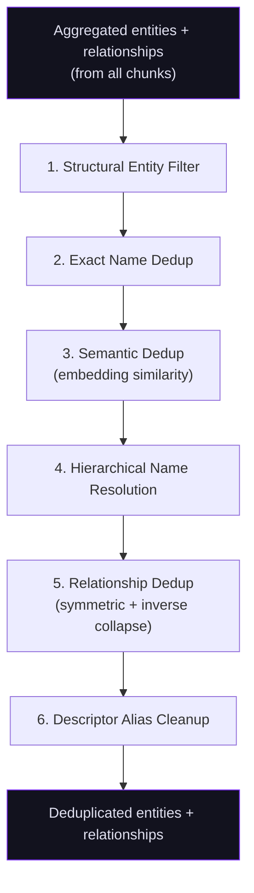
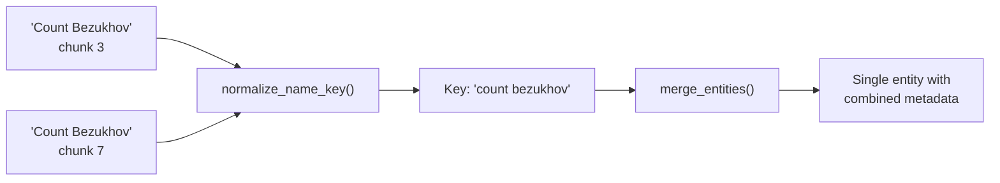
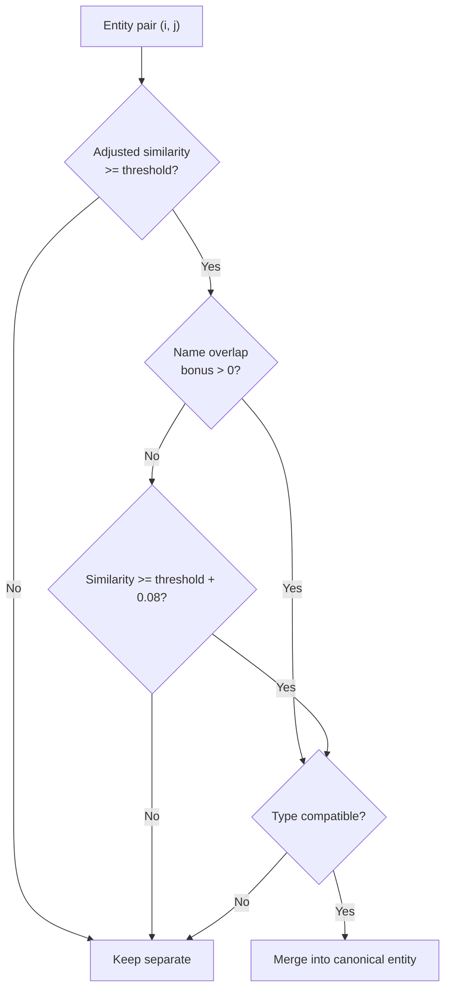

# Deduplication

Entity deduplication prevents duplicate nodes from polluting the knowledge graph. When the same real-world entity appears across multiple document chunks -- often with slightly different names, spellings, or types -- the deduplication pipeline collapses them into a single canonical entity before the commit phase writes anything to the graph.

Deduplication runs **after extraction** (per-chunk AI extraction is complete and chunk results have been aggregated) and **before commit** (no graph nodes exist yet). The pipeline operates on in-memory entity and relationship lists, producing a consolidated set ready for graph persistence.

## Pipeline Overview

The full deduplication pipeline executes these stages in order:



Each stage produces an **index mapping** (`old_index -> new_index | None`) that the next stage uses to remap relationship `source`/`target` indices. Entities mapped to `None` are removed; entities mapped to a different index are merged into that target entity.

:::info[Configuration]

Deduplication mode is controlled by `source_processing.entity_deduplication_mode` in settings. The default is `"semantic"`, which runs both exact and semantic passes. Setting it to `"exact"` skips the embedding-based pass entirely.

:::

## Stage 1: Structural Entity Filter

Before deduplication begins, low-value structural entities are removed. These are document organization markers (chapters, sections, appendices) that do not represent meaningful knowledge.

**Detection criteria:**

| Signal | Examples |
|--------|----------|
| Entity type matches structural types | `STRUCTURAL_UNIT`, `CHAPTER`, `SECTION`, `Document Section` |
| Entity name matches structural patterns | `Chapter 1`, `Section A`, `Part III`, `Appendix B`, `Figure 2.1` |

Structural entity types can be customized per domain via domain configuration. When a structural entity is removed, all relationships referencing it are also removed, and remaining relationship indices are remapped to account for the gap.

:::note[Domain Override]

Domains can disable structural filtering entirely by setting `filter_structural_entities: false` in their `extraction_limits` configuration.

:::

**Implementation:** `extraction/utils/type_normalizer.py` -- `filter_structural_entities()`

## Stage 2: Exact Name Dedup

The first deduplication pass uses **case-insensitive, diacritics-stripped name matching**. This is fast and catches the most common duplicates: the same entity extracted from different chunks with identical names.

**How it works:**

1. Each entity's name is normalized via `normalize_name_key()`: Unicode NFD decomposition strips diacritics (e.g., "François" and "Francois" both become `"francois"`), then lowercased and trimmed.
2. Entities with the same normalized name key are merged.
3. When `require_type_compatibility` is enabled, same-name entities with incompatible types are kept separate (e.g., "Paris" the Person vs. "Paris" the Location use a type-qualified key `paris::location`).



### Alias-Aware Matching

In addition to direct name matching, exact dedup performs **alias-aware matching**. After the primary name-key pass, the system checks whether any entity's name matches another entity's alias (and vice versa). This catches cases where the same entity was extracted with different canonical names across chunks but shares an alias:

| Match Direction | Example |
|----------------|---------|
| **Name → Alias** | Entity A named `"Pierre Bezukhov"` matches Entity B which has `"Pierre Bezukhov"` as an alias (but a different canonical name like `"Count Bezukhov"`) |
| **Alias → Name** | Entity A with alias `"Natasha"` matches Entity B named `"Natasha"` |

Alias-to-alias matching is intentionally excluded to avoid false-positive merges between entities that share a common but ambiguous alias. Type compatibility checks still apply to all alias-based matches.

**Type compatibility** is determined by `are_types_compatible()` in `similarity_matcher.py`:

- Identical types (case-insensitive) are always compatible.
- Generic placeholder types (`unknown`, `thing`, `entity`, `item`, `object`, `concept`, empty string) are compatible with any type.
- Domain-provided compatibility groups allow custom groupings (e.g., `{"Person": ["Character", "Individual"]}`).

**Implementation:** `EntityProcessor.deduplicate_entities_with_mapping()` in `deduplication/service.py`

## Stage 3: Semantic Dedup

The second pass uses **embedding-based cosine similarity** to detect entities that refer to the same thing but have different names -- synonyms, abbreviations, spelling variants, or partial names.

### Embedding Generation

Each entity is converted to an embedding-friendly text representation:

```
Name | Also known as: alias1, alias2 | Description text | Property values
```

The text is truncated to `MAX_EMBEDDING_TEXT_LENGTH` (16,000 characters) with intelligent sentence-boundary truncation. Embeddings are generated by the configured embedding provider — `LocalEmbeddingProvider` runs sentence-transformers on the CPU and uses batch encoding for efficiency.

Embeddings are L2-normalized so cosine similarity reduces to a simple dot product.

**Implementation:** `deduplication/embedding_generator.py`

### Similarity Scoring

Raw cosine similarity is adjusted with **name and alias matching bonuses**:

| Signal | Bonus |
|--------|-------|
| Exact normalized name match | +0.20 |
| One entity's name appears in the other's aliases | +0.15 (per direction) |
| Shared aliases between entities | +0.10 |

The adjusted similarity is capped at 1.0.

**Implementation:** `similarity_matcher.py` -- `calculate_entity_similarity()`

### Merge Decision Flow



Key design decisions:

- **No-name-overlap guard:** When entities have no name/alias overlap at all (bonus is zero), the threshold is boosted by +0.08. This prevents merging semantically similar but distinct entities (e.g., two Italian cities whose embeddings are naturally close).
- **Confidence penalty:** Borderline merges (adjusted similarity within 0.10 of the threshold) receive a 0.05 confidence penalty on the merged entity.
- **Type partitioning:** When `require_type_compatibility` is enabled and there are more than 50 entities, the algorithm partitions entities into type-compatible groups before computing similarity. This reduces comparisons by 80-90% for typical documents with many entity types.

The similarity threshold is configurable via `extraction.semantic_dedup_threshold` (default `0.95`) and can be overridden per domain via `extraction_limits.semantic_dedup_threshold`. Filtering presets pin the effective value per mode (`unfiltered` 0.99 → `maximum` 0.85; the default `balanced` preset runs at 0.90) — see the Filtering Modes reference.

**Fallback:** If embedding generation fails, the semantic pass falls back to exact-only dedup. As of Phase 2 (2026-05-08) this fallback increments `SEMANTIC_DEDUP_FALLBACKS` / `semantic_dedup_fallbacks` so operators can see how often embedding-based dedup was unavailable.

**Implementation:** `EntityProcessor.deduplicate_entities_semantic()` and `_find_semantic_duplicates()` in `deduplication/service.py`

## Stage 4: Hierarchical Name Resolution

After semantic dedup, a **name containment pass** merges entities where one name is a more complete form of another within the same type group.

This handles progressive name resolution across chunks, where early chapters may reference "Anna" and later chapters use "Anna Pavlovna" or "Anna Pavlovna Scherer".

**Merge criteria (with false-positive guards):**

1. **Strict containment:** One name fully contains the other as a substring, but the match must occur at a **word boundary** to prevent false positives like "Mary" matching inside "Marya" or "Prince" inside "Princess".
2. **Word-set containment:** One name's significant words (excluding title words like "Mr", "Dr", "Sir", "von") are a complete subset of the other's, and the shorter set covers at least 40% of the longer set's words.

The entity with the **longer/more complete name** is always kept as canonical. The shorter name becomes an alias on the merged entity.

```
"Count" + "Count Pierre" + "Count Pierre Bezukhov"
  --> "Count Pierre Bezukhov" (canonical)
      aliases: ["Count", "Count Pierre"]
```

**Implementation:** `EntityProcessor.resolve_hierarchical_names()` in `deduplication/service.py`, `should_merge_names()` in `similarity_matcher.py`

## Stage 5: Relationship Dedup

After entity deduplication, relationships are cleaned:

1. **Index remapping:** All `source`/`target` indices are updated to reflect merged entities. Relationships referencing removed entities are dropped. Self-loops (where source and target merged into the same entity) are dropped.
2. **Symmetric collapse:** For domain-defined symmetric relationship types (e.g., `spouse_of`, `interacts_with`), `(A, B)` and `(B, A)` are collapsed -- only the highest-confidence direction is kept.
3. **Inverse-pair collapse:** For domain-defined inverse pairs (e.g., `parent_of`/`child_of`), duplicate inverse edges are removed since the commit phase will auto-generate inverse edges.
4. **Exact triple dedup:** Duplicate `(source, target, type)` triples are collapsed, keeping the one with the highest confidence.

**Implementation:** `EntityProcessor.remap_relationship_indices()` in `deduplication/service.py`, `deduplicate_relationships()` in `extraction/utils/entity_cleaner.py`

## Stage 6: Descriptor Alias Cleanup

A final cleanup pass removes aliases that are descriptive phrases rather than genuine name variants. This prevents phrases like "the young prince" from being stored as aliases for "Prince Andrew".

**Implementation:** `clean_descriptor_aliases()` in `extraction/utils/entity_cleaner.py`

## Merge Strategy

When two entities are merged (in any stage), the `merge_entities()` method combines all metadata:

| Field | Strategy |
|-------|----------|
| **Name** | Keep canonical (longer/more complete) entity's name |
| **Aliases** | Union of all aliases from both entities, plus duplicate's name if different |
| **Descriptors** | Union of descriptive phrases |
| **Properties** | Deep merge: unique keys from both; string conflicts resolved by length (long) or confidence (short < 20 chars); lists deduplicated and merged; nested dicts recursively merged |
| **Description** | If word overlap > 50%, keep longer; otherwise concatenate (capped at 8,000 chars) |
| **Confidence** | `max(kept, duplicate) - confidence_penalty` (minimum 0.1) |
| **Type** | Prefer type from higher-confidence entity |
| **Source chunks** | Accumulate all chunk indices for provenance tracking |
| **`merged_property_history`** | Phase 6 — see below |

### Phase 6: `merged_property_history` provenance (2026-05-08)

When two entities are merged and both had values for the same property key,
the canonical entity's `merged_property_history` field records the
superseded value:

```json
{
  "merged_property_history": {
    "birth_year": [
      {"value": "1869", "from_entity": "Leo Tolstoy (chunk 3)"}
    ]
  }
}
```

This lets downstream consumers (graph explorer, MCP tools) show which
property values were discarded during deduplication rather than silently
losing them. The history is stored as a JSON property on the committed
graph node.

`merged_property_history` is always recorded when a merge discards a
conflicting value from the duplicate entity; there is no setting to
suppress it.

Title words (honorifics like "Mr", "Dr", "Sir") are filtered from alias lists to prevent overly generic aliases from polluting semantic matching.

**Implementation:** `EntityProcessor.merge_entities()` in `deduplication/service.py`

## Phase 3: Magic numbers lifted to settings (2026-05-08)

Prior to Phase 3, several deduplication thresholds were hardcoded constants
in `deduplication/service.py`. They are now configurable in settings:

| Setting | Default | Description |
|---------|---------|-------------|
| `extraction.semantic_dedup_threshold` | `0.95` | Minimum adjusted cosine similarity to trigger a semantic merge (preset-tuned — filtering presets pin the effective value per mode) |
| `extraction.dedup_no_overlap_boost` | `0.08` | Additional threshold boost when entities share no name/alias overlap |
| `extraction.dedup_borderline_penalty` | `0.05` | Confidence penalty applied to entities merged within 0.10 of the similarity threshold |
| `extraction.dedup_type_partition_cutoff` | `50` | Minimum entity count before type-partitioned similarity computation is used |
| `source_processing.entity_max_description_length` | `8000` | Maximum character length for merged entity descriptions |

The name/alias similarity bonuses (+0.20 exact-name match, +0.15 name-in-aliases per direction, +0.10 shared alias) are fixed constants in `similarity_matcher.py`, not settings.

## Type Rescue System

Before deduplication, entities with invalid types (types not recognized by the active domain) go through a **three-tier rescue system** rather than being blindly dropped:

| Tier | Action | Example |
|------|--------|---------|
| **1. Junk filter** | Drop obviously invalid entities | Empty names, `name == type`, single stop words |
| **2. Property absorption** | Convert property-like entities into properties on their target entity | "Personality Trait" entity becomes a `personality_trait` property on the connected Person entity |
| **3. Type remapping** | Remap invalid type to a valid domain type using description keywords | Entity typed as "Occupation" remapped to "Role" via normalization rules |

Entities that survive tier 3 are remapped and kept. Entities that cannot be rescued are dropped. The key advantage over blind filtering is that tier 3 preserves all relationships the entity had.

**Implementation:** `extraction/utils/type_rescue.py` -- `rescue_invalid_entity_types()`

## Type Normalization

After deduplication, domain-specific **type normalization rules** fix entities that were assigned generic fallback types by the LLM when a more specific type is identifiable from the description:

```python
# Example: Domain rules for a technical codebase
rules = {"Class": ["a class", "class that", "class definition"]}

# Entity with generic type but specific description
{"name": "Mailbox", "type": "Item", "description": "A class in mailbox module"}
# Normalized to:
{"name": "Mailbox", "type": "Class", "type_normalized_from": "Item"}
```

Only entities with generic types (`Item`, `Unknown`, `Thing`, `Object`, `Entity`, `Concept`) are candidates for normalization. The original type is preserved in `type_normalized_from` for traceability.

**Implementation:** `extraction/utils/type_normalizer.py` -- `normalize_entity_types()`
