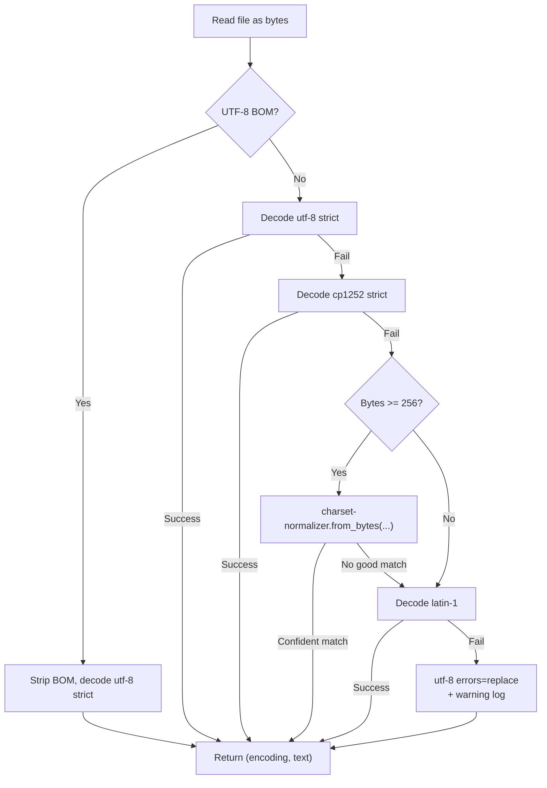

# Encoding detection

Every text-shaped loader in Chaos Cypher (Text, JSON, CSV, HTML, RST,
plus the EPUB chapter parser and the archive Markdown handler) routes
its byte-level reads through one helper: `detect_encoding(path: Path)`
in `packages/core/src/chaoscypher_core/utils/encoding.py`.

The helper's job is to decode bytes into Python strings *strictly* —
no `errors="replace"` until every other option is exhausted — and to
record which encoding it actually used so the operator can see it on
the source's [Data Quality tab](../../user-guide/data-quality.md).

## Why a shared helper

Pre-W6 each text loader had its own `open(filepath, encoding="utf-8",
errors="replace")` or `errors="ignore"` call. Three things went wrong:

1. **Replacement characters silently corrupted content.** A cp1252
   smart quote (`0x91`) became `U+FFFD`; the LLM saw garbage where the
   author wrote prose.
2. **Different loaders behaved differently.** The CSV loader fell back
   to one encoding; the JSON loader fell back to another; the HTML
   archive handler fell back to a third.
3. **The user couldn't tell whether their file decoded cleanly.** A
   `.txt` upload that produced mojibake offered no hint of where the
   problem was.

The shared helper fixes all three.

## Detection strategy

The helper tries each candidate strictly, in order, falling through
only when the previous candidate raises:



| Step | Encoding label | When it fires |
|------|----------------|----------|
| 1 | `utf-8-bom` | File starts with a UTF-8 BOM (stripped before decoding) |
| 2 | `utf-8` | Strict UTF-8 succeeded — the modern default |
| 3 | `cp1252` | Strict cp1252 succeeded — the most common Windows export (Notepad / Excel save-as / older corporate sites) |
| 4 | `<charset-normalizer name>` | Library returned a confident match for an unusual encoding (Asian code pages, Cyrillic, etc.). Only consulted for files >= 256 bytes — the library is unreliable on tiny samples. |
| 5 | `latin-1-fallback` | Strict Latin-1 (always succeeds because every byte 0x00–0xFF maps to a codepoint). The "fallback" suffix flags this as a defensive last-strict-step. |
| 6 | `utf-8-replace` | Defensive — UTF-8 with `errors="replace"`. Latin-1 cannot fail in CPython, so this path is unreachable in practice; it exists so the helper never raises. |

## Why cp1252 strict before charset-normalizer

`charset-normalizer`'s best guess is overconfident on short snippets.
A 13-byte file containing two undefined-in-cp1252 bytes can come back
labelled `utf_16_be`, `cp1125`, or any number of obscure encodings
that don't actually fit the data.

The overwhelming majority of non-UTF-8 text files Chaos Cypher sees in
the wild are Western European cp1252 — Excel CSV exports, Notepad
saves, documents copied out of Word. Trying cp1252 strict *first*
gives deterministic behaviour for that case without putting a heuristic
on top of a heuristic library.

Five byte values (`0x81`, `0x8D`, `0x8F`, `0x90`, `0x9D`) are undefined
in cp1252; if a file uses any of them the strict decode raises and the
helper falls through to `charset-normalizer` for a real opinion.

## Phase 4 hardening (2026-05-08)

Two improvements landed to make charset-normalizer usage more precise
and to add a chardet tiebreaker for borderline cases:

### Lower input-size threshold

The minimum byte count required before `charset-normalizer` is consulted
was lowered from 256 to `LoaderSettings.encoding_chardet_min_input_size`
(default `32`). This allows the library to make a guess on slightly
shorter files (32–255 bytes) where it can be reliable for common
non-UTF-8 code pages, while still protecting against completely
unreliable tiny-sample guesses.

### chardet tiebreaker

When `charset-normalizer` returns a result, the helper now also runs
`chardet` (if installed) and compares the two guesses. If the two
libraries disagree but one has high confidence, the
`LoaderSettings.encoding_chardet_confidence_threshold` (default `0.70`)
is used to pick a winner:

- If `chardet` confidence ≥ threshold **and** it agrees with
  `charset-normalizer` → use the charset-normalizer label (more
  readable).
- If `chardet` confidence ≥ threshold **and** it disagrees →
  `chardet`'s label wins; this handles edge-cases where
  `charset-normalizer` mis-identifies Asian code pages.
- If `chardet` confidence < threshold → fall back to the
  `charset-normalizer` result as before.

`chardet` is an optional dependency; when absent the tiebreaker step is
skipped silently and behaviour is identical to the pre-Phase-4 path.

### Granular encoding labels

The set of labels that can appear in `loader_encoding_used` was expanded:

| Label | Meaning |
|-------|---------|
| `utf-8` | Strict UTF-8 succeeded |
| `utf-8-bom` | UTF-8 BOM stripped then decoded |
| `cp1252` | Strict Windows-1252 succeeded |
| `charset-normalizer:<name>` | Library returned a confident match (e.g., `charset-normalizer:iso-8859-2`) |
| `chardet:<name>` | chardet tiebreaker won (e.g., `chardet:euc-jp`) |
| `latin-1-fallback` | Latin-1 strict (always succeeds) — last strict step |
| `utf-8-replace` | Defensive UTF-8 with `errors="replace"` (unreachable in CPython practice) |

The `charset-normalizer:` and `chardet:` prefixes make it easy to grep
`loader_encoding_used` values and distinguish library-guided guesses from
the deterministic `utf-8` / `cp1252` / `latin-1-fallback` steps.

## `LOADER_REPLACEMENT_CHARS_COUNT` counter (Phase 2, 2026-05-08)

After decoding, loaders that use `detect_encoding()` count the number of
Unicode replacement characters (U+FFFD) present in the decoded text and
increment `LOADER_REPLACEMENT_CHARS_COUNT` / `loader_replacement_chars_count`
with that count. A non-zero value signals that the file had bytes that
could not be decoded cleanly by any strict strategy and the defensive
`utf-8-replace` fallback was used for those bytes.

Operators seeing a high `loader_replacement_chars_count` should inspect the
file's encoding — the `loader_encoding_used` field in the Data Quality tab
will show the label that was ultimately used.

## How the encoding surfaces

Loaders that use `detect_encoding()` pair it with `set_loader_encoding()`
from `chaoscypher_core.services.quality.counters`:

```python
from chaoscypher_core.services.quality.counters import set_loader_encoding
from chaoscypher_core.utils.encoding import detect_encoding

encoding_used, text = detect_encoding(path)
set_loader_encoding(
    adapter=adapter,
    source_id=source_id,
    database_name=database_name,
    encoding=encoding_used,
)
```

The label lands on `SourceRow.loader_encoding_used`, surfaced via
[QualityMetrics](../../reference/api/quality-metrics.md). Operators
seeing `latin-1-fallback` or `utf-8-replace` know the file decoded
defensively and may want to investigate. `utf-8` and `utf-8-bom` are
the clean cases.

## Loaders that route through `detect_encoding`

- `text_loader.py`
- `csv_loader.py` (per-row reads after the dialect sniffer)
- `json_loader.py` (one decode for `.json`, line-by-line for JSONL)
- `html_loader.py`
- `rst_loader.py`
- `epub_loader.py` (per-chapter)
- `archive/handlers/markdown_handler.py`
- `archive/handlers/sphinx_handler.py`

PDF, image, audio, video, DOCX, XLSX, and PPTX loaders bypass the
helper because their underlying libraries handle bytes themselves.

## See also

- [Loading](loading.md) — full loader reference
- [Data Quality tab](../../user-guide/data-quality.md) — where `loader_encoding_used` surfaces in the UI
- [Quality Metrics API](../../reference/api/quality-metrics.md) — field-level reference
