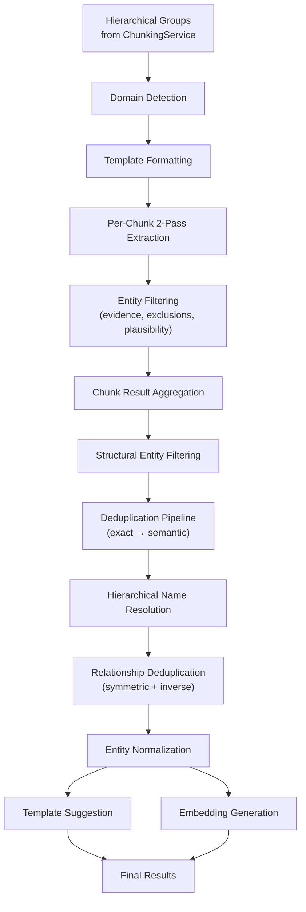
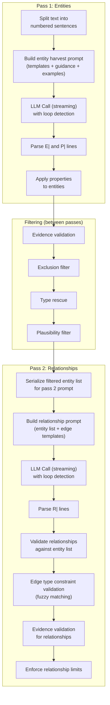
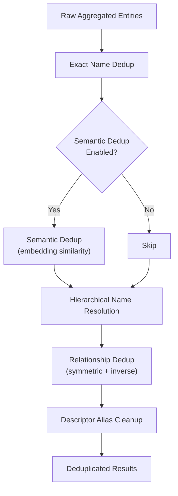

# Entity Extraction

Entity extraction is the AI-powered stage that transforms document text into structured knowledge graph entities and relationships. It is the most computationally expensive stage of the pipeline, relying on LLM calls for each chunk group, and includes extensive post-processing to clean, validate, and deduplicate the results.

**Source files:**

- `packages/core/src/chaoscypher_core/services/sources/engine/extraction/orchestration.py` -- shared orchestration functions
- `packages/core/src/chaoscypher_core/services/sources/engine/extraction/service.py` -- `ExtractionService`
- `packages/core/src/chaoscypher_core/services/sources/engine/extraction/extractor.py` -- extraction pipeline and deduplication
- `packages/core/src/chaoscypher_core/services/sources/engine/extraction/utils/ai_entities.py` -- `AIEntityExtractor` (LLM interaction)
- `packages/core/src/chaoscypher_core/services/sources/engine/extraction/utils/prompts.py` -- LLM prompt templates
- `packages/core/src/chaoscypher_core/services/sources/engine/extraction/utils/line_parser.py` -- pipe-delimited output parser
- `packages/core/src/chaoscypher_core/services/sources/engine/extraction/utils/entity_cleaner.py` -- validation and cleanup
- `packages/core/src/chaoscypher_core/services/sources/engine/extraction/domains/` -- domain registry and configuration

## Pipeline Overview



## Domain Detection and Selection

Before extraction begins, the system determines which domain configuration to use. Domains provide extraction guidance, entity/relationship templates, examples, and post-processing rules tailored to specific content types (literary, technical, scientific, etc.).

### How Domain Detection Works

The `DomainRegistry` auto-discovers domains from two locations:

1. **Built-in domains** -- JSON-LD files in `packages/core/src/chaoscypher_core/services/sources/engine/extraction/domains/plugins/`
2. **User domains** -- JSON-LD files in `data/plugins/domains/` (drop-in, no Python code required)

Each domain implements `can_analyze(text, filename, metadata)` which returns a `(can_handle, confidence)` tuple. The registry runs all registered domains against a text sample and selects the highest-confidence match. If nothing matches well, it falls back to the `generic` domain.

Users can also **force** a specific domain, bypassing auto-detection entirely (confidence is set to 1.0).

### What Domains Provide

| Component | Purpose | Used In |
|-----------|---------|---------|
| Entity guidance | Domain-specific instructions appended to entity extraction prompt | Pass 1 |
| Relationship guidance | Domain-specific instructions appended to relationship extraction prompt | Pass 2 |
| Node templates | Entity type definitions (name + description) | Pass 1 prompt |
| Edge templates | Relationship type definitions | Pass 2 prompt |
| Examples | Few-shot examples for entity and relationship extraction | Both passes |
| Entity exclusions | Categories of things the LLM should skip | Pass 1 prompt + code-level filter |
| Normalization rules | Type correction rules applied post-extraction | Post-processing |
| Extraction limits | Override global relationship density caps | Post-processing |
| Type compatibility | Groups of entity types that can be merged during dedup | Deduplication |
| Title words | Honorifics/titles to exclude from name matching during dedup | Deduplication |
| Evidence validation mode | Per-domain override for evidence strictness | Filtering |
| Strict entity types | Whether to enforce template-only types | Filtering |
| `system_prompt` | Optional domain-level system prompt override (Phase 6; see below) | Both passes |

#### Phase 6: System-prompt customization (2026-05-08)

The `ExtractionSettings.system_prompt` setting and its domain-level
counterpart let operators replace the default extraction system prompt
entirely:

- **Global override** — `ExtractionSettings.system_prompt` (string or `null`). When set, it replaces the built-in system prompt for every LLM extraction call.
- **Domain override** — the domain's JSON-LD can set `system_prompt` to a domain-specific string. A domain value takes precedence over the global setting; `null` in the domain config means "use the global setting".

This is useful for operators running models that have been fine-tuned with
domain-specific system prompts, or for A/B testing prompt variants.

#### Phase 6: Template fallback for empty-template domains (2026-05-08)

When a domain has no node or edge templates defined (e.g., a sparse custom
domain that relies entirely on the LLM's generic extraction), `ExtractionSettings.allow_template_fallback` (default `False`) controls behaviour:

- `False` (default) — extraction proceeds with empty template lists. The LLM receives no type guidance and may produce arbitrary types. This is the pre-Phase-6 behaviour.
- `True` — when the resolved domain has no templates, the extractor falls back to the `generic` domain's templates so extraction always has baseline type guidance.

This is an opt-in rather than a default to avoid changing behaviour for existing domains that intentionally operate without templates.

## Depth Strategy

Extraction operates at two depth levels, determined by the `analysis_depth` parameter:

| Depth | Groups Processed | Typical Use |
|-------|-----------------|-------------|
| `quick` | 5 evenly-distributed groups | Fast preview, cost-sensitive |
| `full` | All groups | Production extraction |

The `apply_depth_strategy()` function in `orchestration.py` uses **even-distribution sampling** for `quick` mode -- selecting every Nth group -- to ensure representative coverage across the document rather than just sampling the beginning.

:::note[Phase 6: Depth value validation (2026-05-08)]

`apply_depth_strategy()` now validates that `analysis_depth` is one of the
known literal values (`"quick"` or `"full"`) and raises a
`ChaosCypherException` subclass on an unknown value rather than silently
treating it as `full`. This prevents misconfigured per-source depth
overrides from producing unexpected output without any error signal.

:::

## Per-Chunk 2-Pass Extraction

Each hierarchical group is extracted using a **2-pass approach** that eliminates token competition between entities and relationships. This is the core of the `AIEntityExtractor.extract_single_chunk()` method.



### Why 2-Pass?

A single-pass approach forces the LLM to split its token budget between entities and relationships. In practice, this leads to either truncated entity lists or sparse relationship coverage. The 2-pass design gives each task the full token budget:

- **Pass 1** produces entities and properties with full context
- **Filtering** cleans the entity list between passes
- **Pass 2** receives a clean, validated entity list and focuses exclusively on relationships

### Pipe-Delimited Output Format

The extraction uses a simple, robust pipe-delimited format rather than tool calling or JSON output:

```
E|name|type|aliases|confidence|sent_ref|description
P|entity_index|key|value
R|source_index|target_index|type|confidence|sent_ref|justification
```

This format was chosen because:

- **No tool calling failures** -- works with any LLM, including local models
- **Greedy parsing** -- the last field (description/justification) absorbs unescaped pipes
- **Line independence** -- partial output is still usable if the LLM is interrupted
- **Evidence gating** -- `sent_ref` fields (e.g., `S1-S3`) link every extraction to source sentences

The parser (`line_parser.py`) requires `sent_ref` on every entity and relationship line — extractions without sentence references are rejected.

`parse_extraction_output()` accepts two keyword-only kwargs that thread
filtering-mode behaviour and quality-counter accounting into parsing:

- `minimum_alias_length: int` — drops aliases shorter than this from
  the parsed entity. Honours the active `FilteringConfig` so `maximum`
  / `strict` modes (length 3) shed `AI` / `ML` aliases that survive
  in `lenient` (length 2) and `unfiltered` (length 1).
- `stats: dict[str, int] | None` — caller-supplied counter dict the
  parser increments for malformed lines, out-of-bounds indices, and
  similar drops. Threaded through to `parser_lines_dropped` on the
  source row.

:::info[Production extraction parity]

The Cortex finalizer (`finalize_distributed_extraction`), the Neuron
worker (`_finalize_extraction_inner`), the standalone CLI extractor
(`extract_entities_from_groups`), and the MCP path all share one
post-extraction helper:
`apply_structural_and_normalization` in
`utils/post_extraction.py`. It runs `filter_structural_entities` (gated
on `FilteringConfig.enable_structural_filter`) followed by
`normalize_entity_types`, with both honouring the resolved domain's
custom structural and generic types. This guarantees that the same
input produces the same graph regardless of which entry point ran the
extraction.

:::

### Sentence-Referenced Evidence

Before extraction, the chunk text is split into numbered sentences:

```
S1: Prince Andrei returned from the war in 1805.
S2: He found his wife expecting their first child.
S3: Napoleon's forces had crossed the border.
```

Every entity and relationship must reference the sentence(s) that support it via the `sent_ref` field. This enables downstream evidence validation -- entities that cannot be traced back to their source sentences are filtered out.

### Prompt Structure

**Pass 1 (Entity Harvest):**

The `ENTITY_HARVEST_TEMPLATE` includes:

1. Numbered sentences from the chunk
2. Node template definitions from the domain
3. Strict type enforcement instruction (if domain enables it)
4. Entity extraction guidelines (named entities only, proper names, rich descriptions, alias rules)
5. Domain-specific entity exclusion rules
6. A worked example showing E| and P| lines
7. Domain-specific entity guidance (appended if available)
8. Domain-specific entity examples (appended if available)

**Pass 2 (Relationship Harvest):**

The `RELATIONSHIP_HARVEST_TEMPLATE` includes:

1. The same numbered sentences
2. The filtered entity list with indices (e.g., `0: Prince Andrei (Character) [aliases: Andrei; Prince Andrew]`)
3. Valid index range (0 to N-1)
4. Edge template definitions from the domain
5. Relationship extraction guidelines
6. A worked example showing R| lines
7. Domain-specific relationship guidance and examples

### Fuzzy Relationship Type Matching

After Pass 2 parses R| lines, each relationship's type is validated against the domain's edge templates. Rather than requiring an exact match, the system uses **three-tier fuzzy matching**:

| Tier | Method | Example |
|------|--------|---------|
| **1. Exact** | Case-insensitive exact match | `"interacts_with"` matches template `"interacts_with"` |
| **2. Substring** | LLM type is a substring of a template name (or vice versa) | `"interacts"` matches template `"interacts_with"` |
| **3. Word overlap** | Significant words (>= 3 chars) overlap between the LLM type and a template name | `"character_interaction"` matches `"interacts_with"` via shared root |

When a match is found, the relationship type is **rewritten** to the canonical template name. If no match is found, the behavior depends on the `strict_edge_type_constraints` setting:

- **`false`** (default) -- unmatched types fall through and are kept as-is
- **`true`** -- unmatched types cause the relationship to be dropped

The same setting also controls **source/target entity type validation**. When edge templates define `source_types` and `target_types`, the endpoint entity types are checked against those constraints. When `strict_edge_type_constraints` is `false` (default), source/target type mismatches also fall through -- the relationship is kept even if the endpoint entity types don't match the template. When `true`, mismatches cause the relationship to be dropped.

This fuzzy matching significantly improves extraction quality because LLMs frequently produce slight variations of the intended relationship types (e.g., `"located_in"` vs `"located_at"`, `"member_of"` vs `"is_member_of"`).

### Direction Correction

When source/target entity types don't match the edge template's constraints, the pipeline attempts to auto-correct the direction by swapping source and target. If the swapped direction satisfies the constraints, the relationship is kept with corrected direction. This handles a common LLM error where relationships are extracted backwards (e.g., "WAR AND PEACE -> wrote -> Leo Tolstoy" is corrected to "Leo Tolstoy -> wrote -> WAR AND PEACE").

The correction logic runs before fall-through -- so a backwards relationship with a matching template gets fixed rather than passed through with wrong direction. If neither direction matches the constraints, the behavior follows `strict_edge_type_constraints` (drop when strict, fall through when not).

Each successful swap increments `RELATIONSHIPS_DIRECTION_CORRECTED` /
`relationships_direction_corrected`. The toggle
`ExtractionSettings.enable_direction_correction` (Phase 4, default `True`)
can disable swapping entirely so mismatches are dropped instead. See
[Relationship toggles](relationships.md#phase-4--phase-6-toggles-2026-05-08)
for the full cascade description.

## Loop Detection

LLMs can enter degenerate output states where they repeat the same pattern indefinitely. The `call_llm()` method streams the response and monitors completed lines in real-time for three loop patterns:

| Pattern | Detection | Threshold Setting |
|---------|-----------|-------------------|
| **Entity count exceeded** | More than N entity lines | `loop_max_entity_count` |
| **Out-of-bounds indices** | R| lines referencing non-existent entity indices | `loop_max_out_of_bounds` consecutive OOB |
| **Repeating source-type** | Same `(source_index, relationship_type)` pair repeating | `loop_max_source_type_repeat` consecutive repeats |
| **Repeating property key** | Same `(entity_index, key)` pair repeating | `loop_max_property_repeat` consecutive repeats |

When a loop is detected, the stream is **aborted early**, saving GPU time. The content collected up to that point is still usable -- the parser handles partial output gracefully.

The line parser (`_parse_mixed_lines`) also performs independent loop detection during parsing as a safety net, truncating output when the same degenerate patterns appear.

## Entity Filtering Pipeline

Between pass 1 and pass 2, extracted entities go through multiple filtering stages. Each stage produces an index mapping so downstream references (relationships, properties) can be remapped.

### Evidence Validation

Four modes controlled by `evidence_validation_mode` (domains can override):

| Mode | Entity Check | Relationship Check |
|------|-------------|-------------------|
| `strict` | Full name or alias must appear as substring in referenced sentence(s) | Both entity names must appear |
| `standard` (default) | Any significant word (>= 4 chars) from name/aliases must appear | At least one entity name must appear |
| `narrative` | Accepts one entity name (no keyword required) or zero names with a relationship type keyword present in the sentence | One entity name or relationship type keyword must appear |
| `relaxed` | Valid `sent_ref` in bounds is sufficient | Valid `sent_ref` is sufficient |

The `narrative` mode sits between `standard` and `relaxed` and is designed for literary and narrative content where characters are often referred to by pronouns or descriptive phrases rather than by name. The `literary` domain uses this mode by default.

### Exclusion Filter

A code-level safety net that catches entities the LLM extracted despite being told to skip them in the prompt. Domain-specific exclusion rules (e.g., "bare titles without names") are applied as pattern matches against entity names and types.

### Type Rescue

When a domain enables `strict_entity_types`, entities with types not in the domain's template list are processed through a rescue system before being discarded:

1. **Normalization rules** -- if the invalid type matches a keyword pattern, remap to the correct type (e.g., "Philosophical Idea" -> "Concept")
2. **Property-type mapping** -- absorb the entity as a property on a related entity (e.g., "Personality Trait" -> `Character.personality_traits`)

:::note[Phase 6: `enable_type_rescue` gating (2026-05-08)]

The type rescue pass is now gated on `ExtractionSettings.enable_type_rescue`
(default `True`). Setting this to `False` disables the three-tier rescue and
applies the domain's `strict_entity_types` policy directly: entities with
unrecognized types are dropped without a rescue attempt. This is useful when
extraction prompts are very precise and rescue attempts introduce noise rather
than recover signal.

:::

### Plausibility Filter

Catches LLM-hallucinated descriptive names that read like sentence fragments rather than proper entity names. Uses configurable thresholds:

- `plausibility_threshold` -- for entity types that require proper named referents
- `plausibility_threshold_non_named` -- for other entity types (more lenient)

## Chunk Result Aggregation

After all chunks are processed, results are aggregated by `aggregate_chunk_results()`:

1. Entity lists from all chunks are concatenated into a global list
2. Relationship indices are **remapped from chunk-local to global** -- if chunk 0 produced 5 entities, chunk 1's entity index `0` becomes global index `5`
3. Chunk texts and sentence lists are collected for downstream reference

Within-task duplicate relationships (same source/target/type from the same extraction task) are merged, keeping the highest confidence and combining justifications.

## Deduplication Pipeline

The deduplication pipeline (`run_deduplication()`) collapses duplicate entities that appear across different chunks.



### Exact Name Deduplication

The first pass uses `EntityProcessor.deduplicate_entities_with_mapping()` to merge entities with identical or alias-matching names. Two entities are candidates for merging when:

- Their names match (case-insensitive) or one's name matches another's alias
- Their types are compatible (either identical, or within the same type compatibility group if the domain defines one)

Merged entities combine descriptions, aliases, properties, and source chunk references. The highest confidence is kept.

### Semantic Deduplication

When `entity_deduplication_mode` is set to `semantic` (the default), a second pass uses embedding similarity to catch entities that refer to the same thing but have different names (abbreviations, alternate spellings, etc.):

1. Generate embeddings for all surviving entities
2. Compare embedding similarity against `semantic_dedup_threshold`
3. Merge pairs that exceed the threshold and pass type compatibility checks

The embeddings generated during semantic dedup are cached and reused for the final entity embedding generation, avoiding redundant computation.

### Hierarchical Name Resolution

After deduplication, `resolve_hierarchical_names()` handles cases where one entity name is a substring of another (e.g., "Moscow" vs "Battle of Moscow"). The shorter name is resolved to the more specific entity when the context supports it.

### Relationship Deduplication

`deduplicate_relationships()` collapses duplicate relationships and handles two special cases:

- **Symmetric relationships** (e.g., `spouse_of`, `interacts_with`) -- `(A, B)` and `(B, A)` are semantically identical; only the highest-confidence direction is kept
- **Inverse relationships** (e.g., `parent_of` / `child_of`) -- `(A, parent_of, B)` and `(B, child_of, A)` are collapsed to the canonical direction

Both symmetric and inverse relationship types are defined per-domain.

### Descriptor Alias Cleanup

The final cleanup pass (`clean_descriptor_aliases()`) removes aliases that are descriptive phrases rather than proper name variants (e.g., "the old prince" as an alias for "Prince Nikolai Bolkonsky"). Domain-provided title words are used to identify and filter these.

## Structural Entity Filtering

Before deduplication, `filter_structural_entities()` removes entities that represent document structure rather than meaningful content (chapters, sections, page headers). Domain configurations specify which entity types are considered structural and which are generic catch-all types.

This step can be disabled per-domain via the `filter_structural_entities` extraction limit.

## Type Normalization

After deduplication, domain-specific `normalization_rules` are applied to fix entity types. Each rule maps a target type to a list of trigger keywords found in entity descriptions:

```json
{
  "Character": ["a character", "protagonist", "antagonist"],
  "Location": ["a place", "a city", "located in"]
}
```

Generic types (defined per-domain) are also normalized when a more specific match is available.

## Finalization

The `ExtractionService.finalize_distributed_extraction()` method performs the final steps:

### Entity Normalization

`normalize_entities()` ensures every entity has a consistent structure with all required fields and sensible defaults:

- `id`, `name`, `type`, `description`, `properties`, `aliases`, `confidence`
- `chunk_index`, `sent_ref`, `source_chunk_indices`

### Template Suggestion

Two types of template suggestions are generated concurrently:

1. **Node template suggestions** -- `TemplateExtractor.generate_suggestions_from_entities()` analyzes extracted entity types and suggests graph templates that don't already exist
2. **Edge template suggestions** -- `suggest_edge_templates()` analyzes relationship types and suggests edge templates, using domain descriptions when available

### Embedding Generation

Entity embeddings are generated for vector search in the knowledge graph. The process reuses cached embeddings from semantic deduplication when the count matches, avoiding redundant computation:

```
Cached embeddings count == entity count?
├─ Yes → Reuse cached embeddings (zero additional embedding calls)
└─ No  → Generate fresh embeddings via the embedding provider's batch_embed()
```

Each entity's embedding text is constructed from its name, type, and description to create a semantically rich representation.

## Quality Score Caching

After extraction completes, `cache_quality_scores()` computes quality metrics and persists them to the source file record. This is a non-blocking operation -- if scoring fails, extraction is not aborted. Scores are computed once at extraction time so they don't need recalculation on every page load.

Quality scoring takes into account:

- Entity and relationship counts
- Entity chunk mention distribution
- Domain-specific scoring configuration
- Overall extraction coverage relative to document size

## Filtering Modes

The `extraction_filtering_mode` setting selects a **preset** that controls which quality filters are active and how strict they are. This replaces the need for domains to individually configure evidence validation, type constraints, plausibility thresholds, and relationship limits -- instead, each domain simply declares a preset and optionally overrides specific values.

### Available Presets

| Preset | Evidence | Type Constraints | Plausibility | Relationship Limits | Orphan Protection |
|--------|----------|-----------------|--------------|--------------------|--------------------|
| **`maximum`** | Full name/alias match | Drop on mismatch | Tighter thresholds | All active | On |
| **`strict`** | Full name/alias match | Drop on mismatch | Standard thresholds | All active | On |
| **`balanced`** (default) | Significant word match | Fall-through on mismatch | Standard thresholds | All active | On |
| **`lenient`** | Lenient (pronoun-heavy prose) | Fall-through on mismatch | Lower thresholds | All active | On |
| **`minimal`** | Relaxed (valid sent_ref only) | Disabled | Elevated limits | Most filters disabled | On |
| **`unfiltered`** | Disabled | Disabled | Disabled | Data integrity only | N/A |

**`maximum`** enables all filters with the tightest thresholds. Evidence validation requires full name or alias substring matches. Plausibility threshold is tighter than `strict`. Best for cases where absolute precision is required.

**`strict`** uses strict evidence validation and type constraints (dropping on mismatch) with standard plausibility thresholds and orphan protection. Best for factual and structured content where entities have formal names and relationships follow well-defined schemas.

**`balanced`** (the default) activates all filters with fall-through behavior -- unmatched relationship types and entity type mismatches are kept rather than dropped. Orphan protection prevents degree and ratio caps from disconnecting sparsely-connected entities. Suitable for most general content.

**`lenient`** uses narrative evidence validation designed for prose where characters are often referenced by pronouns or descriptive phrases rather than by name. Plausibility thresholds are lowered to accommodate literary naming conventions. All other filters remain active with fall-through behavior.

**`minimal`** disables most quality filters. Evidence validation only requires a valid sentence reference. Type constraints are disabled. Relationship limits are elevated. Useful for content where aggressive filtering would lose too much signal (e.g., news articles with many loosely-connected entities).

**`unfiltered`** provides data integrity only -- deduplication and index validation run, but no quality filtering is applied. Entities and relationships pass through as extracted. Useful for debugging extraction prompts or when all filtering will be done downstream.

Legacy preset names (`standard`, `precise`, `narrative`, `permissive`, `raw`) are accepted as aliases for backwards compatibility.

### Domain-to-Preset Mapping

Each built-in domain maps to one of these presets. Of the 19 built-in domains, 11 need zero per-domain overrides:

| Preset | Domains |
|--------|---------|
| **`balanced`** | generic, educational, financial, philosophical, political, technical, theological, design, reference |
| **`strict`** | cybersecurity, legal, investigation, medical, scientific, intelligence |
| **`lenient`** | literary, biographical, historical |
| **`minimal`** | news |

Domain configs declare their preset via the `extraction_filtering_mode` field. Specific filter values can still be overridden per-domain when needed -- the preset provides the baseline, and overrides are applied on top. For example, the literary domain includes additional tuning: `plausibility_threshold` lowered to 0.12 (from 0.20 in the `lenient` preset) for title-as-name characters common in Russian literature, and `max_entity_degree` raised to 40 for dense character interaction scenes.

### Override Hierarchy

The filtering mode can be set at three levels, with each level overriding the previous:

1. **Global default** — `balanced` preset
2. **Domain config** -- `extraction_filtering_mode` field in the domain's `.jsonld` file
3. **Per-source override** -- Set via the API, CLI, or UI when adding a document

## Relationship Limits

Multiple layers of relationship limiting act as a **safety net** to prevent extraction from producing an unmanageable graph. These are not primary quality filters -- they catch runaway cases where the LLM produces disproportionate relationship counts:

| Limit | Setting | Default | Description |
|-------|---------|---------|-------------|
| Ratio cap | `max_relationship_ratio` | 8.0 | Max relationships as a multiple of entity count |
| Degree cap | `max_entity_degree` | 25 | Max relationships per entity (source + target combined) |
| Source-type cap | `max_same_source_type` | 12 | Max relationships with the same (source, type) pair |

These defaults are intentionally generous. Primary extraction quality comes from evidence validation, type constraints, and deduplication -- the limits above only activate when those upstream filters are insufficient. All limits can be overridden per-domain via `extraction_limits`. When trimming is needed, lower-confidence relationships are dropped first.

### Orphan Protection

Both the degree cap and the total ratio cap include **orphan protection**: if either endpoint of a relationship has fewer than 2 edges, the relationship is kept regardless of whether the other endpoint has hit the degree cap or whether the total relationship count has exceeded the ratio cap. For the total ratio cap, relationships that protect near-orphan entities are exempt from the count entirely -- they don't count toward the limit. This prevents both caps from disconnecting sparsely-connected entities that would otherwise become orphaned nodes in the graph.

## Distributed Extraction

Chaos Cypher supports three execution modes for extraction:

1. **Standalone** (`extract_from_chunks`) -- processes all chunks sequentially in a single call, used by the CLI
2. **Distributed** (`finalize_distributed_extraction`) -- chunks are processed in parallel via the queue system (Neuron workers), then aggregated and finalized
3. **[Model Context Protocol](https://modelcontextprotocol.io/) (MCP) Extraction** -- external tools process chunks via the MCP protocol, with results stored as `ExtractionSubmission` records for incremental commit

The distributed path splits extraction into per-chunk jobs dispatched to the LLM queue, then calls `finalize_distributed_extraction()` to run the deduplication pipeline, template matching, and embedding generation on the aggregated results. This is the production path used by the Cortex backend.
