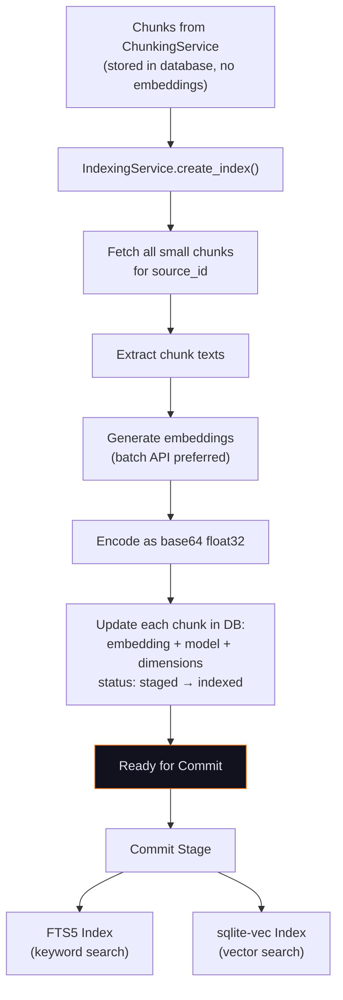
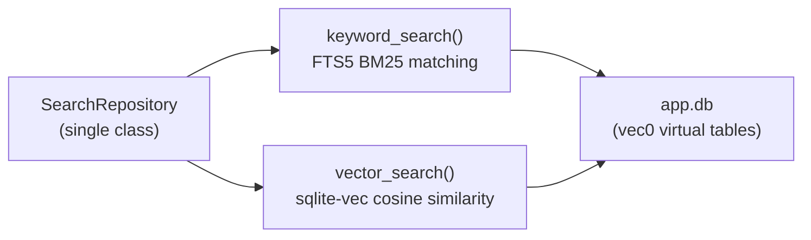

# Indexing & Embeddings

The `IndexingService` generates vector embeddings for pre-chunked documents and prepares them for search. It works in tandem with the `SearchRepository`, a single class that manages both FTS5 keyword indices and sqlite-vec vector indices -- all stored in `app.db`.

**Source files:**

- `packages/core/src/chaoscypher_core/services/search/engine/index.py` -- `IndexingService`
- `packages/core/src/chaoscypher_core/adapters/sqlite/repos/search.py` -- `SearchRepository` (single class handling both FTS5 and sqlite-vec)

## Indexing Flow



## Embedding Generation

The `IndexingService` consumes chunks that were previously created by the [ChunkingService](chunking.md). Its sole responsibility is generating embeddings and writing them back to the database.

Embeddings are generated by a dedicated **embedding provider**. The default is `LocalEmbeddingProvider`, a local CPU embedding pipeline using [sentence-transformers](https://www.sbert.net/) — it runs entirely offline with no LLM provider, API keys, or network access required. Cloud (`OpenAIEmbeddingProvider`, `GeminiEmbeddingProvider`) and `OllamaEmbeddingProvider` alternatives are available via `EmbeddingSettings.provider`.

### Batch Processing

Embedding generation uses batch processing for performance:

| Setting | Default | Description |
|---------|---------|-------------|
| `embedding_batch_size` | 512 | Chunks per embedding API call |
| `embedding_concurrency` | 4 | Concurrent embedding batch requests per wave |
| `chunk_fetch_limit` | 100,000 | Max chunks fetched in internal bulk operations (indexing, source delete cleanup) |

Batches are processed in concurrent waves — up to `embedding_concurrency` API calls run in parallel per wave, with cancellation checks between waves. All encoding runs on background threads via `asyncio.to_thread()` to keep the event loop responsive.

### Embedding Storage

Each embedding is stored in the chunk's database record as a **base64-encoded float32 array**:

```python
embedding_array = np.array(embedding, dtype=np.float32)
embedding_bytes = base64.b64encode(embedding_array.tobytes()).decode("utf-8")
```

Along with the embedding data, each chunk record receives:

- `embedding_model` -- the model name that generated the embedding (e.g., `Qwen/Qwen3-Embedding-0.6B`)
- `embedding_dimensions` -- dimensionality of the vector (e.g., 1024)
- `status` -- updated from `staged` to `indexed`

### Embedding Model

The embedding model is configured in `EmbeddingSettings` (config key `embedding.model`), while the output dimensionality lives in `SearchSettings`:

| Setting | Settings class | Default | Description |
|---------|----------------|---------|-------------|
| `model` (`embedding.model`) | `EmbeddingSettings` | `Qwen/Qwen3-Embedding-0.6B` | Any HuggingFace sentence-transformers model ID |
| `vector_dimensions` | `SearchSettings` | `1024` | Output dimensions (Matryoshka Representation Learning (MRL) truncation) |

The model downloads automatically on first use and is cached at `data/models/embeddings/`. `LocalEmbeddingProvider` supports Matryoshka Representation Learning (MRL), which truncates the model's native output to the configured `vector_dimensions`.

## Search Index Architecture

The `SearchRepository` is a **single class** with two internal search paths: BM25 keyword search backed by FTS5 virtual tables, and vector similarity search backed by sqlite-vec `vec0` virtual tables. Both paths query `app.db` directly via a shared SQLAlchemy engine — there are no sub-repositories or delegate objects.



### FTS5 Full-Text Index

The `keyword_search()` method uses SQLite's FTS5 extension for BM25 keyword search. It operates on the main `app.db` database alongside other tables.

**Schema:**

| Table | Purpose |
|-------|---------|
| `fulltext_content` | Regular table storing node data (`node_id`, `label`, `properties`, `searchable_text`) |
| `fulltext_index` | FTS5 virtual table, content-linked to `fulltext_content` |
| Triggers | INSERT/UPDATE/DELETE triggers keep the FTS5 index synchronized |

**Tokenization:** Porter stemming with Unicode61 tokenizer (`tokenize='porter unicode61'`).

**Scoring:** BM25 ranking with field weights:

| Field | Weight | Rationale |
|-------|--------|-----------|
| `label` | 3.0 | Entity names are the strongest match signal |
| `properties` | 1.0 | Property values provide supporting context |
| `searchable_text` | 0.5 | Full text gives broad recall at lower precision |

FTS5 returns negative BM25 scores (closer to 0 is better), so the repository negates them for a conventional "higher is better" ordering.

### sqlite-vec Vector Index

The `vector_search()` method uses [sqlite-vec](https://github.com/asg017/sqlite-vec) for vector similarity search. sqlite-vec is a SQLite extension that stores vectors directly in the database as `vec0` virtual tables, eliminating the need for external index files.

**Index architecture:**

- **Storage:** `vec0` virtual table in `app.db` with float32 vector columns
- **Similarity:** Cosine distance via `vec_distance_cosine()` (vectors are L2-normalized before insertion)
- **ID mapping:** Uses string IDs directly -- no integer ID translation needed

**Benefits over file-based indices:**

- **Single file:** All data (relational + FTS5 + vectors) lives in `app.db` -- no separate index files to manage
- **Transactional:** Vector operations participate in SQLite transactions alongside other data changes
- **Atomic:** Database resets, backups, and migrations handle everything in one step
- **Simpler:** No file-based persistence, no metadata JSON, no dimension mismatch recovery logic

### Hybrid Search

The `SearchRepository` supports three search modes:

| Mode | Method | Description |
|------|--------|-------------|
| Keyword | `keyword_search()` | FTS5 BM25 matching |
| Semantic | `semantic_search()` | Vector cosine similarity |
| Hybrid | `hybrid_search()` | Merges keyword + semantic results |

Hybrid search is the primary mode used by the application. It runs both keyword and semantic searches in parallel, then merges results by keeping the highest score for each unique ID. Short queries (< 3 characters) skip semantic search and use keyword-only for better partial-match behavior.

A configurable `min_similarity_threshold` (default: 0.55) filters out low-confidence semantic results before merging.

## Storage Layout

All search indices for a database live inside `app.db`:

```
data/databases/{db_name}/
└── app.db                   # Contains all data including:
                             #   - FTS5 virtual tables (keyword search)
                             #   - vec0 virtual tables (vector search via sqlite-vec)
                             #   - All relational data (sources, graph, chat, etc.)
```

## Commit Stage

After indexing generates embeddings and updates chunk status to `indexed`, the **commit stage** writes the final graph nodes into both search indices:

1. **FTS5:** Each committed node is inserted into `fulltext_content`, which triggers automatic FTS5 index updates via database triggers.
2. **sqlite-vec:** Each node's embedding vector is normalized and added to the sqlite-vec index.

The commit stage also supports **idempotent re-commit** -- previously indexed nodes are cleaned from search indices before re-insertion, preventing duplicate entries.

## Index Maintenance

The `SearchRepository` provides maintenance operations:

| Operation | Method | Description |
|-----------|--------|-------------|
| Reindex all | `reindex_all_nodes()` | Clears both indices and rebuilds from node list |
| Clear all | `clear_all_indices()` | Wipes both indices (requires rebuild) |
| Stats | `get_index_stats()` | Returns document count (FTS5) and vector count (sqlite-vec) |
| Close | `close()` | Disposes database connections and releases resources |

## Phase 5b: Image-only PDF routing (2026-05-08)

When `PdfLoader` determines that a PDF produced fewer characters than
`LoaderSettings.pdf_image_only_threshold`, it sets `needs_vision=True`
in the document metadata rather than raising an error. The indexing
handler checks this flag after loading:

- If `needs_vision=True` **and** the source's `enable_vision` setting is
  `True` → the document is routed to the vision pipeline (LLM image
  description generation) before normalization proceeds.
- If `needs_vision=True` **and** `enable_vision` is `False` → the
  handler raises a `ValidationError` with an actionable message ("PDF
  appears to be image-only — re-upload with vision enabled") and sets
  the source status to `error`.

This replaces the pre-Phase-5b behaviour where image-only PDFs raised
immediately in the loader with a generic "scanned PDF" error regardless
of whether vision was configured.

## Phase 6: Content-type per-doc fix (2026-05-08)

Archives containing multiple documents of different types (e.g., a ZIP
with a `.txt` README and an `openapi.yaml`) previously applied the
**archive-level** content-type to every extracted document, causing
mismatches in normalization and embedding behaviour.

The fix: each document extracted from a multi-doc archive now carries
its own `content_type` in metadata, derived from the individual file's
extension (via `ContentType.from_extension()`). The archive-level
`detection_format` is still recorded as `archive_detection_format` for
traceability but no longer overrides per-document content-type detection.

## `LOADER_REPLACEMENT_CHARS_COUNT` rollup (Phase 2)

After embedding generation completes, the indexing handler rolls up the
`LOADER_REPLACEMENT_CHARS_COUNT` counter across all chunks from the
source. A non-zero rollup is logged at `WARNING` with
`replacement_chars_found=<count>` so the signal appears in structured
logs even if the operator is not watching the Data Quality tab.

## See also

- [User guide: Search](../../user-guide/search.md) — search modes, re-ranking configuration, and index rebuild instructions
- [API reference: Search](../../reference/api/search.md) — endpoint details for keyword, semantic, and hybrid search; index rebuild and embedding generation
- [Loading](loading.md) — PDF hardening details including `needs_vision` flag and `EncryptedPDFError`
- [Quality counters](quality-counters.md) — all counter columns including `loader_replacement_chars_count`
