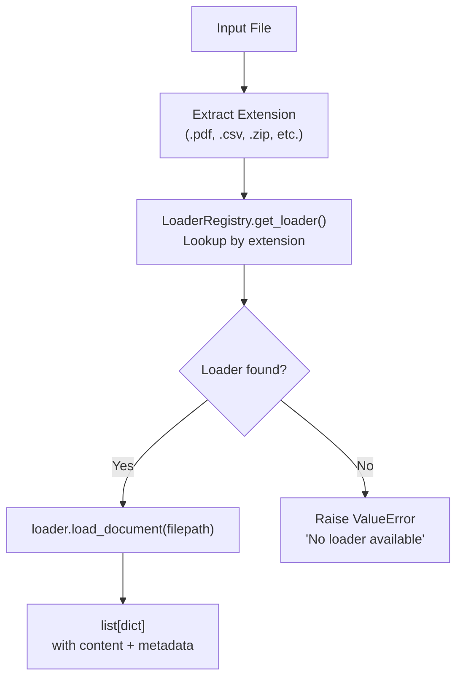
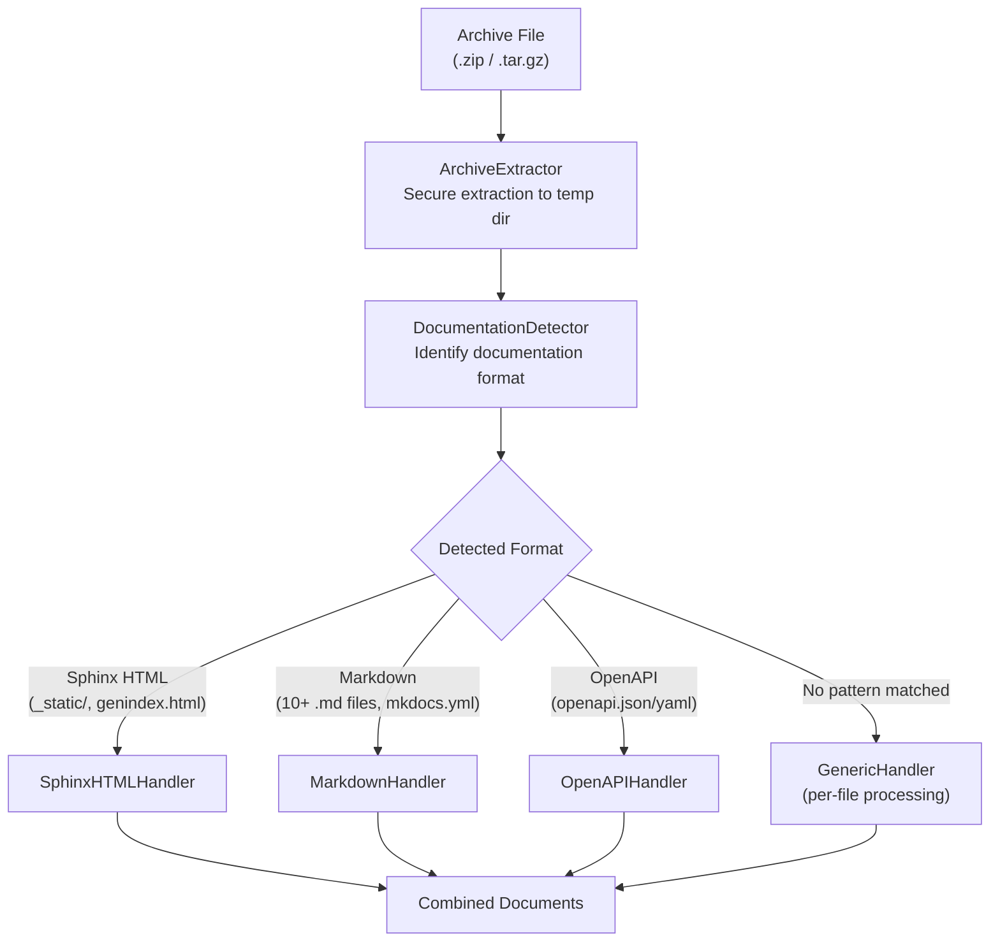

# Loading

Document loading is the first step of the [extraction pipeline](overview.md). It converts raw files from any supported format into a uniform `list[dict]` structure with `content` (text) and `metadata` keys. This normalized output feeds directly into the [normalization](normalization.md) and chunking stages.

## When Loading Runs

Loading happens inside the `handle_index_document()` handler on the **Operations queue**. The handler calls `LoaderRegistry.load_document(filepath)`, which:

1. Looks up the file extension in the registry
2. Instantiates the appropriate loader
3. Calls `loader.load_document()` to extract text
4. Returns the raw document(s) for downstream normalization

:::warning[Loading returns raw content]

The registry returns raw documents. Chunking is handled separately by `ChunkingService` after normalization, using a hierarchical chunking strategy suited to the document's content.

:::

## Loader Selection Flow



## LoaderRegistry

The `LoaderRegistry` extends `BaseRegistry[BaseLoader]` and auto-discovers loaders at initialization by scanning two directories:

1. **Built-in loaders** -- the `loaders/` directory in `chaoscypher_core`
2. **User plugins** -- `data/plugins/loaders/` (any file matching `*_loader.py`)

Discovery works by finding classes that have a `supported_extensions` property, instantiating them, and registering each extension as a key. User plugins override built-in loaders with the same extension.

### Singleton Caching

The registry is expensive to create (~10-35ms for module scanning and class inspection), so it is cached per `EngineSettings` instance via `get_loader_registry(settings)`. Worker startup creates one registry that is reused for all document imports.

```python
from chaoscypher_core import Loaders

# Recommended: one-liner for file loading
text = Loaders.load_text("/path/to/file.pdf")
```

For advanced loader plugin development, the registry is also accessible:

```python
from chaoscypher_core.services.sources.loaders import get_loader_registry

registry = get_loader_registry(engine_settings)
documents = registry.load_document("/path/to/file.pdf")
```

## Built-in Loaders

### PdfLoader

| Property | Value |
|----------|-------|
| Extensions | `.pdf` |
| Library | `pypdf` (BSD-3, ADR-0003) |
| OCR Support | No |
| Output | Plain text |

Extracts text page-by-page using `PdfReader`, combines pages with double-newline separators. Includes metadata: page count, character count, extraction speed, title/author from PDF metadata.

pypdf preserves prose accurately but loses heading structure, which lowers the source's `structure_score`. The Interface explains this inline with an info tooltip on the affected source-quality indicator.

#### Phase 5b hardening (2026-05-08)

The PDF loader received several resilience improvements:

- **Per-page error isolation** — extraction is wrapped in a per-page `try/except`. A page that raises (corrupt page stream, unsupported font, etc.) increments `LOADER_PDF_PAGES_FAILED` / `loader_pdf_pages_failed` and continues to the next page. Previously a single bad page aborted the entire document.
- **Encrypted PDF detection** — when `pypdf` reports `is_encrypted=True`, the loader first attempts an empty-password decrypt. Many real-world PDFs (Adobe Acrobat output, OCR scans, journal articles) declare encryption only to advertise permission restrictions; `decrypt("")` returns `USER_PASSWORD` / `OWNER_PASSWORD` and the document loads normally. The loader only raises `EncryptedPDFError` (a Core exception mapped to HTTP 422) when the empty-password attempt returns `NOT_DECRYPTED` or raises. Operators see "This PDF is password-protected" only when the file genuinely requires one.
- **Image-only detection** — when every attempted page returns empty text, the loader sets `needs_vision=True` in the document metadata, appends a `loader_warnings` entry ("all N pages produced empty text; vision processing required"), and emits a `pdf_image_only_detected` log event. The indexing handler then routes the source through the vision pipeline when vision is enabled.
- **Page cap** — `LoaderSettings.pdf_max_pages` (default `None` = unlimited) caps extraction at N pages. Truncation appends a `loader_warnings` entry (surfaced via `loader_warnings_count`) and emits a `pdf_pages_truncated` log event.

### TextLoader

| Property | Value |
|----------|-------|
| Extensions | `.txt`, `.md`, `.log` |
| Library | `detect_encoding()` helper |
| OCR Support | No |
| Output | Raw file content |

Routes through `detect_encoding()` (strict UTF-8 → cp1252 → charset-normalizer/chardet → Latin-1 fallback) and records `encoding_used` + `replacement_chars_count` in document metadata. The simplest loader -- returns the full file content as a single document.

### CSVLoader

| Property | Value |
|----------|-------|
| Extensions | `.csv` |
| Library | stdlib `csv` |
| OCR Support | No |
| Output | One document per row |

Reads through `csv.Sniffer` to detect the dialect (delimiter, quoting style) so files using semicolons or tabs decode correctly without configuration. Each row becomes a separate document — structured data benefits from row-level granularity rather than treating the entire file as a text blob. Routes through `detect_encoding()` so cp1252 / Latin-1 exports keep their characters.

:::note[Normalization is typically skipped for CSV]

The upload API accepts `enable_normalization=false`, which is recommended for CSV and JSON files to preserve their exact structure.

:::

### JSONLoader

| Property | Value |
|----------|-------|
| Extensions | `.json`, `.jsonl`, `.ndjson` |
| Library | stdlib `json` |
| OCR Support | No |
| Output | One document for `.json`; one document per line for `.jsonl` / `.ndjson` |

Branches on extension. `.json` files are parsed as a single document via `json.loads`. `.jsonl` and `.ndjson` files are parsed line-by-line with per-line error isolation — one bad line records a `loader_warnings_count` increment but the rest of the file continues. Routes through `detect_encoding()` for non-UTF-8 exports. Raises `ValidationError` when every JSONL line fails to parse, otherwise attaches a `loader_warnings` metadata key to the first surviving document so the indexing handler surfaces partial failures.

### HTMLLoader

| Property | Value |
|----------|-------|
| Extensions | `.html`, `.htm`, `.xhtml` |
| Library | beautifulsoup4 |
| OCR Support | No |
| Output | Visible body text + `<title>` metadata |

Strips chrome elements (`script`, `style`, `nav`, `aside`, `footer`, `header`, `noscript`) to extract clean prose. More aggressive than the archive's Sphinx handler — standalone HTML uploads are typically blog posts or article pages where the user's intent is the main content. Captures `<title>` in metadata and decomposes it from the soup so the title text doesn't appear twice.

### RSTLoader

| Property | Value |
|----------|-------|
| Extensions | `.rst` |
| Library | docutils |
| OCR Support | No |
| Output | Plain text rendered from reStructuredText |

Renders reStructuredText source to plain text via docutils, handling directives like `code-block`, `note`, and `image`. Routes through `detect_encoding()` for legacy Windows-encoded `.rst` exports.

### DOCXLoader

| Property | Value |
|----------|-------|
| Extensions | `.docx` |
| Library | python-docx |
| OCR Support | No |
| Output | Headings, paragraphs, list items, and tables flattened to text |

Iterates over the document's body in order, preserving heading hierarchy as Markdown-style `#` headers. Tables are rendered as tab-separated rows. Empty paragraphs are dropped to avoid noise.

### XLSXLoader

| Property | Value |
|----------|-------|
| Extensions | `.xlsx`, `.xlsm` |
| Library | openpyxl |
| OCR Support | No |
| Output | One document per worksheet |

Reads each worksheet in `read_only=True, data_only=True` mode (so cell values come through as their final computed form, not formula strings). Rows are joined with tabs and sheets are joined with double newlines. Sheet name is preserved in document metadata.

### PPTXLoader

| Property | Value |
|----------|-------|
| Extensions | `.pptx` |
| Library | python-pptx |
| OCR Support | No |
| Output | One document per slide with shape text concatenated |

Each slide becomes its own document. Shape text is concatenated in slide order. Slide notes are included when present. Slide index is preserved in document metadata.

### EPUBLoader

| Property | Value |
|----------|-------|
| Extensions | `.epub` |
| Library | (stdlib `zipfile` + `xml.etree`) |
| OCR Support | No |
| Output | One document per chapter |

Reads the EPUB container directly as a ZIP archive and parses each XHTML chapter. Hand-rolled rather than using `ebooklib` to avoid taking on an AGPL dependency that would conflict with the project's permissive-dependency policy (see ADR-0002). Chapter title and order are preserved in metadata.

### ImageLoader

| Property | Value |
|----------|-------|
| Extensions | `.jpg`, `.jpeg`, `.png`, `.gif`, `.webp`, `.tiff`, `.tif`, `.bmp` |
| Library | `pytesseract` + Pillow |
| OCR Support | **Yes** |
| Output | OCR-extracted text |

Performs Tesseract OCR on image files. Includes image metadata (dimensions, format, mode) alongside the extracted text. Requires the `tesseract-ocr` system package.

**Vision Processing:** When `enable_vision=true` is set during upload, the VisionService generates LLM-powered textual descriptions of images, augmenting text extraction for better RAG retrieval.

### AudioLoader

| Property | Value |
|----------|-------|
| Extensions | `.mp3`, `.wav`, `.m4a`, `.flac`, `.ogg`, `.wma`, `.aac` |
| Library | `ffmpeg` + `faster-whisper` |
| OCR Support | No |
| Output | Transcribed text |

Converts audio to 16kHz mono WAV via `ffmpeg`, then transcribes using the Whisper `base` model (CPU, no GPU required). Includes metadata: duration, detected language, segment count. The Whisper model is lazily loaded and cached as a class variable.

### VideoLoader

| Property | Value |
|----------|-------|
| Extensions | `.mp4`, `.mkv`, `.avi`, `.mov`, `.webm`, `.wmv`, `.flv` |
| Library | `ffmpeg` + `faster-whisper` |
| OCR Support | No |
| Output | Transcribed audio track |

Extracts the audio track from video files via `ffmpeg`, then transcribes identically to `AudioLoader`. Shares the same cached Whisper model instance.

### ArchiveLoader

| Property | Value |
|----------|-------|
| Extensions | `.zip`, `.tar.gz`, `.tgz` |
| Library | `zipfile` / `tarfile` + format handlers |
| OCR Support | No |
| Output | Concatenated documents from archive contents |

Handles documentation archives with intelligent format detection. See [Archive Handling](#archive-handling) below.

## Archive Handling

Archives receive special treatment because they may contain structured documentation rather than arbitrary files. The `ArchiveLoader` orchestrates a multi-step process:



### Secure Extraction

`ArchiveExtractor` extracts archives to a temporary directory with security validation:

- **Path traversal prevention** -- rejects members with `..` in paths
- **Absolute path rejection** -- rejects members with absolute paths
- **Symlink validation** -- prevents symlink-based attacks
- **Size limits** -- configurable maximum extraction size
- **File count limits** -- configurable maximum number of files

The temporary directory is always cleaned up in a `finally` block after processing.

### Format Detection

`DocumentationDetector` uses heuristic scoring to identify the archive format. Detection runs in priority order:

| Format | Indicators | Confidence Signals |
|--------|------------|-------------------|
| **OpenAPI** | `openapi.json/yaml`, `swagger.json/yaml` at root or nested | Validated by checking for `openapi` or `swagger` keys in the file |
| **Sphinx HTML** | `_static/` directory, `genindex.html`, `searchindex.js`, `.doctrees/`, Sphinx CSS files | Each indicator adds 0.1-0.3 confidence; threshold is 0.5 |
| **Markdown** | 10+ `.md`/`.mdx` files, `docs/` directory, `mkdocs.yml`, `docusaurus.config.js` | File count and config files contribute to confidence score |
| **Generic** | No specific patterns matched | Fallback at 0.1 confidence |

Detection also identifies the **root path** -- the subdirectory where documentation actually starts (e.g., `docs/_build/html/` for Sphinx). This prevents handlers from processing non-documentation files.

### Format Handlers

Each handler implements the `ArchiveHandler` protocol:

```python
class ArchiveHandler(Protocol):
    @property
    def name(self) -> str: ...
    def can_handle(self, extracted_dir: Path) -> tuple[bool, float]: ...
    def process(self, extracted_dir: Path, settings: Any) -> list[dict[str, Any]]: ...
```

- **SphinxHTMLHandler** -- Parses Sphinx HTML documentation, extracting content from article elements and preserving navigation hierarchy
- **MarkdownHandler** -- Reads markdown files preserving directory structure as hierarchy metadata
- **OpenAPIHandler** -- Parses OpenAPI/Swagger specifications into readable documentation (see Phase 5c below)
- **GenericHandler** -- Falls back to processing each file individually via the `LoaderRegistry`

All handlers add `archive_file`, `detection_format`, and `detection_confidence` to each document's metadata.

#### Phase 5c: OpenAPI full-section coverage (2026-05-08)

The `OpenAPIHandler` was substantially expanded to emit all major spec
sections rather than just paths and components:

| Section | Previously | Now |
|---------|------------|-----|
| `paths` / operations | Yes | Yes |
| `components/schemas` | Partial | Full recursive expansion |
| `security` / `securitySchemes` | No | Yes |
| `parameters` | No | Yes |
| `responses` | No | Yes |
| `requestBodies` | No | Yes |
| `tags` + `externalDocs` | No | Yes |
| `callbacks` | No | Yes |
| `webhooks` (OAS 3.1) | No | Yes |
| `examples` | No | Yes |

**Recursive schema expansion** — `oneOf`, `anyOf`, `allOf`, `items`,
`properties`, and `enum` schemas are expanded recursively up to
`LoaderSettings.openapi_max_schema_depth` (default `4`) levels deep.
This surfaces nested object shapes that previously produced only an
opaque `$ref` string in the extracted text.

**`jsonref` is now hard-required.** The handler will raise at import
time if `jsonref` is not installed. This replaces the previous
soft-fallback that silently produced incomplete output when `jsonref`
was missing.

**Per-section coverage tracking.** The handler records which sections
it successfully processed in document metadata (`openapi_sections_emitted`).
Sections that are absent from the spec (e.g., a v2 swagger file with
no `webhooks`) are simply omitted — no counter increment.

**Multi-spec archives.** An archive containing multiple OpenAPI files
(e.g., `api-v1.yaml` + `api-v2.yaml`) now produces one document per
spec file rather than only processing the first file found.

## Phase 6: Per-format loader observability (2026-05-08)

Six new `QualityCounter` members give granular per-format drop
visibility. Each is incremented inside the relevant loader:

| Counter | Loader | What it counts |
|---------|--------|----------------|
| `LOADER_HTML_DROPPED_TAGS` | `HTMLLoader` | Tags stripped during boilerplate removal |
| `LOADER_DOCX_PARAGRAPHS_SKIPPED` | `DOCXLoader` | Empty or otherwise-skipped paragraphs |
| `LOADER_XLSX_ROWS_SKIPPED` | `XLSXLoader` | Empty rows, header-only rows, or rows over the row limit |
| `LOADER_PPTX_SHAPES_SKIPPED` | `PPTXLoader` | Shapes with no extractable text content |
| `LOADER_CSV_ROWS_TRUNCATED` | `CSVLoader` | Rows whose content was truncated to the per-row character cap |
| `CLEANER_PLUGIN_LOAD_FAILURES` | `LoaderRegistry` | User plugin files that raised during import or instantiation (counter shared with the cleaner-plugin path, hence the `CLEANER_` prefix) |

Additionally, `MarkdownHandler` and `GenericHandler` (archive handlers)
now expose configurable skip-lists so operators can suppress specific
files or extensions without writing a custom plugin.

## Error Handling

| Scenario | Behavior |
|----------|----------|
| Unsupported extension | `LoaderRegistry.load_document()` raises `ValueError` with supported extensions list |
| File not found | `FileNotFoundError` raised |
| Loader dependency missing | Loader-specific handling — wrapped in `ValidationError` with an actionable install hint |
| Library raises during parse | Wrapped in `ValidationError` so the indexing handler records a clean `error_message` instead of a third-party stack trace |
| Scanned PDF (zero text post-extract) | `PdfLoader` sets `needs_vision=True` (does not raise — see the Image-only PDF row); when vision is disabled and no text survives, the indexing handler raises `ValidationError`: "This PDF has N image-only pages and produced no extractable text. Enable vision in upload settings..." |
| Encrypted PDF (genuine password) | `PdfLoader` tries empty-password decrypt first; raises `EncryptedPDFError` only when `decrypt("")` returns `NOT_DECRYPTED`. Cortex maps the error to HTTP 422 (Phase 5b; empty-password hardening 2026-05-09). |
| Restriction-only "encrypted" PDF | Empty-password decrypt succeeds (returns `USER_PASSWORD` / `OWNER_PASSWORD`); document loads normally. Emits `pdf_decrypted_with_empty_password` log event for observability. |
| Image-only PDF | `PdfLoader` sets `needs_vision=True` in metadata; does not raise (Phase 5b) |
| Archive extraction failure | `ArchiveExtractionError` raised; temp directory cleaned up |
| Archive security violation | `ArchiveSecurityError` raised (path traversal, absolute paths) |
| Empty document | Returns empty list `[]`; logged as warning |

All errors propagate up to `handle_index_document()`, which catches them and calls `adapter.fail_indexing(file_id, error_message)` to set the source status to `error` with `error_stage="indexing"`.

:::note[`application/octet-stream` is not in the default upload allowlist]

The default `batching.upload_content_type_allowlist` list does **not** include `application/octet-stream` — including it would defeat the allowlist (the browser sends `octet-stream` for any binary it doesn't recognize). Operators who genuinely need to accept arbitrary binaries can add it via `settings.yaml`.

:::

## Custom Loaders

To add support for a new file format, create a `*_loader.py` file in `data/plugins/loaders/`. The conventions below match what the built-in W7 loaders (HTML / RST / DOCX / XLSX / PPTX / EPUB) follow:

- **Wrap library errors in `ValidationError`** so the indexing handler can record an actionable error message instead of leaking a third-party stack trace.
- **Use `detect_encoding()`** for any text format where the user might supply a non-UTF-8 file (CSV, JSON, HTML, RST, plain text). Pair it with `set_loader_encoding()` so the encoding the loader actually used surfaces on the source's `loader_encoding_used` quality counter.
- **Raise specific errors when content is empty post-extraction.** A scanned PDF that produces zero text is a different failure from "the file is corrupt" — give the user a hint they can act on.

```python
from pathlib import Path

from chaoscypher_core.exceptions import ValidationError
from chaoscypher_core.plugins import PluginMetadata
from chaoscypher_core.utils.encoding import detect_encoding


class ExcelLoader:
    @property
    def metadata(self) -> PluginMetadata:
        return PluginMetadata(
            plugin_id="excel",
            name="Excel Loader",
            description="Loads Excel spreadsheets",
            category="loader",
        )

    @property
    def supported_extensions(self) -> list[str]:
        return [".xlsx", ".xls"]

    def __init__(self, settings=None):
        self.settings = settings

    def load_document(self, filepath: str) -> list[dict]:
        try:
            from openpyxl import load_workbook
        except ImportError as exc:
            raise ValidationError(
                "openpyxl is required for Excel loading."
            ) from exc

        try:
            workbook = load_workbook(filepath, read_only=True, data_only=True)
        except Exception as exc:
            # Wrap library errors so the indexing handler reports a clean
            # error_message instead of an opaque library trace.
            raise ValidationError(f"Could not open Excel file: {exc}") from exc

        documents = [...]
        if not documents:
            raise ValidationError(
                "Excel file produced zero text — every cell was empty."
            )
        return documents

    def supports_ocr(self) -> bool:
        return False
```

The file will be automatically discovered and registered on the next worker restart. User plugins override built-in loaders that handle the same extensions.

For a worked example mirroring the shipped `xlsx_loader.py`, see [Building Document Loaders](../../developer-guide/building-loaders.md).

## Code Locations

| Component | Path |
|-----------|------|
| BaseLoader Protocol | `packages/core/src/chaoscypher_core/services/sources/loaders/base.py` |
| LoaderRegistry | `packages/core/src/chaoscypher_core/services/sources/loaders/registry.py` |
| Registry Factory | `packages/core/src/chaoscypher_core/services/sources/loaders/factory.py` |
| Encoding helper | `packages/core/src/chaoscypher_core/utils/encoding.py` |
| PdfLoader | `packages/core/src/chaoscypher_core/services/sources/loaders/pdf_loader.py` |
| TextLoader | `packages/core/src/chaoscypher_core/services/sources/loaders/text_loader.py` |
| CSVLoader | `packages/core/src/chaoscypher_core/services/sources/loaders/csv_loader.py` |
| JSONLoader | `packages/core/src/chaoscypher_core/services/sources/loaders/json_loader.py` |
| HTMLLoader | `packages/core/src/chaoscypher_core/services/sources/loaders/html_loader.py` |
| RSTLoader | `packages/core/src/chaoscypher_core/services/sources/loaders/rst_loader.py` |
| DOCXLoader | `packages/core/src/chaoscypher_core/services/sources/loaders/docx_loader.py` |
| XLSXLoader | `packages/core/src/chaoscypher_core/services/sources/loaders/xlsx_loader.py` |
| PPTXLoader | `packages/core/src/chaoscypher_core/services/sources/loaders/pptx_loader.py` |
| EPUBLoader | `packages/core/src/chaoscypher_core/services/sources/loaders/epub_loader.py` |
| ImageLoader | `packages/core/src/chaoscypher_core/services/sources/loaders/image_loader.py` |
| AudioLoader | `packages/core/src/chaoscypher_core/services/sources/loaders/audio_loader.py` |
| VideoLoader | `packages/core/src/chaoscypher_core/services/sources/loaders/video_loader.py` |
| ArchiveLoader | `packages/core/src/chaoscypher_core/services/sources/loaders/archive_loader.py` |
| Archive Detector | `packages/core/src/chaoscypher_core/services/sources/loaders/archive/detector.py` |
| Archive Extractor | `packages/core/src/chaoscypher_core/services/sources/loaders/archive/extractor.py` |
| Archive Handlers | `packages/core/src/chaoscypher_core/services/sources/loaders/archive/handlers/` |
