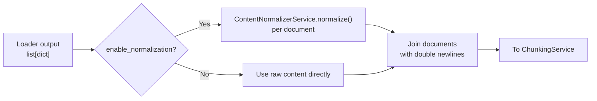
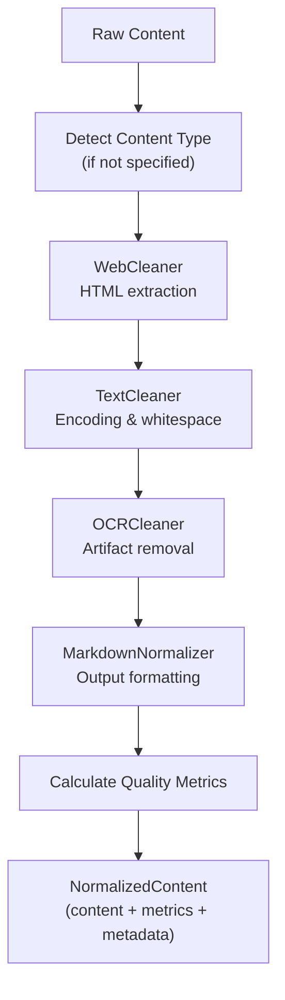
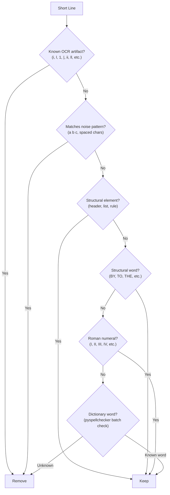

# Normalization

Content normalization is the second step of the [extraction pipeline](overview.md), running immediately after [document loading](loading.md) and before chunking. It transforms raw extracted text into clean, consistent Markdown output by fixing encoding errors, removing OCR artifacts, stripping HTML boilerplate, and normalizing formatting.

## Why Normalization Exists

Raw document text is messy. PDFs produce mojibake and scattered whitespace. OCR outputs gibberish lines and duplicate paragraphs. Web scrapes include navigation, ads, and script tags. Without normalization, these artifacts propagate into chunks and embeddings, degrading RAG search quality and confusing the LLM during entity extraction.

Normalization addresses this by running a configurable pipeline of cleaners and a transformer to produce uniform Markdown output, regardless of the original source format.

## When Normalization Runs

Normalization runs inside `handle_index_document()` on the **Operations queue**, between loading and chunking. The `_extract_text()` helper function orchestrates it:



Each document in the loader output is normalized independently. The `ContentType` is inferred from the file extension, which determines how cleaners and the transformer behave.

### When Normalization is Skipped

Normalization is skipped in two cases:

1. **User opt-out** -- The upload API accepts `enable_normalization=false`. This is logged as `import_document_normalization_skipped` with `reason="disabled_by_user"`.
2. **Structured data** -- CSV and JSON files should typically be uploaded with normalization disabled to preserve their exact structure. The UI recommends this for structured formats.

:::tip[When to disable normalization]

Disable normalization for code files, CSV data, JSON data, or any content where exact formatting matters. Normalization is designed for natural language documents (PDFs, web pages, scanned images).

:::

## Pipeline Architecture

`ContentNormalizerService` orchestrates a sequential pipeline of **cleaners** followed by a single **transformer**:



Each cleaner receives the output of the previous one and returns a tuple of `(cleaned_content, operations_applied)`. The operations list tracks exactly what was done, enabling quality assessment and debugging.

### Content Type Detection

If the caller does not specify a `ContentType`, the service auto-detects it by examining the content:

| Detection | Pattern |
|-----------|---------|
| HTML | `<!doctype html>`, `<html>`, `<head>`, `<body>` tags |
| JSON | Content starts with `{`/`[` and ends with `}`/`]` |
| CSV | 2+ lines with consistent comma counts |
| Markdown | Headers (`# ...`), code fences, tables, list markers |
| Code | `def`/`class`/`function`/`const`/`let`/`import` keywords |
| Text | Default fallback |

The detected type is stored in the working metadata and passed to cleaners and the transformer for type-aware behavior.

## Cleaners

Cleaners implement the `CleanerProtocol`:

```python
@runtime_checkable
class CleanerProtocol(Protocol):
    @property
    def name(self) -> str: ...

    def clean(self, content: str, metadata: dict | None = None) -> CleanerResult: ...
```

The protocol is `runtime_checkable`, so custom cleaners can be validated with `isinstance()`.

`clean()` returns a `CleanerResult` dataclass with the cleaned content,
the ops list, and three per-removal counts that drive the source-row
[quality counters](quality-counters.md):

| Field | Type | Populated by |
|-------|------|--------------|
| `content` | str | every cleaner — the cleaned text |
| `ops` | list[str] | every cleaner — operation identifiers (e.g. `"encoding_fix"`, `"gibberish_removal:14"`) |
| `lines_removed` | int | OCR cleaner (gibberish + page artifact passes); 0 from text / web cleaners |
| `paragraphs_deduplicated` | int | OCR cleaner's duplicate-paragraph pass; 0 from text / web cleaners |
| `chars_removed` | int | text cleaner (net before/after delta); 0 elsewhere |

The dataclass also defines `__iter__` yielding `(content, ops)` so
pre-W11 callers that wrote `content, ops = cleaner.clean(...)` keep
working. New code should index the dataclass fields by name.

### WebCleaner

**Purpose:** Extracts main content from HTML, removing boilerplate (navigation, ads, footers, scripts, styles).

**When it activates:** Only processes content when the metadata `content_type` is `HTML` or `WEB`, or when the content looks like HTML (detected via tag patterns in the first 1000 characters).

**Extraction methods (in priority order):**

1. **Trafilatura** (preferred) -- High-quality web content extraction with configurable output format (markdown or text). Favors precision over recall, includes tables and links, deduplicates content. Requires the `trafilatura` package.
2. **Basic regex fallback** -- Strips `<script>`, `<style>`, `<nav>`, `<footer>`, `<header>`, `<aside>` elements, converts block elements to newlines, removes remaining tags, decodes HTML entities. Used when trafilatura is unavailable.

**Operations recorded:** `trafilatura_extraction` or `basic_html_extraction`.

#### Phase 6: Trafilatura settings exposed (2026-05-08)

Four trafilatura options are now configurable via `NormalizerSettings`:

| Setting | Default | Trafilatura kwarg | Description |
|---------|---------|-------------------|-------------|
| `web_favor_precision` | `True` | `favor_precision` | Prefer a smaller high-quality extract over a larger noisy one |
| `web_include_images` | `False` | `include_images` | Include alt-text from `` tags in the extract |
| `web_include_comments` | `False` | `include_comments` | Include comment sections (e.g., blog comments) |
| `web_basic_strip_tags` | `["script", "style", "nav", "footer", "header", "aside", "noscript"]` | N/A | Tag list used by the regex fallback path when trafilatura is unavailable |

The basic strip-tag list was previously hardcoded; it is now a setting so
operators can suppress additional tags (e.g., `"figure"`, `"table"`) or
preserve tags they need without patching the source.

### TextCleaner

**Purpose:** Fixes fundamental text issues -- encoding errors, unicode inconsistencies, control characters, and whitespace irregularities.

**Operations (applied in order, each controlled by a setting):**

| Step | Setting | What It Does |
|------|---------|--------------|
| Encoding fix | `enable_encoding_fix` | Uses `ftfy` to repair mojibake (e.g., `café` becomes `cafe`). Fixes character width, line breaks, surrogates, and terminal escapes. |
| Unicode normalization | `enable_unicode_normalize` | Normalizes to NFC form via `unicodedata.normalize("NFC", ...)`. Ensures characters with multiple encodings use a single canonical form. |
| Control character removal | `enable_control_char_removal` | Strips ASCII control chars (0x00-0x1F except tab/newline/CR), DEL (0x7F), and C1 control chars (0x80-0x9F). |
| Whitespace normalization | `enable_whitespace_normalize` | Converts non-breaking spaces, em/en spaces, and other unicode whitespace to standard space. Normalizes line endings to `\n`. Collapses multiple spaces. Collapses 3+ newlines to 2 (preserving paragraph breaks). Strips trailing whitespace per line. |
| BOM removal | Always on | Removes UTF-8/UTF-16 Byte Order Marks from the start of content. |

**Operations recorded:** `encoding_fix`, `unicode_normalize`, `control_char_removal`, `whitespace_normalize`, `bom_removal`.

:::note[Dependency: ftfy]

The encoding fix step requires the `ftfy` package. If unavailable, it logs a warning and skips the step gracefully -- the remaining cleaners still run.

:::

### OCRCleaner

**Purpose:** Removes artifacts specific to OCR output -- gibberish lines, duplicate paragraphs from multi-column misdetection, and page artifacts (headers, footers, standalone page numbers).

**When it activates:** Only runs when `enable_ocr_cleaning` is `True` in settings (enabled by default) **and** the source's `extraction_method` metadata names an OCR-derived pipeline (PDF text extraction, Tesseract OCR, vision-LLM-derived text). Plain `.txt` / `.md`, HTML loaders, Office loaders, and similar non-OCR sources skip this cleaner entirely so short identifiers like `git`, `npm`, `K8s`, or `awk` survive normalization.

The scoping is implemented by an `applies_to(metadata)` predicate on
the cleaner — the registry only invokes cleaners whose predicate
returns truthy for the source's metadata. Cleaners without an
`applies_to` predicate (the text and web cleaners) always fire.

When the OCR cleaner's predicate returns `False`, the skip is counted in
`OCR_PREDICATE_SKIPPED` / `ocr_predicate_skipped` (Phase 2, 2026-05-08)
so operators can confirm that the cleaner was intentionally bypassed for
non-OCR content rather than silently inactive.

**Operations (applied in order):**

#### 1. Gibberish Line Removal

Uses a hybrid validation approach for short lines (below `min_line_length` setting):



Key design decisions:

- **Batch spell checking** -- Words needing validation are collected in a first pass and checked in a single batch via `pyspellchecker`, avoiding per-line overhead.
- **Structural words allowlist** -- Common short words that legitimately appear alone on lines (BY, TO, THE, FOR, etc.) are always kept regardless of length.
- **Roman numerals** -- Pattern-matched up to XXXIX and always kept.
- **Known OCR artifacts** -- A hardcoded set of single characters and short sequences (`i`, `l`, `1`, `|`, `ii`, `ll`, `hi`, `ie`, etc.) that are almost always OCR noise.

For longer lines, traditional heuristics apply:

- **Alpha ratio** -- Lines below `min_alpha_ratio` are removed (too many non-alphabetic characters).
- **Gibberish patterns** -- Excessive consonant clusters (5+ consonants without vowels), random capitalization alternation.

#### 2. Duplicate Paragraph Removal

Uses a three-phase approach for O(n) performance:

1. **Exact MD5 hash** -- Catches identical duplicates instantly
2. **Normalized hash** -- Catches case/whitespace variations (lowercased, whitespace-collapsed)
3. **Simhash fuzzy matching** -- Catches OCR character errors. Uses Hamming distance < 10 bits as a pre-filter, then confirms with `SequenceMatcher` against a `duplicate_similarity_threshold`. Only checks the 50 most recent paragraphs (duplicates from column misdetection are typically adjacent).

Falls back to pure `SequenceMatcher` comparison if the `simhash` package is unavailable.

#### 3. Page Artifact Removal

Detects and removes:

- **Standalone page numbers** -- Patterns like `42`, `-1-`, `Page 1`, `p. 1`
- **Repeated short lines** -- Lines under 30 characters appearing more than twice (likely headers/footers repeated on each page)

**Operations recorded:** `gibberish_removal:N`, `duplicate_removal:N`, `artifact_removal:N` (where N is the count of items removed).

:::info[Optional dependencies]

The OCR cleaner has three optional dependencies that enhance quality but are not required:

- `pyspellchecker` -- Dictionary validation for short lines (falls back to structural/allowlist checks only)
- `simhash` -- Fast fuzzy duplicate detection (falls back to `SequenceMatcher` for recent paragraphs)
- `ftfy` -- Used by TextCleaner, not OCRCleaner directly

:::

## Transformer

After all cleaners run, the `MarkdownNormalizer` transformer converts the cleaned content into consistent Markdown formatting.

### MarkdownNormalizer

**Purpose:** Ensures uniform Markdown structure regardless of how the content was originally formatted.

**When it activates:** Only runs when `enable_markdown_normalize` is `True` in settings.

**Normalization steps:**

| Step | What It Does |
|------|--------------|
| Header normalization | Ensures space after `#` symbols, removes trailing `#` markers |
| List marker standardization | Converts `*` and `+` to `-` for unordered lists; normalizes `1)` to `1.` |
| Horizontal rule normalization | Converts various styles (`***`, `___`, `- - -`) to `---` |
| Emphasis normalization | Converts `__bold__` to `**bold**`, `_italic_` to `*italic*` |
| Spacing normalization | Adds blank lines before headers/lists/code blocks; limits consecutive blank lines to 2 |
| JSON wrapping | Wraps raw JSON content in ` ```json ` code fences |
| Code wrapping | Wraps detected code in fenced code blocks with language detection (Python, JavaScript, HTML, SQL, JSON) |

The transformer is content-type-aware: JSON and code-specific transformations only apply when the source type matches.

## Quality Metrics

After normalization, the service calculates `QualityMetrics` to assess the output:

| Metric | Weight | Description |
|--------|--------|-------------|
| `text_ratio` | 30% | Ratio of alphabetic characters to total characters. Higher = cleaner text. |
| `language_confidence` | 30% | Heuristic score based on average word length (3-10 chars is ideal) and presence of common English words. |
| `duplicate_ratio` | 20% | How much content was removed (inverted: 1.0 - ratio). Higher removal = more duplication was present. |
| `structure_score` | 20% | Presence of Markdown structure: headers (+0.15), lists (+0.1), paragraphs (+0.1), code blocks (+0.1), tables (+0.05). Base: 0.5. |

The overall score is `text_ratio * 0.3 + language_confidence * 0.3 + (1 - duplicate_ratio) * 0.2 + structure_score * 0.2`.

Quality metrics are logged after normalization and available in the `NormalizedContent` output. The indexing handler logs the average quality score across all documents for monitoring.

## Output Structure

The normalization service returns a `NormalizedContent` dataclass:

```python
@dataclass
class NormalizedContent:
    content: str                  # Cleaned and normalized text
    original_content: str         # Original text before normalization
    content_type: ContentType     # Detected or specified content type
    quality_metrics: QualityMetrics
    metadata: dict                # Enriched metadata (includes content_type)

    @property
    def char_count(self) -> int: ...
    @property
    def word_count(self) -> int: ...
```

The indexing handler joins all normalized documents with `"\n\n"` to produce the full text for chunking.

## Configuration

Normalization behavior is controlled by `NormalizerSettings` (defined in `chaoscypher_core.settings`).

:::info[Settings now reach the cleaners]

Pre-W5, the operator's `NormalizerSettings` were silently ignored — the indexing handler instantiated cleaners with default settings regardless of what was configured. As of May 2026 the handler threads the resolved `NormalizerSettings` through `IndexingService` to every cleaner instance, so flipping `enable_ocr_cleaning: false` in `settings.yaml` actually disables the OCR cleaner instead of pretending to.

:::

| Setting | Default | Effect |
|---------|---------|--------|
| `enable_encoding_fix` | `True` | Enable ftfy encoding repair |
| `enable_unicode_normalize` | `True` | Enable NFC unicode normalization |
| `enable_control_char_removal` | `True` | Strip non-printable characters |
| `enable_whitespace_normalize` | `True` | Normalize whitespace and line endings |
| `enable_ocr_cleaning` | `True` | Enable OCR artifact removal |
| `enable_duplicate_removal` | `True` | Enable paragraph deduplication |
| `enable_markdown_normalize` | `True` | Enable markdown formatting normalization |
| `min_line_length` | `10` | Threshold for short line gibberish detection (formerly `ocr_min_line_length`) |
| `min_alpha_ratio` | `0.60` | Minimum alphabetic character ratio for longer lines (formerly `ocr_min_alpha_ratio`) |
| `duplicate_similarity_threshold` | `0.85` | SequenceMatcher threshold for fuzzy dedup (formerly `ocr_duplicate_similarity_threshold`) |
| `target_format` | `"markdown"` | Output format for web extraction |
| `web_favor_precision` | `True` | Trafilatura precision mode (Phase 6) |
| `web_include_images` | `False` | Include image alt-text in web extract (Phase 6) |
| `web_include_comments` | `False` | Include comment sections in web extract (Phase 6) |
| `web_basic_strip_tags` | (see Phase 6 above) | Tag list for fallback regex stripper (Phase 6) |

## Phase 4: Domain normalizer overrides (2026-05-08)

`DomainNormalizerOverrides` is a new section in each domain's JSON-LD
that lets domains flip individual cleaner flags without defining a
full custom `NormalizerSettings` object:

```json
{
  "normalizer_overrides": {
    "enable_encoding_fix": true,
    "enable_ocr_cleaning": false,
    "enable_duplicate_removal": true,
    "enable_markdown_normalize": false
  }
}
```

Any key present in `normalizer_overrides` overrides the global
`NormalizerSettings` value for sources processed under that domain.
Keys absent from the override block inherit the global setting.
This is applied by `ContentNormalizerService` after domain resolution
so the override is transparent to individual cleaner implementations.

## Phase 3: Magic numbers lifted to NormalizerSettings (2026-05-08)

Previously hardcoded constants have been promoted to `NormalizerSettings`:

| Setting | Old constant | Default | Description |
|---------|-------------|---------|-------------|
| `ocr_min_line_length` | `10` | `10` | Short-line threshold for gibberish detection |
| `ocr_min_alpha_ratio` | `0.60` | `0.60` | Minimum alphabetic-character ratio for longer lines |
| `ocr_duplicate_similarity_threshold` | `0.85` | `0.85` | SequenceMatcher threshold for fuzzy duplicate detection |
| `ocr_artifact_line_max_length` | `30` | `30` | Lines shorter than this repeated 3+ times are treated as headers/footers |
| `ocr_max_recent_paragraphs_check` | `50` | `50` | Window of recent paragraphs to check for near-duplicates |
| `ftfy_fix_encoding` | `True` | `True` | Enable ftfy's encoding-fix pass |
| `ftfy_fix_latin_ligatures` | `True` | `True` | Expand Latin ligatures (fi → fi, etc.) |
| `ftfy_fix_character_width` | `True` | `True` | Normalize full-width/half-width characters |
| `ftfy_uncurl_quotes` | `True` | `True` | Normalize curly quotes to straight quotes |

These are overridable in `settings.yaml` under the `normalizer:` key.

## Custom Cleaners

Custom cleaners can be injected into `ContentNormalizerService` via the `cleaners` constructor parameter:

```python
from chaoscypher_core.services.sources.normalizer.cleaners import CleanerResult


class MyCustomCleaner:
    @property
    def name(self) -> str:
        return "my_custom_cleaner"

    def clean(self, content: str, metadata: dict | None = None) -> CleanerResult:
        cleaned = content.replace("REDACTED", "[REMOVED]")
        return CleanerResult(
            content=cleaned,
            ops=["custom_redaction"],
            chars_removed=len(content) - len(cleaned),
        )


# Use custom cleaner pipeline
service = ContentNormalizerService(
    cleaners=[WebCleaner(settings), TextCleaner(settings), MyCustomCleaner()]
)
```

The custom cleaner must satisfy `CleanerProtocol` (runtime-checkable via `isinstance()`). Counts you populate flow through to the source's [quality counters](quality-counters.md); leaving them at 0 is fine when the cleaner doesn't naturally track that signal.

## Code Locations

| Component | Path |
|-----------|------|
| ContentNormalizerService | `packages/core/src/chaoscypher_core/services/sources/normalizer/service.py` |
| Normalizer `__init__` (barrel) | `packages/core/src/chaoscypher_core/services/sources/normalizer/__init__.py` |
| Models (ContentType, QualityMetrics, NormalizedContent) | `packages/core/src/chaoscypher_core/services/sources/normalizer/models.py` |
| CleanerProtocol | `packages/core/src/chaoscypher_core/services/sources/normalizer/cleaners/base.py` |
| TextCleaner | `packages/core/src/chaoscypher_core/services/sources/normalizer/cleaners/text_cleaner.py` |
| OCRCleaner | `packages/core/src/chaoscypher_core/services/sources/normalizer/cleaners/ocr_cleaner.py` |
| WebCleaner | `packages/core/src/chaoscypher_core/services/sources/normalizer/cleaners/web_cleaner.py` |
| TransformerProtocol | `packages/core/src/chaoscypher_core/services/sources/normalizer/transformers/base.py` |
| MarkdownNormalizer | `packages/core/src/chaoscypher_core/services/sources/normalizer/transformers/markdown_transformer.py` |
| Indexing handler (calls normalizer) | `packages/core/src/chaoscypher_core/operations/importing/indexing_handler.py` |
