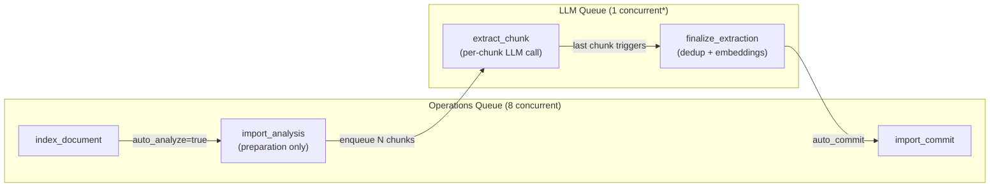

# Extraction Pipeline Overview

The extraction pipeline transforms uploaded documents into knowledge graph entities. It runs as a multi-stage, asynchronous pipeline distributed across the **Operations queue** (CPU-bound work) and the **LLM queue** (model inference). Each stage transitions the source through a well-defined status, enabling the UI to show real-time progress and allowing recovery from failures at any point.

## Full Pipeline Diagram

```mermaid
flowchart TD
    Upload["Upload\n(Cortex API)"] -->|POST /sources| Validate["Validate & Store\n(SourceProcessingService)"]
    Validate -->|Queue: Operations| Indexing

    subgraph Indexing Stage
        Indexing["Load Document\n(LoaderRegistry)"] --> Normalize["Normalize Content\n(ContentNormalizerService)"]
        Normalize --> Chunk["Create Chunks\n(ChunkingService)"]
        Chunk --> Embed["Generate Embeddings\n(IndexingService)"]
    end

    Embed -->|status: indexed| Decision{auto_analyze?}
    Decision -->|No| Done1["Ready for RAG Search"]
    Decision -->|Yes, Queue: Operations| Analysis

    subgraph Extraction Stage
        Analysis["Prepare Extraction\n(ImportOperationsService)"] --> DomainDetect["Detect Domain\n(DomainRegistry)"]
        DomainDetect --> ContentFilter["Filter Non-Essential Content\n(orchestration.py)"]
        ContentFilter --> DepthFilter["Apply Depth Strategy\n(quick/full)"]
        DepthFilter -->|Queue: LLM| ChunkExtract["Extract Entities per Chunk\n(AIEntityExtractor)"]
        ChunkExtract -->|All chunks done| Finalize["Finalize Extraction\n(extraction_finalizer)"]
    end

    subgraph Finalization Stage
        Finalize --> Aggregate["Aggregate Chunk Results"]
        Aggregate --> Dedup["Deduplicate Entities\n(EntityProcessor)"]
        Dedup --> NormEnt["Normalize & Embed Entities\n(ExtractionService)"]
        NormEnt --> QualScore["Cache Quality Scores\n(QualityScorer)"]
    end

    QualScore -->|status: extracted| AutoCommit{auto_commit?}
    AutoCommit -->|Yes, Queue: Operations| Commit

    subgraph Commit Stage
        Commit["Match Templates\n(EntityTemplateMatcher)"] --> CreateNodes["Create Graph Nodes\n(EntityCommitHandler)"]
        CreateNodes --> CreateEdges["Create Graph Edges\n(RelationshipCommitHandler)"]
        CreateEdges --> IndexNodes["Index in Search\n(SearchRepository)"]
        IndexNodes --> Reload["Trigger Cortex Reload"]
    end

    Reload -->|status: committed| Done2["Knowledge Graph Updated"]
```

## Status Flow

### Public phases (API and UI)

The `progress` field on `SourceDetailResponse` (and `SourceResponse`) exposes a simplified 4-phase view that the UI can display directly, without needing to understand the internal state machine:

| Phase | `is_searchable` | Meaning |
|-------|:---------------:|---------|
| `waiting_to_index` | No | Pending or failed — nothing useful exists yet |
| `indexing` | No | Chunking and embedding in progress |
| `extracting` | **Yes** | Indexed and searchable; optional extraction is running or complete |
| `ready` | **Yes** | Fully committed to the knowledge graph |

`is_searchable` becomes `True` once indexing completes and remains `True` through all extraction and commit stages.

### Internal states (for contributors / debugging)

Sources progress through these 11 internal statuses as the pipeline executes. Each transition is atomic — if a stage fails, the source is marked with an error status and the `error_stage` field records where the failure occurred.

Internal 11-state SourceStatus table

| Status | Maps to public phase | Set By |
|--------|---------------------|--------|
| `pending` | `waiting_to_index` | `SourceProcessingService.upload_file()` |
| `indexing` | `indexing` | `handle_index_document()` via `adapter.start_indexing()` |
| `vision_pending` | `indexing` | `handle_index_document()` after enqueuing per-page vision tasks (atomic CAS `INDEXING → VISION_PENDING`); the vision finalizer CAS-reverts it to `indexing` |
| `indexed` | `extracting` | `adapter.complete_indexing()` |
| `awaiting_confirmation` | `extracting` | `park_for_confirmation()` (domain-confirmation gate; `bootstrap.py`). `confirm_extraction()` CASes it back to `indexed` and re-queues |
| `extracting` | `extracting` | `adapter.try_claim_extraction()` |
| `mcp_extracting` | `extracting` | `adapter.try_claim_extraction()` (MCP path) |
| `extracted` | `extracting` | Extraction finalizer |
| `committing` | `extracting` | `SourceCommitService.commit()` |
| `committed` | `ready` | `SourceCommitService.commit()` |
| `error` | `waiting_to_index` | Any stage on exception |

:::note[Indexed is a usable state]

Once a source reaches `indexed`, it is fully usable for RAG search (semantic similarity, full-text search). Entity extraction and commit are optional stages that enrich the knowledge graph but are not required for search.

:::

## Stage Detail Pages

Each pipeline stage is documented in detail on its own page:

| Stage | Page | Queue | Key Service |
|-------|------|-------|-------------|
| Loading | [loading.md](loading.md) | Operations | `LoaderRegistry` |
| Encoding detection | [encoding.md](encoding.md) | Operations | `detect_encoding` helper |
| Normalization | [normalization.md](normalization.md) | Operations | `ContentNormalizerService` |
| Chunking | [chunking.md](chunking.md) | Operations | `ChunkingService` |
| Indexing | [indexing.md](indexing.md) | Operations | `IndexingService` |
| Entity Extraction | [entity-extraction.md](entity-extraction.md) | LLM | `AIEntityExtractor` |
| Deduplication | [deduplication.md](deduplication.md) | LLM | `EntityProcessor` |
| Relationship Mapping | [relationships.md](relationships.md) | LLM | `ExtractionService` |
| Commit | [commit.md](commit.md) | Operations | `SourceCommitService` |
| Quality counters (cross-cutting) | [quality-counters.md](quality-counters.md) | — | `chaoscypher_core.services.quality.counters` |

:::info[Production extraction parity]

Cortex (`finalize_distributed_extraction`), the Neuron worker
(`_finalize_extraction_inner`), the standalone CLI extractor
(`extract_entities_from_groups`), and the MCP path all share one
post-extraction pipeline: `apply_structural_and_normalization` in
`utils/post_extraction.py`. The structural-entity filter and type
normalization fire in lockstep across all four code paths, so the same
source produces the same graph regardless of which entry point ran the
extraction.

:::

## Queue Routing

The pipeline distributes work across two queues based on whether the stage requires LLM inference:

:::info[LLM queue concurrency]

The LLM queue defaults to 1 concurrent task but scales dynamically when multi-instance Ollama load balancing is configured. Each chunk extraction task makes a single LLM call, so throughput scales linearly with available model instances.

:::

### Handler Registration

Handlers are registered at worker startup in the Neuron package:

- **Operations handlers** (`chaoscypher_neuron.setup.ops_handlers`): `index_document`, `import_analysis`, `import_commit`
- **LLM handlers** (`chaoscypher_neuron.setup.llm_handlers`): `extract_chunk`, `finalize_extraction` (via `ChunkExtractionOperationsService`)

## Extraction Gating

Only one source can be in the `extracting` state at a time. This prevents LLM queue saturation when multiple files are uploaded simultaneously.

When a source requests extraction while another is already extracting:

1. `adapter.try_claim_extraction()` returns `False` (atomic check)
2. `adapter.mark_extraction_waiting()` stamps `extraction_queued_at` and stores the file info and analysis config for later retrieval -- the source's `status` remains `indexed`
3. When the active extraction completes, the recovery system (`chaoscypher_neuron.recovery.extraction`) picks up queued sources ordered by `extraction_queued_at` and re-queues them

:::note[No `waiting` status]

There is no `waiting` value in `SourceStatus`. When the extraction queue is paused or full, sources accumulate an `extraction_queued_at` timestamp; the source's `status` remains `indexed` until extraction begins.

:::

## Error Handling and Recovery

### Stage-Level Failure

Each stage wraps its work in a try/except and records the failure:

| Stage | Failure Method | Behavior |
|-------|---------------|----------|
| Indexing | `adapter.fail_indexing(file_id, error)` | Sets `error_stage="indexing"` |
| Extraction | `adapter.fail_extraction(file_id, error)` | Sets `error_stage="extraction"` |
| Commit | `adapter.fail_commit(file_id, error)` | Sets `error_stage="commit"` |

The source status is set to `error` with an `error_message` describing what went wrong. The `error_stage` field tells the UI exactly where the pipeline stopped.

### Chunk-Level Retry

Individual chunk extraction tasks have built-in retry (max 5 attempts via the queue system). If a chunk fails all retries, it is marked as `failed` in the `ChunkExtractionTask` table. The finalization step proceeds with whatever chunks succeeded -- partial extraction is better than none.

### Stale Task Detection

The `ChunkExtractionOperationsService` detects stale tasks (chunks that were queued but never completed) and can re-queue them. This handles cases where the worker crashes mid-extraction.

### Extraction Cancellation

Users can cancel an in-progress extraction via `DELETE /sources/{id}/extraction`. This:

1. Cancels all pending/queued chunk tasks in Valkey
2. Marks the extraction job as cancelled
3. Reverts source status to `indexed` (RAG remains usable)

## Progress Tracking

The pipeline provides fine-grained progress via `adapter.update_step_progress(file_id, current_step, total_steps, message)`:

**`status=indexing` phase — covers 4 pipeline stages (Loading → Normalization → Chunking → Indexing):**

1. Loading document
2. Creating chunks
3. Generating embeddings
4. Completing indexing

**Extraction phase (3 preparation steps, then N chunk steps):**

1. Preparing extraction
2. Queuing chunks for analysis
3. Analyzing chunk `i/N` (updated per chunk completion)

The UI polls `GET /sources/{id}/extraction` to display these progress updates, including estimated time remaining based on completed chunk throughput.

## Configuration

Key settings that control pipeline behavior:

| Setting | Location | Effect |
|---------|----------|--------|
| `chunking.small_chunk_size` | Settings | Size of individual text chunks |
| `chunking.group_size` | Settings | Number of small chunks per hierarchical group |
| `chunking.group_overlap` | Settings | Overlap between groups |
| `analysis.quick_sample_size` | Settings | Max groups for `quick` depth |
| `llm.extraction_examples_enabled` | Settings | Include domain examples in prompts |
| `priorities.background` | Settings | Queue priority for pipeline tasks |
| `batching.max_upload_bytes` | Settings | Maximum upload file size (unified across file uploads + URL fetches; default 500 MB). The legacy `source_processing.source_processing_max_file_size_gb` is deprecated as of 2026-05-06 and no longer honored. |

## Content Filtering

Before chunks are sent to the LLM for entity extraction, a content filtering stage strips non-essential content that would waste LLM tokens without producing useful entities. Filtered content remains in the original chunks for RAG search — only the copies sent to extraction are modified.

### How It Works

1. **Resolve exclusions** — `resolve_content_exclusions()` loads the domain's `content_exclusions` config, which references built-in categories and optional custom patterns
2. **Strip chunk content** — `strip_chunk_content()` applies matchers to each chunk copy. Line-ratio mode strips matching lines; count mode excludes entire chunks
3. **Filter short chunks** — Chunks whose content was stripped by a filter and falls below 100 characters after stripping are excluded. Chunks that no filter touched are always kept, regardless of length.
4. **Build extraction groups** — `build_extraction_groups()` packs remaining chunks into token-budgeted groups for LLM calls

### Built-In Categories

15 categories are available for domain configuration:

| Category | What It Matches |
|----------|----------------|
| `toc` | Table of contents, navigation listings |
| `changelog` | Version notes, release history |
| `legal` | Copyright, license, terms of service |
| `bibliography` | References, citations, works cited |
| `acknowledgments` | Dedications, prefaces, author bios |
| `boilerplate` | Formatting artifacts, stubs |
| `metadata` | Front matter, revision history |
| `code_blocks` | Source code, config snippets |
| `data_tables` | Tabular data, statistical output |
| `math` | Equations, formulas, LaTeX |
| `api_tables` | Auto-generated parameter tables |
| `procedural` | Installation steps, setup instructions |
| `advertising` | Marketing copy, CTAs |
| `web_artifacts` | Cookie banners, navigation chrome |
| `bulk_lists` | Long enumeration lists without narrative |

### Per-Source Control

Content filtering is enabled by default on upload (`content_filtering=true`). It can be disabled per source when exact content preservation is needed for extraction.

## Code Locations

| Component | Path |
|-----------|------|
| Upload API | `packages/cortex/src/chaoscypher_cortex/features/sources/api.py` |
| Source Processing Service | `packages/core/src/chaoscypher_core/services/sources/management/service.py` |
| Import Operations Service | `packages/core/src/chaoscypher_core/operations/importing/import_service.py` |
| Indexing Handler | `packages/core/src/chaoscypher_core/operations/importing/indexing_handler.py` |
| Chunk Extraction Service | `packages/core/src/chaoscypher_core/operations/extraction/chunk_extraction_service.py` |
| Extraction Finalizer | `packages/core/src/chaoscypher_core/operations/extraction/extraction_finalizer.py` |
| Orchestration Helpers | `packages/core/src/chaoscypher_core/services/sources/engine/extraction/orchestration.py` |
| Post-extraction helpers (structural + normalize parity) | `packages/core/src/chaoscypher_core/services/sources/engine/extraction/utils/post_extraction.py` |
| Commit Service | `packages/core/src/chaoscypher_core/services/sources/engine/commit/service.py` |
| Deduplication | `packages/core/src/chaoscypher_core/services/sources/engine/deduplication/service.py` |
| Encoding helper | `packages/core/src/chaoscypher_core/utils/encoding.py` |
| Quality counters (typed increment + status transitions) | `packages/core/src/chaoscypher_core/services/quality/counters.py` |
| Neuron Worker Setup | `packages/neuron/src/chaoscypher_neuron/setup/` |

## See also

- [User guide: Sources](../../user-guide/sources.md) — how to upload and manage sources, including pipeline stages and status flow
- [API reference: Sources](../../reference/api/sources.md) — endpoint details for upload, extraction management, and source data access
