# Quality counters

The quality counter system records, on every source row, what the
extraction pipeline silently dropped, deduplicated, or merged.
45 typed counters cover every silent-drop site from loader to commit
and embedding — the original W2 set, the Phase 2 batch, Phase 5b
(PDF per-page failures), Phase 6 (loader observability), the Phase 7
audit-remediation pass on 2026-05-09 that closed the remaining drift
gaps (embedding stage, evidence / aggregator counters, the
`chunks_filtered_count` → `chunks_coalesced_count` rename to reflect the
merge-not-drop semantics, and JSON-shaped per-tag / per-shape breakdowns
for HTML and PPTX loaders), plus the later vision, per-chunk-rerun, and
fuzzy-type-match additions. The exact list always lives in the
`QualityCounter` enum (see the source-of-truth note below); the snippets
on this page are illustrative.

This page is the internal architecture reference; for the user-facing
explanation see the [Pipeline flow & quality counters](../../user-guide/data-quality.md)
in the user guide and the [Quality Metrics API](../../reference/api/quality-metrics.md)
for the field-level reference.

:::note Source of truth
The canonical list of counter columns lives in `chaoscypher_core.services.quality.counters.QualityCounter`. The SQLite adapter derives its integer-increment allowlist from that enum at import time (`SourceLifecycleMixin._COUNTER_COLUMN_ALLOWLIST = frozenset(c.value for c in QualityCounter) - _NON_INTEGER_QUALITY_COUNTERS`), so adding a counter to the enum is sufficient — no parallel allowlist edit. A drift test (`packages/core/tests/unit/adapters/sqlite/test_counter_allowlist_matches_enum.py`) fails CI if the relationship breaks. If the code snippets below drift from the live enum, the enum is correct.
:::

## Why counters

Every stage of the pipeline has at least one *defensible reason* to
remove content — duplicate paragraphs, boilerplate chunks, malformed
LLM lines, relationships pointing at non-existent entities. Pre-W2,
those drops were invisible. The quality grade told you the graph was
small without telling you whether 8 entities meant "the source was
short" or "the cleaner ate 90% of the input."

Counters make every silent drop legible without changing pipeline
behaviour: they are pure observability, never control flow.

## The `QualityCounter` enum

Every counter column lives in one place — the `QualityCounter`
StrEnum in `chaoscypher_core.services.quality.counters`:

```python
class QualityCounter(StrEnum):
    LOADER_WARNINGS = "loader_warnings_count"
    LOADER_FILES_SKIPPED = "loader_files_skipped"
    CLEANER_LINES_REMOVED = "cleaner_lines_removed"
    CLEANER_PARAGRAPHS_DEDUPLICATED = "cleaner_paragraphs_deduplicated"
    CLEANER_CHARS_REMOVED = "cleaner_chars_removed"
    CHUNKS_COALESCED = "chunks_coalesced_count"  # renamed from CHUNKS_FILTERED (Phase 7)
    LLM_CHUNKS_TRUNCATED = "llm_chunks_truncated"
    LLM_CHUNKS_ABORTED_BY_LOOP = "llm_chunks_aborted_by_loop"
    PARSER_LINES_DROPPED = "parser_lines_dropped"
    DEDUP_ENTITIES_MERGED = "dedup_entities_merged"
    STRUCTURAL_ENTITIES_FILTERED = "structural_entities_filtered"
    ORPHAN_ENTITIES_FILTERED = "orphan_entities_filtered"
    RELATIONSHIPS_DROPPED_INVALID = "relationships_dropped_invalid"
    RELATIONSHIPS_DROPPED_CAPPED = "relationships_dropped_capped"
    CITATIONS_SKIPPED_NO_CHUNK_INDEX = "citations_skipped_no_chunk_index"
    # ... see Phase 2 / 5b / 6 / 7 additions below for the full set ...
```

The string value matches the SQL column on `sources`. Keeping the enum
in lockstep with the columns means a typo in a stage's `increment` call
surfaces as a static type error rather than a silent miss.

### Original 15 counters

```python
class QualityCounter(StrEnum):
    LOADER_WARNINGS = "loader_warnings_count"
    LOADER_FILES_SKIPPED = "loader_files_skipped"
    CLEANER_LINES_REMOVED = "cleaner_lines_removed"
    CLEANER_PARAGRAPHS_DEDUPLICATED = "cleaner_paragraphs_deduplicated"
    CLEANER_CHARS_REMOVED = "cleaner_chars_removed"
    CHUNKS_COALESCED = "chunks_coalesced_count"  # renamed from CHUNKS_FILTERED (Phase 7)
    LLM_CHUNKS_TRUNCATED = "llm_chunks_truncated"
    LLM_CHUNKS_ABORTED_BY_LOOP = "llm_chunks_aborted_by_loop"
    PARSER_LINES_DROPPED = "parser_lines_dropped"
    DEDUP_ENTITIES_MERGED = "dedup_entities_merged"
    STRUCTURAL_ENTITIES_FILTERED = "structural_entities_filtered"
    ORPHAN_ENTITIES_FILTERED = "orphan_entities_filtered"
    RELATIONSHIPS_DROPPED_INVALID = "relationships_dropped_invalid"
    RELATIONSHIPS_DROPPED_CAPPED = "relationships_dropped_capped"
    CITATIONS_SKIPPED_NO_CHUNK_INDEX = "citations_skipped_no_chunk_index"
```

### Phase 2 additions (2026-05-08)

A batch of counters wired across the pipeline to close previously-invisible
drop sites (the `QualityCounter` enum is the authoritative list):

```python
    # Evidence / aggregator drops
    EVIDENCE_ENTITIES_DROPPED = "evidence_entities_dropped"
    EVIDENCE_RELATIONSHIPS_DROPPED = "evidence_relationships_dropped"
    AGGREGATOR_RELATIONSHIPS_DROPPED = "aggregator_relationships_dropped"

    # LLM operational failures
    LLM_CHUNKS_TIMED_OUT = "llm_chunks_timed_out"
    LLM_CHUNKS_FAILED_PERMANENT = "llm_chunks_failed_permanent"

    # Standalone pipeline
    STANDALONE_CHUNK_FAILURES = "standalone_chunk_failures"

    # Semantic dedup fallback
    SEMANTIC_DEDUP_FALLBACKS = "semantic_dedup_fallbacks"

    # Relationship quality
    RELATIONSHIPS_DIRECTION_CORRECTED = "relationships_direction_corrected"
    RELATIONSHIPS_DROPPED_TYPE_UNMATCHED = "relationships_dropped_type_unmatched"

    # User-regex
    USER_REGEX_TIMEOUT_HITS = "user_regex_timeout_hits"

    # OCR predicate skip
    OCR_CLEANER_SKIPPED_BY_PREDICATE = "ocr_cleaner_skipped_by_predicate"

    # Chunker internals
    CHUNKER_NORMALIZE_DROPS = "chunker_normalize_drops"
    CHUNKER_PRESTRIP_LINES_REMOVED = "chunker_prestrip_lines_removed"
    CHUNKS_SKIPPED_BY_DEPTH = "chunks_skipped_by_depth"

    # Text quality
    LOADER_REPLACEMENT_CHARS_COUNT = "loader_replacement_chars_count"

    # Citation path
    CITATIONS_SKIPPED_INDEX_NOT_MAPPED = "citations_skipped_index_not_mapped"
```

### Phase 5b additions (2026-05-08)

1 new counter from the PDF loader hardening:

```python
    LOADER_PDF_PAGES_FAILED = "loader_pdf_pages_failed"
```

### Phase 6 additions (2026-05-08)

6 new loader-observability counters for granular per-format drop
visibility:

```python
    LOADER_HTML_DROPPED_TAGS = "loader_html_dropped_tags"
    LOADER_DOCX_PARAGRAPHS_SKIPPED = "loader_docx_paragraphs_skipped"
    LOADER_XLSX_ROWS_SKIPPED = "loader_xlsx_rows_skipped"
    LOADER_PPTX_SHAPES_SKIPPED = "loader_pptx_shapes_skipped"
    LOADER_CSV_ROWS_TRUNCATED = "loader_csv_rows_truncated"
    CLEANER_PLUGIN_LOAD_FAILURES = "cleaner_plugin_load_failures"
```

## Where counters fire

### Original counters

| Counter | Stage | Increment site (illustrative) |
|---------|-------|-------------------------------|
| `loader_warnings_count` | Loading | `json_loader.py` per-line parse failure; archive handlers when an entry is unreadable |
| `loader_files_skipped` | Loading | `archive_loader.py` when an entry is rejected for size / extension / security |
| `cleaner_lines_removed` | Normalization | `OCRCleaner._remove_gibberish_lines` and `_remove_page_artifacts` |
| `cleaner_paragraphs_deduplicated` | Normalization | `OCRCleaner._remove_duplicate_paragraphs` |
| `cleaner_chars_removed` | Normalization | `TextCleaner.clean` (net delta from before/after lengths) |
| `chunks_coalesced_count` | Chunking | `ChunkingService._create_small_chunks` — incremented per merge event when a sub-`min_chunk_size` chunk is coalesced into a neighbor. Phase 7 (2026-05-09) rename of the legacy `chunks_filtered_count` so the name matches the merge-not-drop semantics. |
| `llm_chunks_truncated` | LLM extraction | `_consume_extraction_stream` when finish_reason normalizes to `length` |
| `llm_chunks_aborted_by_loop` | LLM extraction | `_consume_extraction_stream` when `detector.aborted` is true |
| `parser_lines_dropped` | LLM extraction | `line_parser.parse_extraction_output` via the `stats` kwarg |
| `dedup_entities_merged` | Post-extraction | `EntityProcessor.deduplicate_entities_with_mapping` |
| `structural_entities_filtered` | Post-extraction | `apply_structural_and_normalization` (Cortex / Neuron / CLI / MCP) |
| `orphan_entities_filtered` | Commit | `commit/service.drop_orphan_entities` |
| `relationships_dropped_invalid` | Post-extraction / Commit | Index-validation passes in extractor + commit |
| `relationships_dropped_capped` | Post-extraction | Per-entity / same-source-type / total-ratio cap enforcement |
| `citations_skipped_no_chunk_index` | Commit | `_create_source_citations` and `_create_relationship_citations` when `chunk_index` is missing |

### Phase 2 counters (2026-05-08)

| Counter | Stage | Increment site |
|---------|-------|----------------|
| `evidence_entities_dropped` | LLM / post-extraction | Entities dropped because their `sent_ref` evidence fails validation |
| `evidence_relationships_dropped` | LLM / post-extraction | Relationships dropped because their `sent_ref` evidence fails validation |
| `aggregator_relationships_dropped` | Post-extraction aggregation | Relationships dropped during chunk-result aggregation (out-of-bounds or de-duplication at aggregation time) |
| `llm_chunks_timed_out` | LLM extraction | LLM call raised a timeout/cancellation for a chunk |
| `llm_chunks_failed_permanent` | LLM extraction | LLM call raised a non-timeout error for a chunk |
| `standalone_chunk_failures` | Standalone path | `extract_entities_from_groups` catches an exception on a per-chunk call in the non-distributed path |
| `semantic_dedup_fallbacks` | Deduplication | Embedding generation failed; semantic pass fell back to exact-string match |
| `relationships_direction_corrected` | Post-extraction | Direction-correction swap applied (source/target swapped to satisfy edge-template constraints) |
| `relationships_dropped_type_unmatched` | Post-extraction | Relationship type could not be matched to any edge template even with fuzzy matching |
| `user_regex_timeout_hits` | Normalization / post-extraction | User-supplied regex pattern timed out during matching |
| `ocr_cleaner_skipped_by_predicate` | Normalization | OCRCleaner's `applies_to` predicate returned `False` for this document — OCR cleaning was skipped because the source is not OCR-derived |
| `chunker_normalize_drops` | Chunking | Total regex substitutions performed across the normalization passes (page-header removals, broken-sentence joins, newline-to-space conversions, multi-space collapses) |
| `chunker_prestrip_lines_removed` | Chunking | Total lines stripped by the structural-noise pre-strip passes (page numbers, structural markers, TOC blocks, repeated headers/footers) |
| `chunks_skipped_by_depth` | Chunking | Chunk excluded because depth strategy (`quick`) did not select its group |
| `loader_replacement_chars_count` | Loading | Number of U+FFFD replacement characters found in decoded text (indicates defensive UTF-8 decode was needed) |
| `citations_skipped_index_not_mapped` | Commit | A citation's `chunk_index` exists but doesn't map to a stored chunk — commit-pipeline drift (e.g. the chunk was pruned after extraction) |

### Phase 5b counters (2026-05-08)

| Counter | Stage | Increment site |
|---------|-------|----------------|
| `loader_pdf_pages_failed` | Loading | `PdfLoader` per-page try/except — page raised during `pypdf` text extraction; page is skipped and the counter is incremented per failed page |

### Phase 6 counters (2026-05-08)

| Counter | Stage | Increment site |
|---------|-------|----------------|
| `loader_html_dropped_tags` | Loading | `HTMLLoader` — HTML tags stripped during boilerplate removal |
| `loader_docx_paragraphs_skipped` | Loading | `DOCXLoader` — paragraphs that were empty or otherwise skipped |
| `loader_xlsx_rows_skipped` | Loading | `XLSXLoader` — rows skipped (empty, header-only, or over row limit) |
| `loader_pptx_shapes_skipped` | Loading | `PPTXLoader` — shapes with no extractable text |
| `loader_csv_rows_truncated` | Loading | `CSVLoader` — rows whose content was truncated to the per-row character cap |
| `cleaner_plugin_load_failures` | Loading | `LoaderRegistry` — user plugin files that raised during import/instantiation |

## The increment helper

All increment sites go through a single typed entry point:

```python
from chaoscypher_core.services.quality.counters import (
    QualityCounter,
    increment_quality_counter,
)

await increment_quality_counter(
    adapter=adapter,
    source_id=source_id,
    database_name=database_name,
    counter=QualityCounter.CLEANER_LINES_REMOVED,
    n=lines_dropped,
)
```

The helper is `async def` purely so call sites in async pipelines can
`await` it inline without an `asyncio.to_thread()` dance — the
underlying SQL is synchronous. Failures are logged at WARNING and
swallowed; counter visibility is observability, not control flow.

The storage adapter implements two methods on
`SourceLifecycleMixin`:

| Method | Purpose |
|--------|---------|
| `increment_source_counter(*, source_id, database_name, column, n)` | Atomic `COALESCE(col, 0) + :n` UPDATE on a single allowlisted column. The allowlist is the `QualityCounter` enum. |
| `update_source_columns(*, source_id, database_name, updates)` | Bulk-set a dict of columns in one statement. Used by the encoding-set helper, the search-status transitions, and the reset path. |

## Schema history

The counter columns, the upload-settings columns, and the
`vector_indexed_at` / `vector_indexing_status` fields originally landed
together in one internal migration. Adding them together kept the schema
in sync with the design intent of the W1+W2 workstreams (what you set is
what you get; nothing disappears silently). The public repository's
migration history is squashed into a single `0001_baseline.py`, where
all 45 counter columns are defined today on the `sources` table,
alongside:

- 5 upload-settings columns: `auto_analyze`, `enable_normalization`,
  `enable_vision`, `content_filtering`, `filtering_mode`
- 1 loader-encoding column: `loader_encoding_used`
- 2 vector-search columns: `vector_indexed_at`, `vector_indexing_status`

## Reset-on-re-extract

`force_re_extract` in
`chaoscypher_core.services.sources.management.re_extraction` calls
`reset_quality_counters(adapter, source_id, database_name)`, which
issues one `update_source_columns` setting every counter back to its
post-upload default:

- Every counter column (45 as of today) → its post-upload default — `0`
  for integer counters, `null` for the JSON-shaped
  `loader_html_dropped_tags` / `loader_pptx_shapes_skipped` breakdowns
- The cumulative `llm_*` metrics → their zero/empty defaults
- `loader_encoding_used` → `null`
- `vector_indexed_at` → `null`
- `vector_indexing_status` → `"pending"`

The reset is symmetric with the baseline migration's column defaults — the row
ends up looking exactly like a freshly-uploaded source as far as the
counters are concerned. The cached quality grade (`cached_quality_grade`,
`cached_avg_entity_quality`, etc.) is **not** in the reset set; it gets
recomputed on the next finalize and overwrites the previous value.

:::note[Phase 1 fix (2026-05-08)]

Prior to the Phase 1 hardening, `force_re_extract` did not reset the
(now-removed) `vision_pages_failed` column or the cumulative `llm_*`
metrics. The `_RESET_DEFAULTS` dict in `counters.py` now covers every
counter column — including all Phase 2, 5b, and 6 additions and the
2026-05-13 `vision_pages_truncated`. `reset_for_retry` (used when a
source enters `ERROR` state) was also updated to match
`force_re_extract`'s reset coverage so both paths arrive at the same
baseline.

(The original `vision_pages_failed` / `vision_failed_pages` /
`loader_pdf_failed_pages` columns referenced here were later
dropped — vision failure history now lives in the
`vision_page_descriptions` table filtered by `status`.)

:::

**Migration note:** new counters are added in a new Alembic migration
alongside the `QualityCounter` enum and `_RESET_DEFAULTS` updates in
the same commit, so the column list and the code stay in lockstep.

## Vector-search status transitions

`vector_indexing_status` is its own state machine, not a counter, but
it lives in the same module because the same migration introduced it
and the same `update_source_columns` write path manages it.

```mermaid
stateDiagram-v2
    [*] --> pending: source uploaded
    pending --> indexed: post-commit indexing succeeded
    pending --> degraded: indexing call raised; retry queued
    degraded --> indexed: orphan-sweep retry succeeded
    degraded --> failed: orphan-sweep retries exhausted
    indexed --> pending: force_re_extract
    failed --> pending: force_re_extract
```



Helpers in `chaoscypher_core.services.quality.counters`:

- `mark_search_indexing_pending` — start of post-commit indexing
- `mark_search_indexing_indexed` — both node + chunk vector writes succeeded; stamps `vector_indexed_at`
- `mark_search_indexing_degraded` — at least one indexing call raised; commit enqueued a retry
- `mark_search_indexing_failed` — sweep worker exhausted retries

All four helpers are best-effort — failure to write the status is
logged and swallowed. Status is observability, not control flow.

## See also

- [Pipeline flow & quality counters (user guide)](../../user-guide/data-quality.md) — when to consult counters vs. the grade
- [Quality Metrics API](../../reference/api/quality-metrics.md) — field-level reference
- [Search Status (user guide)](../../user-guide/search-status.md) — the four `vector_indexing_status` states
