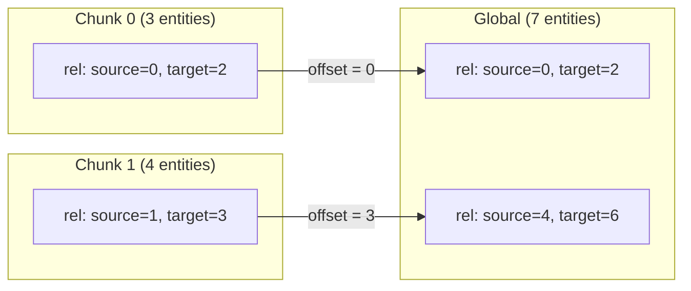
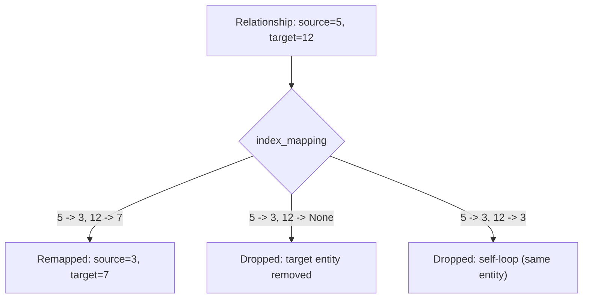
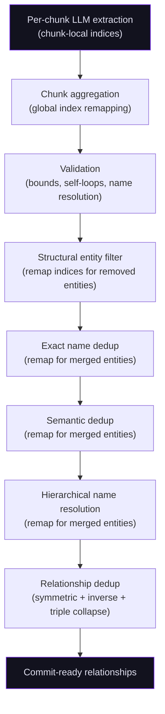

# Relationship Mapping

Relationships are the edges of the knowledge graph -- they connect entities to each other with typed, directional links. Unlike entities, which are extracted primarily from noun phrases and descriptions, relationships are extracted from the verbs, prepositions, and contextual connections that the LLM identifies between entities within each chunk.

This page covers how relationships flow from initial extraction through to validated, deduplicated edge data ready for the commit phase.

## Extraction: A Separate Pass 2 LLM Call

Relationships are extracted in a separate **Pass 2 LLM call**, after entities are extracted and filtered in Pass 1. The relationship pass receives the filtered Pass-1 entity list (serialized with **chunk-local integer indices**) and produces relationships that reference those entities by index. See [Per-Chunk 2-Pass Extraction](entity-extraction.md#per-chunk-2-pass-extraction) for the full two-pass flow and rationale.

The extraction uses a simple, robust **pipe-delimited** format rather than JSON or tool calling. Pass 2 emits one `R|` line per relationship:

```
E|name|type|aliases|confidence|sent_ref|description
P|entity_index|key|value
R|source_index|target_index|type|confidence|sent_ref|justification
```

The `R|` lines reference entities by their chunk-local integer index (`source_index` / `target_index`) into the Pass-1 entity list. See the [Pipe-Delimited Output Format](entity-extraction.md#pipe-delimited-output-format) section for the full format and parsing rules.

After parsing, each relationship carries this metadata:

| Field | Description |
|-------|-------------|
| `source` / `target` | Integer indices into the chunk's entity list |
| `type` | Relationship type label (e.g., `developed`, `located_in`, `parent_of`) |
| `confidence` | LLM-assigned confidence score (0.0 - 1.0) |
| `justification` | LLM-generated explanation of why this relationship exists |
| `sent_ref` | Sentence reference(s) in the source chunk that evidence this relationship |
| `chunk_index` | Which chunk this relationship was extracted from |
| `properties` | Optional additional properties |

## Index Aggregation Across Chunks

When per-chunk results are aggregated into a global list, relationship indices must be **remapped from chunk-local to global scope**. The `aggregate_chunk_results()` function handles this by tracking an entity offset as it concatenates chunk entity lists:



Chunk 1's indices are shifted by the number of entities from chunk 0 (3), so `source=1` becomes `source=4` and `target=3` becomes `target=6`.

**Implementation:** `orchestration.py` -- `aggregate_chunk_results()`

## Reference Resolution

After aggregation, entity indices must survive the deduplication pipeline. Every deduplication stage produces an `index_mapping` dict that maps old entity indices to new ones (or `None` for removed entities). Relationships are remapped through each stage via `EntityProcessor.remap_relationship_indices()`.

### Remapping Rules



| Condition | Action |
|-----------|--------|
| Both indices map to valid new indices | Remap and keep |
| Either index maps to `None` (entity removed) | Drop relationship |
| Both indices map to the **same** new index (entities merged) | Drop as self-loop |
| Non-integer source/target values | Drop with warning |

Self-loop detection is critical: when two entities merge (e.g., "Einstein" and "Albert Einstein" collapse into one), any relationship between them becomes a self-referential edge and is removed.

**Implementation:** `EntityProcessor.remap_relationship_indices()` in `deduplication/service.py`

## Relationship Validation

Before relationships enter the deduplication pipeline, they go through validation in the extraction layer:

1. **Bounds checking:** Source and target indices must be valid integers within the entity list range.
2. **Self-loop rejection:** Relationships where source equals target are dropped immediately.
3. **Name-based resolution (NLP workflow):** When relationships use entity names (`from`/`to` fields) instead of integer indices, the validator resolves names to indices via a case-insensitive name/alias index built from the entity list.

**Implementation:** `validate_relationships()` in `extraction/utils/entity_cleaner.py`

## Relationship Deduplication

After entity deduplication is complete, relationships go through their own deduplication pass:

### Exact Triple Dedup

Duplicate `(source, target, type)` triples are collapsed. When duplicates exist, the relationship with the **highest confidence** is kept. This commonly occurs when the same relationship is extracted from overlapping chunks.

### Symmetric Relationship Collapse

For domain-defined **symmetric relationship types** (e.g., `spouse_of`, `interacts_with`, `allies_with`), the pair `(A, B)` and `(B, A)` are semantically identical. The deduplication pass normalizes these by sorting the node pair and keeping only the highest-confidence direction.

```
(Einstein, Bohr, "collaborates_with", conf=0.9)
(Bohr, Einstein, "collaborates_with", conf=0.85)
  --> Keep: (Einstein, Bohr, "collaborates_with", conf=0.9)
```

Symmetric types are provided by the domain configuration via `get_symmetric_relationships()`.

### Inverse-Pair Collapse

For domain-defined **inverse relationship pairs** (e.g., `parent_of`/`child_of`, `employs`/`employed_by`), the extraction may produce both directions. Since the commit phase auto-generates inverse edges, having both in the extraction results would create duplicates. The dedup pass removes the inverse direction if the canonical direction already exists.

Inverse pairs are provided by the domain configuration via `get_inverse_relationships()`.

**Implementation:** `deduplicate_relationships()` in `extraction/utils/entity_cleaner.py`

## Relationship Flow Through the Pipeline

The complete journey of a relationship from extraction to commit-ready state:



At each entity deduplication stage, relationships are remapped to reflect the new entity indices. By the end, the relationship list contains only unique, validated edges with globally correct indices into the final deduplicated entity list.

## Domain-Specific Guidance

The extraction LLM receives **domain-specific relationship guidance** that shapes what types of relationships it looks for. This guidance comes from the active domain configuration and includes:

- **Relationship type definitions:** What edge types exist and what they mean (e.g., `parent_of`, `located_in`, `authored_by`).
- **Edge templates:** Pre-defined templates with descriptions that help the LLM assign consistent types.
- **Relationship examples:** Concrete examples of entity-relationship-entity triples from the domain.
- **Inverse relationship definitions:** Which edge types are inverses of each other.
- **Symmetric relationship declarations:** Which edge types are bidirectional.

This guidance is formatted into the LLM prompt by `format_extraction_templates()` and `format_domain_edge_templates()` from the orchestration layer.

**Implementation:** `orchestration.py` -- `format_extraction_templates()`, `detect_extraction_domain()`

## Edge Properties

Each relationship carries properties that are preserved through the pipeline and committed as edge properties on the final graph:

| Property | Source | Purpose |
|----------|--------|---------|
| `confidence` | LLM extraction | Quality signal for graph queries and UI display |
| `justification` | LLM extraction | Human-readable explanation of the relationship |
| `sent_ref` | LLM extraction | Sentence reference for citation tracking |
| `chunk_index` | Pipeline tracking | Provenance -- which chunk evidenced this relationship |
| `inverse_of` | Commit phase | Set on auto-generated inverse edges to mark their origin |

These properties flow through the entire pipeline unchanged (deduplication only modifies `source`/`target` indices) and are written to graph edges during the commit phase by `_build_edge_properties()` in the relationship commit handler.

## Phase 4 / Phase 6 Toggles (2026-05-08)

The following toggles are new as of the Phase 4 and Phase 6 hardening
passes. All participate in the **3-layer cascade**:

| Layer | Mechanism |
|-------|-----------|
| Global default | `ExtractionSettings.*` in `settings.yaml` |
| Domain override | `extraction_limits.*` in the domain's JSON-LD |
| Per-source override | API / CLI / UI flag at upload time |

Each layer overrides the previous.

### `enable_direction_correction` (Phase 4)

`ExtractionSettings.enable_direction_correction` (default `True`) — controls
whether the pipeline auto-corrects backwards relationships by swapping
source and target when the swapped direction satisfies edge-template type
constraints.

- `True` (default) — swap and keep; increments `RELATIONSHIPS_DIRECTION_CORRECTED`.
- `False` — direction mismatches are **dropped** instead of swapped.

### `enable_inverse_relationships` (Phase 6)

`ExtractionSettings.enable_inverse_relationships` (default `True`) — controls
whether the commit phase auto-generates inverse edges for domain-defined
inverse pairs (e.g., `parent_of` → `child_of`).

- `True` (default) — inverse edges are generated and written to the graph alongside the canonical edge. Each inverse edge carries `inverse_of` set to the canonical edge's ID.
- `False` — only the canonical direction is written. This is useful when consumers query both directions explicitly and the duplicated inverse edges add noise.

### `allow_self_loops` (Phase 6)

`ExtractionSettings.allow_self_loops` (default `False`) — controls whether
self-referential edges (source == target entity) survive the deduplication
pipeline and reach the commit phase.

- `False` (default) — self-loops are dropped at the `remap_relationship_indices` stage. This is the historical behaviour.
- `True` — self-loops are kept. Useful for domains where a node relationship with itself is meaningful (e.g., a legal clause that references itself, or a recursive function in a code graph).

### `max_entity_degree_override` (Phase 6)

`ExtractionSettings.max_entity_degree_override` (integer or `null`, default `null`) — a per-source override for the `max_entity_degree` cap (the maximum number of relationships any single entity can have as source or target combined).

When set on a source, it overrides both the global `ExtractionSettings.max_entity_degree` and any domain-level `extraction_limits.max_entity_degree`. This is a per-source knob only — it does not participate in the domain-level cascade. Use it for sources where a specific entity (e.g., a central historical figure) legitimately has a very high degree.

Setting it to a very large number (e.g., `9999`) effectively disables the cap for that source.
