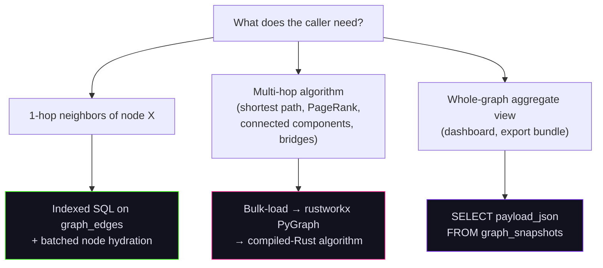

# Knowledge Graph Storage

The knowledge graph lives in plain SQLite tables and is traversed by an in-process Rust graph library. SQL handles persistence and trivial 1-hop lookups; multi-hop algorithms run in [rustworkx](https://www.rustworkx.org/), and whole-graph views read a precomputed snapshot. This page describes the schema, the three read patterns, and the trade-offs.

## Storage Layout

Each database (workspace) gets one SQLite file:

```
{CHAOSCYPHER_DATA_DIR}/databases/{database_name}/app.db
```

Resolved by `get_db_path()` in `packages/core/src/chaoscypher_core/adapters/sqlite/engine.py`. Every connection loads the [`sqlite-vec`](https://github.com/asg017/sqlite-vec) extension so vector search runs in the same process.

Four tables hold the graph:

| Table | Role |
|---|---|
| `graph_nodes` | Entities (people, organizations, concepts, …) |
| `graph_edges` | Relationships between nodes |
| `graph_templates` | Type schemas for nodes and edges |
| `graph_snapshots` | Precomputed `GraphBreakdown` payload for dashboard reads |

Defined in `packages/core/src/chaoscypher_core/adapters/sqlite/models.py`.

## Schema

### `graph_nodes`

| Column | Type | Notes |
|---|---|---|
| `id` | TEXT, PK | `node_<24-hex>` — content-addressed (see [Stable IDs](#stable-ids-and-idempotent-commits)) |
| `database_name` | TEXT, indexed | Workspace scope |
| `graph_name` | TEXT | `'knowledge'` |
| `template_id` | FK → `graph_templates`, RESTRICT | Type schema |
| `label` | TEXT | Display name |
| `properties` | JSON | Free-form property bag matching the template |
| `position_x`, `position_y` | FLOAT | Canvas coordinates (optional) |
| `embedding` | JSON array | Float32 vector for similarity |
| `source_id` | FK → `sources`, CASCADE | Provenance — drives the "enabled" filter |
| `created_at`, `updated_at` | DATETIME UTC | |

Indexes on `(database_name, source_id)` and `(database_name, template_id)`.

### `graph_edges`

| Column | Type | Notes |
|---|---|---|
| `id` | TEXT, PK | `edge_<24-hex>` — content-addressed |
| `database_name`, `graph_name` | TEXT | `graph_name` always `'knowledge'` |
| `template_id` | FK → `graph_templates`, RESTRICT | Relationship type |
| `source_node_id` | FK → `graph_nodes`, CASCADE, indexed | "From" endpoint |
| `target_node_id` | FK → `graph_nodes`, CASCADE, indexed | "To" endpoint |
| `label` | TEXT | Human-readable predicate (`"worked_at"`) |
| `properties` | JSON | Edge properties |
| `source_id` | FK → `sources`, CASCADE | Provenance |

Two endpoint indexes — `ix_graph_edges_db_source_node` and `ix_graph_edges_db_target_node` — make 1-hop neighbor lookups O(degree).

### `graph_templates`

`id`, `database_name`, `name`, `template_type` (`'node'` or `'edge'`), `properties` (JSON array of property definitions), `icon`, `color`, `embedding`. Templates are referenced by both `graph_nodes` and `graph_edges` with `ON DELETE RESTRICT` — you cannot delete a template that is in use.

### `graph_snapshots`

One row per database (`database_name` is the primary key). Stores a serialized `GraphBreakdown` Pydantic model in `payload_json` plus scalar summary columns (`node_count`, `edge_count`). Rebuilt by the `OP_BUILD_GRAPH_SNAPSHOT` operation handler (`operations/graph_snapshot_handler.py`) after commits or on manual refresh.

## Three Traversal Patterns

Use the right pattern for the depth of the question.



### Pattern 1 — 1-hop: indexed SQL

**When to use:** "Give me the edges and neighbors of node X."

The edge table has separate indexes on `source_node_id` and `target_node_id`, so each direction is a B-tree lookup. Run both, union the endpoints, then batch-fetch node labels in a single query.

**Implementation:** `packages/core/src/chaoscypher_core/adapters/sqlite/repos/graph/sqlite_edge_ops.py`

**Example** (from `services/workflows/tools/engine/handlers/graphrag_handlers.py`):

```python
neighbor_ids: set[str] = set()
edges_by_node: dict[str, list[Any]] = {}

for nid in seed_node_ids:
    outgoing = list(self.graph.list_edges(source_node_id=nid, limit=50))
    incoming = list(self.graph.list_edges(target_node_id=nid, limit=50))
    edges_by_node[nid] = outgoing + incoming
    for e in outgoing:
        neighbor_ids.add(e.target_node_id)
    for e in incoming:
        neighbor_ids.add(e.source_node_id)

# Single batched fetch — never call get_node() in a loop
all_needed = neighbor_ids | set(seed_node_ids)
all_fetched = self.graph.get_nodes_batch(list(all_needed))
nodes_map = {n.id: n for n in all_fetched}
```

### Pattern 2 — multi-hop: rustworkx

**When to use:** Shortest path, PageRank, connected components, bridge detection, betweenness centrality, clustering coefficient.

The traversal layer bulk-loads nodes and edges out of SQLite, builds a `rustworkx.PyGraph` (or `PyDiGraph` for directed algorithms), runs the algorithm in compiled Rust on integer indices, and maps the result back to string node IDs.

**Implementation:** `packages/core/src/chaoscypher_core/services/graph/engine/traversal.py`

```python
import rustworkx as rx

def build_graph(nodes, edges):
    """Build an undirected rustworkx graph and return the index maps."""
    graph = rx.PyGraph()
    id_to_idx: dict[str, int] = {}

    for node in nodes:
        idx = graph.add_node(node.label)
        id_to_idx[node.id] = idx

    idx_to_id = {v: k for k, v in id_to_idx.items()}

    added = set()
    for edge in edges:
        src, tgt = edge.source_node_id, edge.target_node_id
        if src in id_to_idx and tgt in id_to_idx:
            pair = (min(src, tgt), max(src, tgt))
            if pair not in added:
                graph.add_edge(id_to_idx[src], id_to_idx[tgt], None)
                added.add(pair)

    return graph, id_to_idx, idx_to_id


def find_shortest_path(nodes, edges, source_id, target_id):
    graph, id_to_idx, idx_to_id = build_graph(nodes, edges)
    paths = rx.dijkstra_shortest_paths(
        graph, id_to_idx[source_id], target=id_to_idx[target_id]
    )
    if id_to_idx[target_id] not in paths:
        return {"success": False, "error": "No path found between nodes"}
    return {
        "success": True,
        "path": [{"id": idx_to_id[i]} for i in paths[id_to_idx[target_id]]],
    }
```

The same `build_graph` / `build_digraph` entry points feed every algorithm in `services/graph/engine/algorithms.py`:

| Algorithm | rustworkx call |
|---|---|
| Shortest path | `rx.dijkstra_shortest_paths()` |
| Connected components | `rx.connected_components()` |
| PageRank | `rx.pagerank()` |
| Betweenness centrality | `rx.betweenness_centrality()` |
| Clustering coefficient | Triangle counting on `rx.PyGraph` |
| Bridges | Tarjan's DFS in pure Python (`traversal.py`) |

Every load goes through `list_nodes(minimal=True)` / `list_edges(minimal=True)` to keep the projection narrow — `embedding` (a fat JSON column on nodes) and `properties` are excluded from analytics loads.

### Pattern 3 — whole-graph aggregate: snapshot read

**When to use:** Dashboard cards, export bundles, anything that wants "the shape of the whole graph" without recomputing it.

The `OP_BUILD_GRAPH_SNAPSHOT` operation handler runs `BuildGraphSnapshotService`, which assembles a `GraphBreakdown` (counts, per-template stats, per-source breakdown) and writes the JSON payload into `graph_snapshots.payload_json`. Read paths fetch by primary key:

```python
# packages/core/src/chaoscypher_core/adapters/sqlite/repos/graph_snapshot.py
class GraphSnapshotRepository:
    def get_current(self, database_name: str) -> GraphBreakdown | None:
        with Session(self._engine) as session:
            row = session.get(GraphSnapshot, database_name)
            if row is None:
                return None
            return GraphBreakdown.model_validate_json(row.payload_json)
```

The snapshot is rebuilt via `import_service.py` after commits, so dashboard reads stay O(1) regardless of graph size.

## Stable IDs and Idempotent Commits

The commit pipeline must survive crashes — if the commit handler writes half its nodes and is re-dispatched, the second attempt must not create duplicates. Node and edge IDs are therefore content-addressed:

```python
# packages/core/src/chaoscypher_core/adapters/sqlite/repos/graph/sqlite_node_ops.py
def _stable_node_id(database_name, source_id, template_id, label) -> str:
    canonical_label = (label or "").strip().lower()
    scope_source = source_id or "no_source"
    raw = f"{database_name}:{scope_source}:{template_id}:{canonical_label}"
    return f"node_{hashlib.sha256(raw.encode()).hexdigest()[:24]}"
```

Edges hash `(db, source, template, source_node_id, target_node_id, label)`. Because endpoint node IDs are themselves stable, edge IDs are stable across commit attempts.

`upsert_nodes_batch()` and `upsert_edges_batch()` use these IDs to do bulk `SELECT ... WHERE id IN (...)` checks, then INSERT only the missing rows. **First write wins** — when a stable key already exists, the row is left untouched. This is deliberate: a partial re-run must not silently overwrite already-committed state.

For the full commit pipeline see [Commit to Graph](./extraction-pipeline/commit.md).

## Provenance and the "Enabled" Filter

Every node and edge has an optional `source_id` foreign key with `ON DELETE CASCADE`. Two consequences:

1. **Deleting a source wipes its graph data.** No application logic needed — the FK cascade handles it.
2. **Disabling a source hides its graph data.** Default list queries `OUTER JOIN sources` and apply `(source_id IS NULL OR sources.enabled = TRUE)`. Pass `include_disabled_sources=True` to bypass.

```python
# Default: hides data from disabled sources
nodes = graph_repo.list_nodes(template_id="tpl_person")

# Admin / export: include everything
nodes = graph_repo.list_nodes(template_id="tpl_person", include_disabled_sources=True)
```

## Trade-offs

The design is consciously skewed toward operational simplicity over arbitrary scale.

**Wins:**

- One file per workspace — `cp app.db` is a complete backup.
- `sqlite-vec` runs vector search inside the same connection — no separate index service.
- FK cascades give "delete source → all entities/edges/citations gone" for free.
- `rustworkx` is fast: a 10k-node / 100k-edge graph builds and runs Dijkstra in tens of milliseconds, all in compiled Rust.

**Costs:**

- Multi-hop algorithms load the graph into RAM. The bound is configurable but real:

  ```yaml
  # settings.yaml
  batching:
    graph_analysis_node_limit: 1500000   # default 1.5M
    graph_analysis_edge_limit: 4000000   # default 4M
  ```

  Defined in `packages/core/src/chaoscypher_core/settings.py` (`BatchingSettings`). Above these limits, analytics return partial results.

- Recursive CTEs are not used. There is no SQL-side multi-hop traversal. If you find yourself wanting one, you have outgrown this design and should add a graph backend behind `GraphRepositoryProtocol`.

## Anti-Patterns

**Hydrating neighbor nodes**

When you need each edge's source and target nodes, pass `with_nodes=True` so the
repository batch-loads them in a single query:

```python
edges = graph_repo.list_edges(with_nodes=True)
for edge in edges:
    print(f"{edge.source_node.label} → {edge.target_node.label}")
```

Calling `get_node()` inside a loop produces O(N) round trips and is significantly slower:

```python
# ❌ Don't do this
edges = graph.list_edges(source_node_id=nid)
for e in edges:
    neighbor = graph.get_node(e.target_node_id)  # N+1 SELECTs
```

✅ **DO** use `with_nodes=True` (one batch SELECT for all endpoints), or manually
collect IDs and call `get_nodes_batch()` when you only need a subset:

```python
edges = graph.list_edges(source_node_id=nid)
neighbor_ids = {e.target_node_id for e in edges}
neighbors = graph.get_nodes_batch(list(neighbor_ids))  # one SELECT
```

❌ **DON'T write a recursive CTE for shortest path or community detection:**

```sql
-- Don't do this — it bypasses the analytics layer
WITH RECURSIVE reachable(node_id, depth) AS (...)
SELECT * FROM reachable;
```

✅ **DO use the analytics service, which goes through rustworkx:**

```python
result = graph_analytics_service.find_shortest_path(
    source_id="node_abc",
    target_id="node_xyz",
)
```

❌ **DON'T compute dashboard stats by listing all nodes/edges on every page load:**

```python
nodes = graph.list_nodes(limit=1_000_000)
edges = graph.list_edges(limit=4_000_000)
breakdown = aggregate(nodes, edges)  # rebuilds every request
```

✅ **DO read the precomputed snapshot:**

```python
breakdown = graph_snapshot_repo.get_current(database_name)
```

❌ **DON'T mint your own node IDs in the commit path:**

```python
node = NodeCreate(...)
graph.create_node(node, custom_id=f"node_{uuid4().hex}")  # not idempotent
```

✅ **DO use the batch upsert, which assigns content-addressed IDs:**

```python
graph.upsert_nodes_batch([NodeCreate(...), NodeCreate(...)])
```

## Related

- [Commit to Graph](./extraction-pipeline/commit.md) — how extraction results land in `graph_nodes` and `graph_edges`.
- [Core](./core.md) — `GraphRepositoryProtocol` and the hexagonal layout.
- [Storage Adapters](../developer-guide/storage-adapters.md) — adapter pattern, `sqlite-vec` extension loading.
- [Graph API](../reference/api/graph.md) — REST endpoints that surface this storage.
