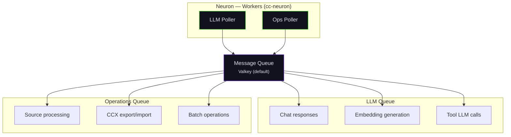

# Neuron — Workers

The Neuron package (`chaoscypher-neuron`) provides background job processing through a unified worker that manages two independent queues.

## Architecture



## Dual Queue System

The worker runs a single process with two independent asyncio pollers:

| Queue | Concurrency | Max Retries | Purpose |
|-------|-------------|-------------|---------|
| **LLM** (`llm`) | 1 (dynamic with multi-instance Ollama) | 5 | Chat, extraction, tool LLM calls |
| **Operations** (`operations`) | 8 | 5 | Source processing, exports, batch ops |

### Why Separate Queues?

**LLM queue** runs with concurrency 1 because LLM calls are GPU-bound. Running multiple LLM requests simultaneously doesn't improve throughput and can cause OOM errors with local models. Interactive chat gets priority over background extraction.

**Operations queue** runs with concurrency 8 because operations are I/O-bound (file processing, database writes, network requests). Higher concurrency improves throughput.

## Priority System

The LLM queue supports priority-based scheduling:

| Priority | Value | Use Case |
|----------|-------|----------|
| Interactive | 100 | User-initiated chat, interactive operations |
| Background | 50 | Background extraction, batch processing |

Higher values = higher priority (ZPOPMAX). Interactive chat preempts background extraction.

## Worker Lifecycle

### Startup

1. Load worker configuration for both queues
2. Initialize shared resources: database, settings, LLM provider, Valkey
3. Register handlers for LLM and operations queues
4. Start background settings listener (watches for config changes)
5. Run extraction recovery (find orphaned tasks, unstick stuck sources)
6. Begin polling both queues

### Runtime

- Independent pollers for each queue
- Configurable poll interval (default: 0.5s)
- Health reporting at configurable intervals
- Settings listener monitors for configuration changes

### Shutdown

1. Cancel settings listener
2. Drain in-flight tasks (configurable timeout)
3. Close worker session
4. Disconnect storage adapter
5. Disconnect Valkey

## Worker Context

All handlers share a `WorkerContext` dictionary containing:

- Application settings, engine settings, and database name
- Storage adapter (database)
- Graph repository
- Search repository
- LLM provider and LLM service
- Config manager
- Worker session (database session)

This context is initialized once at startup and shared across all job handlers.

## Task Cancellation

Both queued and running tasks can be cancelled.

**Queued tasks** are removed from the pending sorted set immediately and marked as cancelled.

**Running tasks** use a cooperative cancellation mechanism:

1. A cancellation flag (`queue:cancel:{task_id}`) is set in Valkey with a 5-minute TTL
2. The task status is updated to `cancelled` immediately (so the UI reflects the change)
3. The worker handler checks for the flag between processing batches
4. When detected, the handler raises `CancelledError` and exits gracefully

This design means the UI updates instantly while the handler finishes its current batch and cleans up. Orphaned tasks (marked as running but no longer in the running set) are handled gracefully.

**Batch cancellation** is supported for cancelling multiple tasks in a single API call, using Valkey pipelines for efficiency.

## Configuration

Worker behavior can be customized via `workers.yaml`:

```yaml
llm_worker:
  max_concurrent: 1
  max_tries: 5

operations_worker:
  max_concurrent: 8
  max_tries: 5
```

Changes to `workers.yaml` require a worker restart. Settings changes via the API are picked up by the settings listener without restart.

## Running

```bash
# Via entry point
cc-neuron

# Via Docker
make docker-dev  # Starts worker as part of the stack
```

## Monitoring

The queue monitor at [http://localhost:3000/queues](http://localhost:3000/queues) shows:

- Active jobs per queue
- Queue depth
- Job status and progress
- Error details for failed jobs
