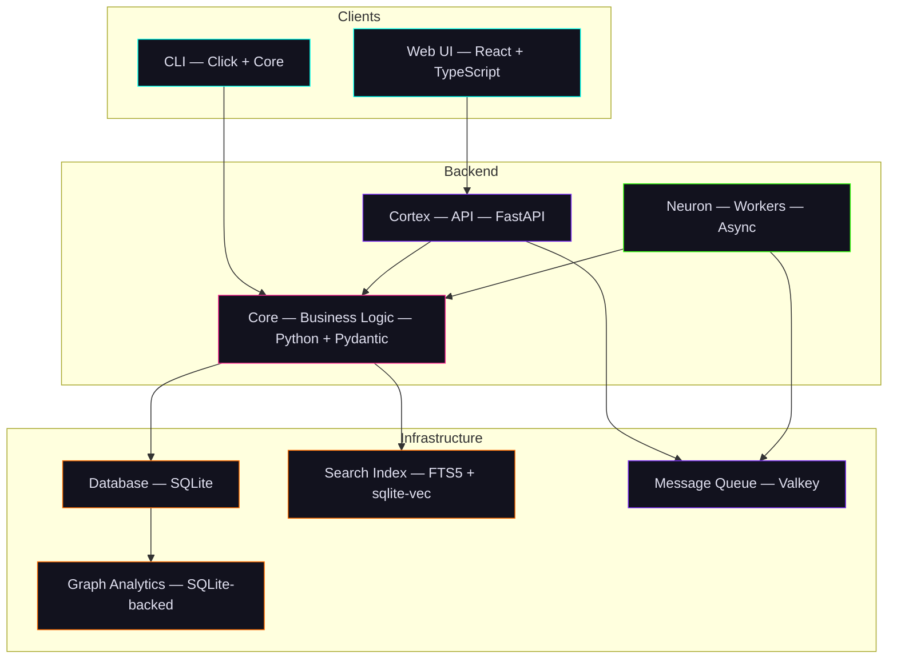
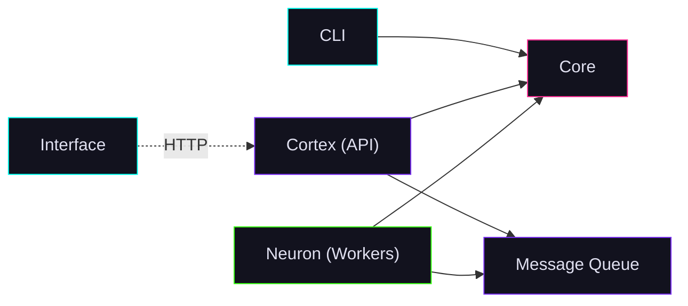

# Neural Architecture

Chaos Cypher is organized using a **brain-inspired metaphor** where each package plays a specialized role in the system.

## Package Overview



## Package Roles

| Package | Role | Technology |
|---------|------|------------|
| **Core** | Business logic, domain models, pluggable storage ports | Pure Python, Pydantic, Hexagonal Architecture |
| **Cortex** | REST API | FastAPI, Vertical Slice Architecture |
| **Neuron** | Background workers | Custom async workers |
| **Interface** | Web UI | React 19, TypeScript, Vite |
| **CLI** | Command-line interface | Click, Core library |

| Infrastructure | Role | Technology |
|----------------|------|------------|
| **Database** | Pluggable storage backend | SQLite (default), more planned |
| **Message Queue** | Job queue and task dispatch | Valkey (default) |
| **Search Index** | Fulltext and vector search | FTS5 + sqlite-vec (in app.db) |
| **Graph Analytics** | Graph algorithms | rustworkx (compiled Rust) — SQLite-backed storage, on-demand in-memory loading for analytics (PageRank, community detection, shortest path, centrality). See [Knowledge Graph Storage](./graph-storage.md). |
| **Orchestration** | Container composition | Docker Compose (all-in-one default: Nginx, Valkey, Cortex, and Neuron in a single container; multi-container available for development) |

## Why This Separation?

### Reusability

Core contains all business logic without any web framework dependencies. The CLI uses Core directly — no FastAPI, no HTTP, no web server. Neuron workers use Core for processing without the API layer.

### Testability

Core's hexagonal architecture means every external dependency is behind a Protocol interface. Tests can mock storage, LLM providers, and search backends with plain Python objects.

### Framework Independence

Core has zero knowledge of FastAPI, SQLModel, or any web framework. If you wanted to build a Django API or a desktop app, Core works without changes.

### Dual Deployment

Core supports both async (Cortex/Neuron) and sync (CLI) execution modes through its adapter pattern.

## Package Dependencies



- **Core** depends on nothing (framework-agnostic)
- **Cortex (API)** depends on Core
- **Neuron (Workers)** depends on Core
- **CLI** depends on Core
- **Interface** communicates via HTTP (no Python dependency)

## Monorepo Structure

```
packages/
├── core/          # chaoscypher-core    — Business logic
├── cortex/        # chaoscypher-cortex  — FastAPI backend
├── neuron/        # chaoscypher-neuron  — Background workers
├── interface/     # chaoscypher-interface — React UI
├── cli/           # chaoscypher-cli     — CLI tools
└── docker/        # Orchestration only  — Docker Compose files
```

Each package has its own `pyproject.toml` (Python) or `package.json` (Node.js), tests, and Dockerfiles.

## Next Steps

- [Core — Hexagonal Architecture](core.md) — How the brain is structured
- [Cortex — VSA](cortex.md) — How the API processes requests
- [Neuron — Workers](neuron.md) — How background jobs run
- [Plugin System](plugins.md) — Extending Chaos Cypher
- [Data Flow](data-flow.md) — How requests flow through the system
