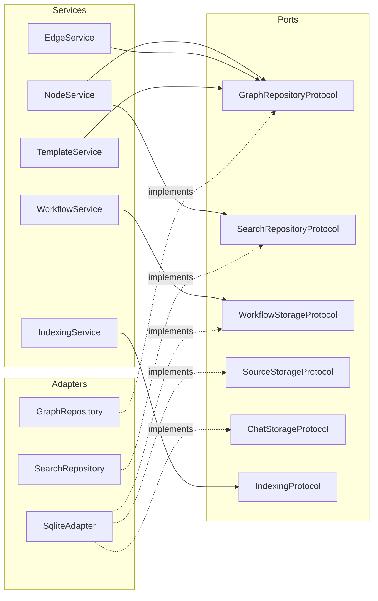

# Core Concepts

This page explains the architecture of `chaoscypher-core` and the design rules you need to follow when working with it.

## Hexagonal architecture

The core library uses **hexagonal architecture** (ports and adapters) to stay framework-agnostic. Business logic never depends on a specific database, web framework, or LLM provider.



The flow is always: **Services depend on Ports (protocols). Adapters implement Ports.** Services never import adapter code directly.

## Ports (protocols)

Ports are Python `Protocol` classes that define contracts for data access. They live in `chaoscypher_core.ports`:

**Graph and search:**

| Protocol | File | Purpose |
|----------|------|---------|
| `GraphRepositoryProtocol` | `ports/graph.py` | Node, edge, and template CRUD |
| `SearchRepositoryProtocol` | `ports/search.py` | Keyword, vector, and hybrid search |
| `SearchRetryQueueProtocol` | `ports/search_retry.py` | Retry queue for failed search index operations |

**Document processing:**

| Protocol | File | Purpose |
|----------|------|---------|
| `ChunkingProtocol` | `ports/chunk.py` | Hierarchical document chunking |
| `IndexingProtocol` | `ports/index.py` | Document chunk embedding storage |
| `StructuredExtractorPort` | `ports/structured_extraction.py` | LLM-backed structured extraction |
| `EmbeddingProviderProtocol` | `ports/embedding.py` | Embedding model provider |

**Per-feature storage protocols** (one file per domain):

| Protocol | File | Purpose |
|----------|------|---------|
| `WorkflowStorageProtocol` | `ports/storage_workflows.py` | Workflow definitions and steps |
| `WorkflowExecutionStorageProtocol` | `ports/storage_workflow_executions.py` | Workflow execution tracking |
| `SourceStorageProtocol` | `ports/storage_sources.py` | Source documents and processing lifecycle |
| `ChatStorageProtocol` | `ports/storage_chats.py` | Chat conversations and messages |
| `TriggerStorageProtocol` | `ports/storage_triggers.py` | Event triggers |
| `ToolStorageProtocol` | `ports/storage_tools.py` | Tool registry (system + user tools) |
| `LLMMetricsStorageProtocol` | `ports/storage_llm_metrics.py` | LLM call cost and token tracking |
| `ChunkStorageProtocol` | `ports/storage_chunks.py` | Document chunk persistence |
| `CitationStorageProtocol` | `ports/storage_citations.py` | Citation tracking |
| `EntityEmbeddingStorageProtocol` | `ports/storage_embeddings.py` | Entity embedding vectors |
| `SourceTagStorageProtocol` | `ports/storage_source_tags.py` | Source tag management |
| `ExtractionQueueStorageProtocol` | `ports/storage_extraction_queue.py` | Extraction job queue state |
| `ExtractionSubmissionStorageProtocol` | `ports/storage_extraction_submissions.py` | Extraction submission tracking |
| `GraphSnapshotStorageProtocol` | `ports/storage_graph_snapshot.py` | Graph snapshot staleness and breakdown queries |

**Infrastructure:**

| Protocol | File | Purpose |
|----------|------|---------|
| `DatabaseProtocol` | `ports/db.py` | Database metadata |
| `LLMProviderPort` | `ports/llm.py` | LLM provider interface |
| `RetryPolicyPort` | `ports/retry.py` | Retry policy configuration |
| `TransactionalAdapterProtocol` | `ports/transactional.py` | Unit-of-work transaction support |
| `SourceRecoveryPorts` | `ports/source_recovery.py` | Source recovery operations |

All protocols use structural typing -- any class with matching method signatures satisfies the protocol. No inheritance required.

## Services

Services contain business logic and depend only on protocols. They live in `chaoscypher_core.services` and are organized by domain:

| Domain | Key Services | Description |
|--------|-------------|-------------|
| **Graph management** | `NodeService`, `EdgeService`, `TemplateService`, `SourceService` | CRUD with validation and search indexing |
| **Search** | `SearchService`, `IndexingService` | RAG retrieval and embedding generation |
| **Sources** | `SourceProcessingService`, `ExtractionService`, `SourceCommitService` | Document ingestion pipeline |
| **Workflows** | `WorkflowService`, `WorkflowExecutor`, `ToolService` | Workflow definitions and LangGraph execution |
| **Quality** | `QualityScorer` | Entity and relationship quality scoring |

:::note[Internal services]

Additional services like `GraphAnalyticsService`, `CountsService`, `ChatService`, `ChatExecutor`, and `ResearchAgent` exist in the codebase but are internal implementation details not exported from the public API. Access their functionality through `Engine` convenience methods instead.

:::

## Adapters

Adapters implement protocols with concrete technology. The core library ships with:

- **`SqliteAdapter`** -- implements all storage protocols (`WorkflowStorageProtocol`, `SourceStorageProtocol`, `ChatStorageProtocol`, etc.) using SQLite + SQLModel
- **`GraphRepository`** -- implements `GraphRepositoryProtocol` using SQLite
- **`SearchRepository`** -- implements `SearchRepositoryProtocol` using sqlite-vec vector index
- **LLM providers** -- Ollama, OpenAI, Anthropic, and Gemini adapters via `ProviderFactory`

## The dict-not-entities rule

:::warning[Critical: Storage protocols return dicts, not ORM entities]


This is the most important rule when working with the core library. Violating it causes `AttributeError` at runtime.

:::

All storage protocol methods return `dict[str, Any]` (or `list[dict[str, Any]]`). This keeps the core library portable across storage backends.

```python
# WRONG -- storage returns a dict, not an ORM entity
workflow = adapter.get_workflow(workflow_id)
name = workflow.name          # AttributeError!

# CORRECT -- use dict access
workflow = adapter.get_workflow(workflow_id)
name = workflow["name"]       # Works
name = workflow.get("name")   # Safe (returns None if missing)
```

The **only** places where ORM entity attribute access is valid are:

1. **Inside the SQLite adapter mixins** (before conversion to dict)
2. **`GraphRepository` return values** -- `GraphRepositoryProtocol` returns Pydantic model objects (`Node`, `Edge`, `Template`), not dicts
3. **Database model definitions**

Everywhere else, use dict access patterns.

## Framework-agnostic design

The core library has **no dependency** on FastAPI, Valkey, or any web framework. This means:

- It can be used in CLI tools, Jupyter notebooks, or background scripts
- No async runtime is required for basic operations (graph CRUD, search)
- Services accept plain Python types (dicts, strings, Pydantic models)
- Configuration is pure Pydantic (`EngineSettings`), not tied to environment variable loaders

:::note[Async operations]

Some methods on `GraphRepositoryProtocol` are async (e.g., `create_nodes_batch`, `create_edges_batch`, `create_templates_batch`). These are used during bulk operations like source commits. Standard CRUD methods (`create_node`, `list_nodes`, etc.) are synchronous.

:::

## EngineSettings

`EngineSettings` is a Pydantic `BaseModel` that configures the entire engine. It uses nested settings groups:

```python
from chaoscypher_core import EngineSettings

settings = EngineSettings(current_database="mydb")
```

| Group | Class | What it configures |
|-------|-------|--------------------|
| `paths` | `PathSettings` | Data and config directories (XDG-compliant) |
| `llm` | `LLMSettings` | Provider selection, API keys, model names, token limits |
| `batching` | `BatchingSettings` | Embedding batch sizes, graph analysis limits |
| `chunking` | `ChunkingSettings` | Chunk sizes, overlap, grouping for extraction |
| `extraction` | `ExtractionSettings` | LLM retry backoff, quality thresholds, loop detection |
| `source_processing` | `SourceProcessingSettings` | Deduplication, web scraping, analysis depth |
| `normalizer` | `NormalizerSettings` | Content cleaning (encoding, OCR, markdown) |
| `search` | `SearchSettings` | Vector dimensions, re-ranking, result limits |
| `embedding` | `EmbeddingSettings` | Embedding provider, model, and vector dimensions |
| `database` | `DatabaseSettings` | SQLite connection timeouts and retry config |
| `pagination` | `PaginationSettings` | Default and max page sizes |
| `graph` | `GraphSettings` | Default templates, relationship types, export limits |
| `archive` | `ArchiveSettings` | Archive extraction limits and format detection |
| `chat` | `ChatSettings` | Tool-calling iteration limits |

When constructing `EngineSettings` directly, `current_database` is the only required field. However, when using `Engine("./data/databases/mydb")`, the database name is auto-inferred from the directory name, so you don't need to set it explicitly. All other settings groups have sensible defaults.

:::tip[Settings in the full stack]

When using Chaos Cypher as a full platform (Cortex + Neuron + Docker), settings are loaded from `settings.yaml` and converted to `EngineSettings` via a bridge. When using `chaoscypher-core` standalone, you construct `EngineSettings` directly.

:::

## The Engine class

The `Engine` class wires up all services with proper dependency injection:

```python
from chaoscypher_core import Engine

with Engine("./data/databases/mydb") as engine:
    engine.node_service       # NodeService instance
    engine.edge_service       # EdgeService instance
    engine.template_service   # TemplateService instance
    engine.workflow_service   # WorkflowService instance
    engine.chunking_service   # ChunkingService instance
    engine.indexing_service   # IndexingService instance
    engine.search_service     # SearchService instance
    engine.llm_provider       # LLMProvider instance (lazy)
    engine.extraction_service # ExtractionService instance (lazy)
    engine.commit_service     # SourceCommitService instance (lazy)
    engine.graph_repository   # GraphRepository instance
    engine.search_repository  # SearchRepository instance
    engine.storage_adapter    # SqliteAdapter instance
    engine.settings           # EngineSettings instance
```

`Engine` supports the context manager protocol -- calling `engine.close()` (or exiting the `with` block) disconnects the storage adapter and releases database locks.

All public `Engine` convenience methods (e.g., `create_node`, `get_stats`, `process_document`, `add_document`, `search`) return **Pydantic models** with attribute access. Underlying service methods still return dicts -- the Engine wraps them for a cleaner API.

## Next steps

- [Quick Start](quickstart.md) -- working code examples
- [Services](services.md) -- detailed service API reference
- [Storage Adapters](storage-adapters.md) -- SQLite adapter internals
- [LLM Providers](llm-providers.md) -- configuring Ollama, OpenAI, Anthropic, and Gemini
