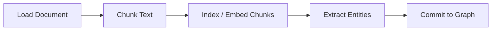
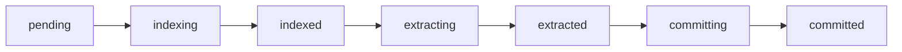

# Extraction Pipeline

This guide walks through using Chaos Cypher's document extraction pipeline programmatically. The pipeline transforms raw documents into knowledge graph entities and relationships through a series of stages: chunking, indexing, extraction, and commit.

:::info[Architecture Reference]

For internals of how the pipeline works under the hood (prompt engineering, deduplication algorithms, template matching), see the [Architecture > Extraction Pipeline](../architecture/extraction-pipeline/overview.md) documentation.

:::

## Quick Start

The simplest way to process a document into a knowledge graph:

```python
from chaoscypher_core import ChaosCypher

result = await ChaosCypher.add_document("research_paper.pdf", database="mydb")
print(f"Nodes: {len(result.nodes)}, Edges: {len(result.edges)}")
```

A sync variant is available too: `ChaosCypher.add_document_sync(...)`.

For repeated operations or more control, use `Engine` directly:

```python
from chaoscypher_core import Engine

async with Engine("./data/databases/mydb") as engine:
    result = await engine.add_document("research_paper.pdf")
    print(f"Nodes: {len(result.nodes)}, Edges: {len(result.edges)}")
```

If you already have text in memory (e.g., from a web scrape or user input), use `process_document` instead:

```python
async with Engine("./data/databases/mydb") as engine:
    result = await engine.process_document(text, filename="research_paper.pdf")
    print(f"Nodes: {len(result.nodes)}")
```

All methods return a `ProcessingResult` model with attribute access.

## Granular Pipeline Control

For step-by-step control (e.g., to inspect chunks before extraction), use the individual pipeline methods. All return typed Pydantic models:

```python
from chaoscypher_core import Engine

async with Engine("./data/databases/mydb") as engine:
    # Step 1: Chunk and store for RAG search
    chunks = await engine.chunk_document(text)
    print(f"{chunks.total_small_chunks} chunks in {chunks.total_groups} groups")

    # Step 2: Generate embeddings (enables semantic search)
    index = await engine.index_source(chunks.source_id)
    print(f"Indexed {index.chunks_count} chunks with {index.embedding_model}")

    # Step 3: Extract entities and commit to graph
    result = await engine.commit(chunks.source_id)
    print(f"Nodes: {len(result.nodes)}, Edges: {len(result.edges)}")
```

| Step | Method | Returns | Purpose |
|------|--------|---------|---------|
| **Chunk** | `engine.chunk_document(text)` | `ChunkingResult` | Split text into RAG chunks and store |
| **Index** | `engine.index_source(source_id)` | `IndexingResult` | Generate vector embeddings |
| **Commit** | `engine.commit(source_id)` | `ProcessingResult` | Extract entities and write to graph |

## Pipeline Overview



| Stage | Service | Purpose |
|-------|---------|---------|
| **Chunk** | `ChunkingService` | Split document into small RAG chunks and hierarchical groups |
| **Index** | `IndexingService` | Generate vector embeddings for each chunk |
| **Extract** | `ExtractionService` | AI-powered entity and relationship extraction |
| **Commit** | `SourceCommitService` | Write entities, edges, and templates to the graph |

## Prerequisites

`Engine` handles all four stages with pre-wired services. The extraction and commit services are lazily initialized on first access.

To configure a specific LLM provider, pass settings:

```python
from chaoscypher_core import Engine, EngineSettings

settings = EngineSettings(
    llm={
        "chat_provider": "ollama",
        "ollama_chat_model": "qwen3:30b-instruct",
    },
)

engine = Engine("./data/databases/my_database", settings=settings)

# Verify LLM connectivity before starting
health = await engine.check_health()
print(f"Chat: {health.chat.status}")
```

## Standalone Extraction (No Database)

To extract entities without persistent storage:

```python
from chaoscypher_core import ChaosCypher

result = await ChaosCypher.extract("paper.pdf")
print(f"{len(result.entities)} entities, {len(result.relationships)} relationships")
```

Or synchronously: `result = ChaosCypher.extract_sync("paper.pdf")`.

Returns an `ExtractionResult` model. Use it however you like -- feed into your own database, export to Neo4j, or pass to another service.

<details>
<summary>Granular control with ChunkingService</summary>

If you need access to intermediate chunking results, use the lower-level APIs directly:

```python
from chaoscypher_core import ChunkingService, Loaders

text = Loaders.load_text("paper.pdf")
result = await ChunkingService().process(text)
```

</details>

<details>
<summary>Advanced: Stage-by-Stage Service Access</summary>


For maximum control (e.g., custom extraction parameters, manual deduplication, or non-Engine contexts), you can access the underlying services directly. These return raw dicts, not typed models.

### Chunking

`ChunkingService` splits raw text into two levels of chunks (see [Chunking Architecture](../architecture/extraction-pipeline/chunking.md)):

- **Small chunks** (~900 chars) -- optimized for RAG retrieval
- **Hierarchical groups** (4 small chunks combined) -- optimized for entity extraction

```python
result = await engine.chunking_service.create_chunks(
    document_text,
    analysis_depth="full",  # "full" = all chunks, "quick" = sampled subset
)
print(f"Created {result.total_small_chunks} chunks in {result.total_groups} groups")
```

The `analysis_depth` parameter controls how many groups are processed:

- `"full"` -- all hierarchical groups (thorough extraction)
- `"quick"` -- evenly-distributed sample of 5 groups (fast preview)

### Indexing

`IndexingService` generates vector embeddings for each chunk.

```python
index_result = await engine.indexing_service.create_index(source_id="source_001")
print(f"Indexed {index_result['chunks_count']} chunks")
```

### Extraction

`ExtractionService` performs entity deduplication, normalization, and template matching on pre-extracted chunk results. See [Entity Extraction Architecture](../architecture/extraction-pipeline/entity-extraction.md) for prompt design.

```python
results = await engine.extraction_service.extract(
    entities=aggregated_entities,
    relationships=aggregated_relationships,
    generate_embeddings=True,
    domain="literary",
)
print(f"Entities: {results['metadata']['total_entities']}")
```

:::note[Where do raw entities come from?]

`extract()` operates on *pre-extracted* data. In the full platform, chunk-level extraction runs in parallel via queue workers. For standalone usage, `ChunkingService.process()` handles chunking and extraction in one call.

:::

The extraction result dictionary contains:

| Key | Type | Description |
|-----|------|-------------|
| `entities` | `list[dict]` | Normalized, deduplicated entities |
| `relationships` | `list[dict]` | Remapped relationships |
| `suggested_templates` | `list[dict]` | Node template suggestions |
| `suggested_edge_templates` | `list[dict]` | Edge template suggestions |
| `inverse_relationships` | `dict[str, str]` | Domain-specific inverse mappings |
| `embeddings` | `dict` | Entity embedding data (if generated) |
| `metadata` | `dict` | Processing statistics |

### Graph Commit

`SourceCommitService` writes the extraction results into the graph database.

```python
commit_result = await engine.commit_service.commit(
    file_id="source_001",
    commit_data=results,
    file_info={"filename": "paper.pdf"},
    auto_enable=True,
)
print(f"Nodes: {len(commit_result['nodes'])}, Edges: {len(commit_result['edges'])}")
```

The commit process is **idempotent** -- re-committing the same source cleans up previously committed graph data before writing new data.

</details>

## Extraction Quality Controls

The extraction pipeline includes several configurable quality controls that balance precision against recall. These are worth understanding when tuning extraction for specific content types.

### Filtering Modes

The `extraction_filtering_mode` setting selects a preset that controls all quality filters as a coherent bundle. Rather than tuning evidence validation, type constraints, plausibility, and relationship limits individually, you select a preset and optionally override specific values.

| Preset | Best For | Summary |
|--------|----------|---------|
| `maximum` | Highest-precision extraction | All filters on, strict evidence, tighter plausibility threshold |
| `strict` | Factual/structured content | Strict evidence + type constraints, drop on mismatches |
| `balanced` (default) | General content | All filters active with fall-throughs and orphan protection |
| `lenient` | Literary/story content | Narrative evidence for pronoun-heavy prose, lower plausibility |
| `minimal` | Noisy/broad content (news) | Most filters disabled, elevated limits |
| `unfiltered` | Debugging/downstream filtering | Data integrity only (dedup + index validation) |

Built-in domains map to presets automatically — 9 use `balanced`, 6 use `strict`, 3 use `lenient`, and 1 uses `minimal` (19 total). Legacy preset names (`standard`, `precise`, `narrative`, `permissive`, `raw`) are accepted as aliases.

The mode can be set at three levels (each overriding the previous): global default, domain config (`extraction_filtering_mode` field), or per-source override via the API, CLI, or UI.

For the full filter matrix and per-preset details, see [Architecture > Entity Extraction > Filtering Modes](../architecture/extraction-pipeline/entity-extraction.md#filtering-modes).

### Evidence Validation

Each filtering mode preset includes an evidence validation strategy. Four underlying modes control how strictly the system verifies that extracted entities and relationships are grounded in the source text:

| Mode | Used By Presets | Behavior |
|------|----------------|----------|
| `strict` | maximum, strict | Full name or alias must appear in referenced sentences |
| `standard` | balanced | Any significant word from name/aliases must appear |
| `narrative` | lenient | Accepts one entity name alone, or zero names if a relationship type keyword is present |
| `relaxed` | minimal | Valid sentence reference is sufficient |

The `unfiltered` preset disables evidence validation entirely.

Domains can still override the evidence mode independently via `evidence_validation_mode` if the preset's default does not fit.

### Fuzzy Relationship Type Matching

LLMs frequently produce slight variations of the intended relationship type names (e.g., `"located_in"` vs `"located_at"`). The pipeline uses three-tier fuzzy matching (exact, substring, word overlap) to map LLM output to domain edge templates. The behavior when no match is found depends on the filtering mode:

- **`maximum` and `strict`** — unmatched types and source/target entity type mismatches cause the relationship to be dropped
- **`balanced`, `lenient`, `minimal`** — unmatched types and mismatches fall through and are kept
- **`unfiltered`** — type matching is not applied

Domains can override this behavior independently via `strict_edge_type_constraints`.

### Relationship Safety-Net Limits

Relationship limits (`max_entity_degree`, `max_same_source_type`, `max_relationship_ratio`) act as safety nets rather than primary quality filters. The defaults vary by filtering mode preset — `balanced` uses generous values (25, 12, 8.0), while `strict` uses tighter values, and `minimal` elevates them further. Primary quality comes from evidence validation, type constraints, and deduplication.

Most presets include **orphan protection**: relationships are kept regardless of caps if either endpoint has fewer than 2 edges, preventing sparsely-connected entities from being disconnected. The `strict` preset disables orphan protection for unconditional cap enforcement.

Domains can override specific limits via `extraction_limits` without changing the rest of the preset's behavior.

## Status Flow

Documents progress through a defined status lifecycle:



Each stage updates the source record's status, enabling the UI to show real-time progress. Failed stages record the error and allow retries.
