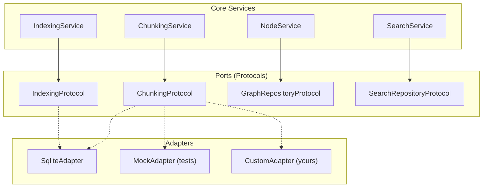

# Storage Adapters

Chaos Cypher uses the Hexagonal Architecture (Ports and Adapters) pattern for data persistence. Services depend on protocol interfaces (ports), and concrete implementations (adapters) are injected at runtime. This design enables storage-agnostic business logic and straightforward testing.

## Architecture



## Storage Protocols

All storage protocols are defined in `chaoscypher_core.ports` and share a key rule:

:::warning[Protocols Return Dicts, Always]

Every storage protocol method returns `dict[str, Any]` or `list[dict[str, Any]]`. Code consuming storage data **must** use dict access (`data["key"]` or `data.get("key")`), never attribute access (`data.field`).

:::

### Available Protocols

Each protocol lives in its own file under `chaoscypher_core.ports`. Storage protocols follow a per-feature naming convention (`storage_<feature>.py`).

**Per-feature storage protocols:**

| Protocol | Module | Purpose |
|----------|--------|---------|
| `WorkflowStorageProtocol` | `ports.storage_workflows` | Workflow definitions, steps, statistics |
| `WorkflowExecutionStorageProtocol` | `ports.storage_workflow_executions` | Workflow execution tracking |
| `ToolStorageProtocol` | `ports.storage_tools` | System and user tool registry |
| `SourceStorageProtocol` | `ports.storage_sources` | Unified source lifecycle (upload through commit) |
| `ChatStorageProtocol` | `ports.storage_chats` | Chat history and messages |
| `TriggerStorageProtocol` | `ports.storage_triggers` | Event triggers and execution history |
| `LLMMetricsStorageProtocol` | `ports.storage_llm_metrics` | LLM call metrics and cost tracking |
| `ChunkStorageProtocol` | `ports.storage_chunks` | Document chunk persistence |
| `CitationStorageProtocol` | `ports.storage_citations` | Citation tracking |
| `EntityEmbeddingStorageProtocol` | `ports.storage_embeddings` | Entity embedding vectors |
| `SourceTagStorageProtocol` | `ports.storage_source_tags` | Source tag management |
| `ExtractionQueueStorageProtocol` | `ports.storage_extraction_queue` | Extraction job queue state |
| `ExtractionSubmissionStorageProtocol` | `ports.storage_extraction_submissions` | Extraction submission tracking |
| `GraphSnapshotStorageProtocol` | `ports.storage_graph_snapshot` | Graph snapshot staleness and breakdown queries |

**Domain-specific protocols:**

| Protocol | Module | Purpose |
|----------|--------|---------|
| `ChunkingProtocol` | `ports.chunk` | Hierarchical document chunk storage |
| `IndexingProtocol` | `ports.index` | Chunk embedding storage and retrieval |
| `GraphRepositoryProtocol` | `ports.graph` | Node, edge, and template CRUD |
| `SearchRepositoryProtocol` | `ports.search` | Keyword, vector, and hybrid search |
| `SearchRetryQueueProtocol` | `ports.search_retry` | Retry queue for failed search index operations |
| `StructuredExtractorPort` | `ports.structured_extraction` | LLM-backed structured extraction |
| `EmbeddingProviderProtocol` | `ports.embedding` | Embedding model provider |
| `TransactionalAdapterProtocol` | `ports.transactional` | Unit-of-work transaction support |

## SqliteAdapter (Default)

`SqliteAdapter` is the built-in storage adapter. It implements all core storage protocols using SQLite and SQLModel.

:::note[sqlite-vec extension]

`SqliteAdapter` loads the [sqlite-vec](https://github.com/asg017/sqlite-vec) extension on every SQLite connection to support vector search operations. Custom adapter authors who need vector search should be aware of this dependency — if you are writing your own adapter, you will need to provide an equivalent vector storage mechanism for your backend.

:::

:::tip[Engine shortcut]

For most use cases, `Engine` handles adapter creation and wiring automatically. Use `SqliteAdapter` directly only when you need low-level storage access or are building a custom integration.

```python
from chaoscypher_core import Engine

with Engine("./data/databases/default") as engine:
    engine.storage_adapter  # Pre-wired SqliteAdapter instance
```

:::

### Setup

For advanced or custom usage, you can create the adapter directly:

```python
from chaoscypher_core import SqliteAdapter

# Option 1: Directory path (database name inferred from directory name)
adapter = SqliteAdapter("data/databases/default")
adapter.connect()

# Option 2: Explicit file path
adapter = SqliteAdapter(db_path="data/databases/default/app.db")
adapter.connect()

# ... use adapter ...

adapter.disconnect()

# Option 3: Context manager (recommended)
with SqliteAdapter("data/databases/default") as adapter:
    workflows = adapter.list_workflows("default")
```

### Constructor

```python
SqliteAdapter(
    db_path: str,                     # Path to SQLite database file, or a directory path
    database_name: str | None = None,  # Derived from parent directory if omitted
)
```

`db_path` accepts either a full path to the SQLite file (e.g., `data/databases/mydb/app.db`) or a directory path (e.g., `data/databases/mydb`). When a directory is provided, the adapter appends `app.db` automatically. If `database_name` is not provided, it is inferred from the directory name. For example, both `data/databases/mydb/app.db` and `data/databases/mydb` yield `database_name="mydb"`.

### Using with Services

Services accept protocol-typed parameters, so `SqliteAdapter` can be passed directly where it satisfies the protocol:

```python
from chaoscypher_core import ChunkingService, EngineSettings
from chaoscypher_core import SqliteAdapter

settings = EngineSettings(current_database="default")

with SqliteAdapter("data/databases/default") as adapter:
    # SqliteAdapter implements ChunkingProtocol (via SourceChunksMixin)
    chunking = ChunkingService(settings=settings, repository=adapter)
    result = await chunking.create_chunks("Document text...")
    print(f"{result.total_small_chunks} chunks in {result.total_groups} groups")
    # Persist chunks to storage (separate step)
    chunking.store_chunks(result)
```

### Mixin Architecture

`SqliteAdapter` composes functionality from focused mixins, each implementing one or more storage protocols:

| Mixin | Protocols Covered |
|-------|-------------------|
| `WorkflowsMixin` | Workflow CRUD |
| `WorkflowExecutionsMixin` | Execution tracking |
| `ToolsMixin` | Tool registry |
| `SourceLifecycleMixin` | Source file upload and lifecycle |
| `SourceIndexingMixin` | Embedding storage, extraction gating |
| `SourceExtractionJobsMixin` | Extraction job management |
| `SourceChunkTasksMixin` | Chunk task analytics |
| `SourcesMixin` | Core source CRUD |
| `SourceTagsMixin` | Tag management |
| `SourceChunksMixin` | Document chunk operations |
| `SourceCitationsMixin` | Citation tracking |
| `ChatsMixin` | Chat history |
| `TriggersMixin` | Event triggers |
| `LLMMetricsMixin` | LLM call metrics |

Mixins live in `chaoscypher_core.adapters.sqlite.mixins/` and inherit from `SqliteMixinBase` which provides shared utilities like entity-to-dict conversion.

### Transaction Support

Use the `adapter.transaction()` context manager to wrap multiple writes atomically. It is nestable — an inner `transaction()` participates in the enclosing one rather than opening a new SQLite transaction.

```python
with SqliteAdapter(db_path="data/app.db") as adapter:
    with adapter.transaction():
        adapter.create_workflow({"id": "wf_1", "name": "Test", ...})
        adapter.create_workflow_step({"id": "step_1", ...})
    # Both writes committed atomically when the context exits normally.
    # Any exception rolls back both.
```

Internally, mixin methods call `self._maybe_commit()` instead of `session.commit()` directly. Outside a `transaction()` block this flushes and commits immediately; inside it only flushes, deferring the commit to the outermost block. This is the Unit of Work pattern — you never need to manage transactions manually in repository code.

## Creating a Custom Adapter

To implement a custom storage backend (PostgreSQL, MongoDB, etc.), implement the protocol interfaces that your services need.

### Step 1: Choose Protocols

Determine which protocols your adapter needs. You do not need to implement all of them -- only the ones required by the services you use.

```python
from chaoscypher_core import ChunkingProtocol, IndexingProtocol
```

### Step 2: Implement the Protocol

```python
from typing import Any
from chaoscypher_core import ChunkingProtocol


class PostgresChunkingAdapter:
    """PostgreSQL implementation of ChunkingProtocol."""

    def __init__(self, connection_string: str):
        self.connection_string = connection_string

    def store_chunks_and_groups(
        self,
        small_chunks: list[dict[str, Any]],
        hierarchical_groups: list[dict[str, Any]],
        batch_size: int = 500,
    ) -> None:
        # Insert chunks and group metadata into PostgreSQL
        ...

    def get_small_chunks(self, source_id: str) -> list[dict[str, Any]]:
        # Query chunks from PostgreSQL, return as dicts
        ...

    def get_hierarchical_groups(self, source_id: str) -> list[dict[str, Any]]:
        # Query hierarchical groups from PostgreSQL
        ...

    def update_chunk_status(self, source_id: str, status: str) -> int:
        # Update chunk status, return count
        ...
```

### Step 3: Use with Services

Because Python protocols use structural typing, your adapter works with any service that expects `ChunkingProtocol` without explicit inheritance:

```python
from chaoscypher_core import ChunkingService

pg_adapter = PostgresChunkingAdapter("postgresql://localhost/chaoscypher")
service = ChunkingService(settings=settings, repository=pg_adapter)
```

### Step 4: Combine Multiple Protocols

For a full adapter, use the mixin pattern (like `SqliteAdapter`) or implement all methods on a single class:

```python
class PostgresAdapter:
    """Full PostgreSQL adapter implementing multiple protocols."""

    def __init__(self, connection_string: str):
        self.conn = connect(connection_string)

    # ChunkingProtocol methods
    def store_chunks_and_groups(self, ...): ...
    def get_small_chunks(self, ...): ...
    def get_hierarchical_groups(self, ...): ...
    def update_chunk_status(self, ...): ...

    # IndexingProtocol methods
    def get_chunks_by_source(self, ...): ...
    def update_chunk_embedding(self, ...): ...
    def get_chunk_by_id(self, ...): ...
    def delete_chunks_by_source(self, ...): ...
    def update_chunk_source(self, ...): ...
```

## Testing with Mock Adapters

For testing, create lightweight mock adapters using in-memory data:

```python
from typing import Any


class MockChunkingAdapter:
    """In-memory mock for testing ChunkingService."""

    def __init__(self):
        self.chunks: dict[str, list[dict[str, Any]]] = {}
        self.groups: dict[str, list[dict[str, Any]]] = {}

    def store_chunks_and_groups(
        self,
        small_chunks: list[dict[str, Any]],
        hierarchical_groups: list[dict[str, Any]],
        batch_size: int = 500,
    ) -> None:
        if small_chunks:
            source_id = small_chunks[0]["source_id"]
            self.chunks[source_id] = small_chunks
            self.groups[source_id] = hierarchical_groups

    def get_small_chunks(self, source_id: str) -> list[dict[str, Any]]:
        return self.chunks.get(source_id, [])

    def get_hierarchical_groups(self, source_id: str) -> list[dict[str, Any]]:
        return self.groups.get(source_id, [])

    def update_chunk_status(self, source_id: str, status: str) -> int:
        chunks = self.chunks.get(source_id, [])
        for chunk in chunks:
            chunk["status"] = status
        return len(chunks)
```

Use it in tests:

```python
from chaoscypher_core import ChunkingService, EngineSettings

mock_repo = MockChunkingAdapter()
settings = EngineSettings(current_database="test")
service = ChunkingService(settings=settings, repository=mock_repo)

result = await service.create_chunks("Test document content for chunking.")

assert result.total_small_chunks > 0

# Persist if needed
service.store_chunks(result)
assert len(mock_repo.chunks["test_src"]) == result.total_small_chunks
```

## Key Design Decisions

**Why dicts instead of entities?** Storage protocols return `dict[str, Any]` rather than ORM entities to maintain framework independence. The `chaoscypher_core` package has no dependency on SQLModel or any web framework. Dicts are universally portable and trivially mockable.

**Why structural typing (Protocols)?** Python's `Protocol` class enables duck typing with static type checking. Adapters do not need to inherit from a base class -- they just need to have the right method signatures. This makes it easy to create partial implementations for testing.

**Why mixins?** The `SqliteAdapter` uses 14 mixins because the full protocol surface is large. Each mixin is focused on one domain (sources, chunks, workflows, etc.), following the Interface Segregation Principle. This keeps individual files maintainable while composing into a comprehensive adapter.
