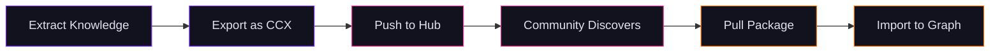

import Tabs from '@theme/Tabs';
import TabItem from '@theme/TabItem';
import PreviewBanner from "@site/src/components/PreviewBanner";

<PreviewBanner service="Lexicon Hub" />

# Lexicon Hub

<p className="tagline" style={{textAlign: "center", fontSize: "1.2rem", opacity: 0.8, marginBottom: "2rem"}}>Share, discover, and reuse knowledge packages from the community</p>

Lexicon Hub is a central registry for **CCX knowledge packages** — portable archives containing templates, entities, relationships, and workflows extracted from documents. Publish your extracted knowledge for others to build on, or pull community packages to jumpstart your own projects.

## How It Works



## Package Types

| Type | Description | Use Case |
|------|-------------|----------|
| **Full** | Complete knowledge graph — templates, entities, relationships | Share a fully extracted knowledge base |
| **Templates** | Node and edge type definitions only | Share domain schemas (medical, legal, technical) |
| **Knowledge** | Graph entities and relationships | Share extracted data without schema definitions |
| **Workflows** | Automation definitions and triggers | Share processing pipelines |
| **Mixed** | Any combination of the above | Flexible packaging for partial shares |

## Quick Start

### Pull a package

<Tabs>
<TabItem value="cli" label="CLI">


```bash
# Search for packages
chaoscypher lexicon search "medical ontology"

# Download a package
chaoscypher pull john/medical-ontology

# Import into your database
chaoscypher graph package load john-medical-ontology.ccx
```

</TabItem>
<TabItem value="web-ui" label="Web UI">


1. Navigate to **Lexicon** in the sidebar
2. Search for packages by keyword, author, or tag
3. Click **Pull** to download and import


</TabItem>
<TabItem value="api" label="API">


```bash
# Search packages
curl "http://localhost:8080/api/v1/lexicon/search?query=medical&sort_by=stars"

# Get package details
curl "http://localhost:8080/api/v1/lexicon/r/john/medical-ontology"
```

</TabItem>
</Tabs>


### Publish a package

<Tabs>
<TabItem value="cli" label="CLI">


```bash
# Login to Lexicon Hub
chaoscypher lexicon login

# Export your knowledge graph
chaoscypher graph package export --output my-knowledge.ccx

# Publish to the Hub
chaoscypher push my-knowledge.ccx --message "Initial release"
```

</TabItem>
<TabItem value="api" label="API">


```bash
# Upload a package (requires authentication)
curl -X POST "http://localhost:8080/api/v1/lexicon/upload?public=true&message=Initial+release" \
  -F "file=@my-knowledge.ccx"
```

</TabItem>
</Tabs>


## What's in a Package?

A CCX (Chaos Cypher eXchange) package is a compressed archive with a flat layout:

```
my-package.ccx
├── manifest.json           # Package metadata and checksums
├── templates.jsonld        # Node and edge type definitions
├── knowledge.jsonld        # Graph nodes and edges (JSON-LD)
├── workflows.jsonld        # Automation definitions
├── sources.jsonl           # Source records
├── graph_preview.png       # Graph thumbnail (optional)
└── README.txt              # Human-readable summary
```

Only non-empty files are included — a templates-only export, for example, contains just `manifest.json`, `templates.jsonld`, and `README.txt`. Packages are versioned, checksummed, and can be public or private. The manifest includes metadata like author, description, tags, and compatibility information.

## Authentication

Lexicon Hub supports two authentication methods:

| Method | Best For | How |
|--------|----------|-----|
| **Device Authorization** | Interactive use (recommended) | Browser-based OAuth — `chaoscypher lexicon login` |
| **Token** | CI/CD pipelines | Direct token — `chaoscypher lexicon login --token TOKEN` |

See [Authentication](authentication.md) for setup details.

## Configuration

Configure the Lexicon Hub connection in [`settings.yaml`](../getting-started/configuration.md):

```yaml
lexicon:
  url: https://lexicon.example.com    # Hub server URL
  api_path: /api/v1                    # API base path
  timeout: 60                          # Request timeout (seconds)
```

Or set the `LEXICON_URL` environment variable:

```bash
export LEXICON_URL=https://lexicon.example.com
```

## Next Steps

- **[Discovering Packages](discovering.md)** — Search, browse, and pull packages from the community
- **[Publishing Packages](publishing.md)** — Export and share your knowledge with others
- **[Authentication](authentication.md)** — Connect to Lexicon Hub
- **[CLI Reference](../reference/cli/lexicon.md)** — Complete CLI command reference
- **[API Reference](../reference/api/lexicon.md)** — REST API endpoints
