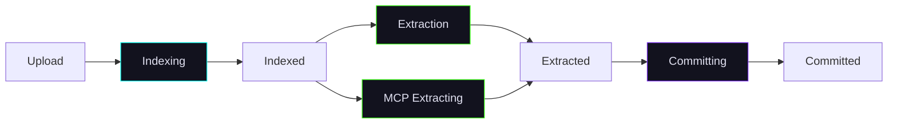

import Tabs from '@theme/Tabs';
import TabItem from '@theme/TabItem';

# Sources

Sources are the foundation of Chaos Cypher. A source is any document — PDF, Word file, web page, image, audio, or video — that you import into the system for indexing, search, and knowledge extraction.

:::note[API port]

The `curl` examples on this page use `http://localhost:8080`, which is the API port for the multi-container development stack. The all-in-one container (the primary install) serves the API on port **80** instead — use `http://localhost/api/v1/...` there.

:::

## Uploading Sources

### Single File Upload

<Tabs>
<TabItem value="web-ui" label="Web UI">


1. Navigate to **Sources** in the sidebar
2. Click **Add Source** to open the Add Source dialog, then drag and drop your file into the drop area or click to browse
3. The file enters the processing pipeline automatically


</TabItem>
<TabItem value="cli" label="CLI">


```bash
chaoscypher source add document.pdf
```

The CLI runs the full pipeline (upload → index → extract → commit) with a progress bar for each stage.

</TabItem>
<TabItem value="python" label="Python">


```python
from chaoscypher_core import ChaosCypher

result = ChaosCypher.add_document_sync("document.pdf")
print(f"Created {len(result.nodes)} nodes, {len(result.edges)} edges")
```

</TabItem>
<TabItem value="api" label="API">


```bash
curl -X POST http://localhost:8080/api/v1/sources \
  -F "file=@document.pdf"
```

</TabItem>
</Tabs>


### Batch Upload

<Tabs>
<TabItem value="web-ui" label="Web UI">


1. Click **Add Source** on the Sources page
2. In the Add Source dialog, select multiple files (up to 20 per batch) or drag and drop them into the drop area


</TabItem>
<TabItem value="cli" label="CLI">


```bash
# Multiple files
chaoscypher source add doc1.pdf doc2.txt notes.md

# Entire directory (all supported files)
chaoscypher source add ./research-papers/
```

</TabItem>
<TabItem value="python" label="Python">


```python
from chaoscypher_core import ChaosCypher

files = ["doc1.pdf", "doc2.pdf", "doc3.txt"]
for f in files:
    result = ChaosCypher.add_document_sync(f)
    print(f"{f}: {len(result.nodes)} nodes")
```

</TabItem>
<TabItem value="api" label="API">


```bash
curl -X POST http://localhost:8080/api/v1/sources/batch \
  -F "files=@doc1.pdf" \
  -F "files=@doc2.pdf" \
  -F "files=@doc3.txt"
```

</TabItem>
</Tabs>


### URL Import

<Tabs>
<TabItem value="web-ui" label="Web UI">


1. Click **Add Source** on the Sources page
2. In the Add Source dialog, paste the URL of a web page into the **URL** field (above the file drop area) and confirm
3. The system fetches the page, extracts clean text content, and processes it like any other source

</TabItem>
<TabItem value="cli" label="CLI">


```bash
chaoscypher source add https://example.com/article
```

</TabItem>
<TabItem value="python" label="Python">


```python
from chaoscypher_core import ChaosCypher

result = ChaosCypher.add_document_sync("https://example.com/article")
print(f"Created {len(result.nodes)} nodes")
```

</TabItem>
<TabItem value="api" label="API">


```bash
curl -X POST http://localhost:8080/api/v1/sources/url \
  -H "Content-Type: application/json" \
  -d '{"url": "https://example.com/article"}'
```

</TabItem>
</Tabs>


The system fetches the page, extracts clean text content, and processes it like any other source. URLs must be HTTP/HTTPS and the extracted content must be at least 50 characters.

### Supported File Types

| Category | Formats |
|----------|---------|
| **Documents** | PDF, DOCX (Word), EPUB |
| **Office** | XLSX (Excel), PPTX (PowerPoint) |
| **Text** | Plain text (.txt), Markdown (.md), Log files (.log) |
| **Web / Markup** | HTML (.html / .htm / .xhtml), reStructuredText (.rst) |
| **Data** | CSV, JSON, JSONL, NDJSON |
| **Images** | JPEG, PNG, GIF, WebP, TIFF, BMP (text extracted via OCR) |
| **Audio** | MP3, WAV, M4A, FLAC, OGG, WMA, AAC (transcribed to text) |
| **Video** | MP4, MKV, AVI, MOV, WebM, WMV, FLV (audio extracted and transcribed) |
| **Archives** | ZIP, TAR.GZ (files extracted and processed individually) |

:::info[File size limit]

The default per-file upload cap is **5 GB** (`batching.max_upload_bytes`). Upload routes are exempted from the per-route 128 MB outer body cap (`batching.max_request_body_mb`) and gated by `max_upload_bytes` only. To raise the cap, set `batching.max_upload_bytes` in `settings.yaml` — nginx's `client_max_body_size` (including on the internal auth-check subrequest) is rendered from this value at container start, so a single source of truth governs both layers.

:::

:::info[Archive handling]

Archives are automatically extracted and the system detects the documentation format — Sphinx HTML, Markdown docs (MkDocs, Docusaurus), OpenAPI specs, or mixed files. Each file is processed according to its detected type.

:::

## Vision Processing

When `enable_vision` is enabled during upload, images embedded in PDFs and standalone image files are processed with the configured vision model. The vision model generates textual descriptions of visual content — diagrams, charts, photographs, and other images — which are included in the document chunks. This improves search and RAG quality by making visual content discoverable through text queries.

Vision processing is optional and requires a vision model to be configured in **Settings** > **Models**. For sources processed with vision enabled, an image gallery is available on the source detail overview page, showing all extracted images alongside their generated descriptions.

The choice you make at upload time is persisted on the source row, so re-extract and recovery honor it without you having to re-pass the flag.

## Upload settings are persistent

Every choice you make on the upload dialog is stored on the source row, not on the in-flight queue payload. That means:

- **Recovery** after a worker restart re-reads your settings instead of resetting everything to defaults.
- **Retry** an errored source preserves your normalization, vision, and content-filtering choices.
- **Re-extract** runs the new extraction with the same settings the source was uploaded with — unless you explicitly override one for the re-extract call.

The persisted fields are:

| Field | What it controls |
|------|------------------|
| `auto_analyze` | Whether the upload flow auto-queues entity extraction after indexing. |
| `enable_normalization` | Run the cleaner pipeline (encoding fixes, OCR cleanup, paragraph dedup). `null` means "use the file-type default." |
| `enable_vision` | Use the vision model on images and scanned PDFs. |
| `content_filtering` | Apply domain content-exclusion rules during extraction. Filtered text stays searchable via RAG. |
| `filtering_mode` | Strictness of post-extraction filters: `unfiltered` / `minimal` / `lenient` / `balanced` / `strict` / `maximum`. See [Filtering Modes](../reference/filtering-modes.md). |

## Processing Pipeline

Every source goes through a multi-stage pipeline. The first stage (indexing) runs automatically. The second stage (extraction) is optional and uses AI.



### Stage 1: Indexing

Runs automatically after upload. The document is chunked into segments and each chunk is embedded as a vector for semantic search.

| What happens | Output |
|-------------|--------|
| Text extraction from source format | Raw text content |
| Content normalization (optional) | Clean, consistent text |
| Chunking into segments | Configurable size (default ~900 chars) |
| Vector embedding generation | One embedding per chunk |

**Time:** ~30 seconds for a 100-page PDF.

After indexing, the source is searchable via RAG — you can chat about it and search it immediately, without waiting for extraction.

### Stage 2: Entity Extraction (Optional)

Uses an LLM to extract entities (people, organizations, concepts, etc.) and relationships from each chunk.

| What happens | Output |
|-------------|--------|
| Chunk groups sent to LLM | Entity + relationship extraction |
| Template matching | Consistent entity types |
| Deduplication | Merged duplicate entities |
| Relationship mapping | Connections between entities |
| Entity embeddings | Vector embeddings for graph entities |

**Time:** ~5 minutes for a 100-page PDF (depends on LLM speed).

**Controls:**

- **Extraction depth** — `full` (comprehensive, default) or `quick` (faster, fewer entities)
- **Domain selection** — Auto-detect or force a specific domain (e.g., technical, medical, legal)
- **Cancel** — Extraction can be cancelled mid-process. Completed chunks are preserved and the source reverts to `indexed` status (RAG still works).

### Stage 3: Committing

Automatically runs after extraction. Imports extracted entities and relationships into the knowledge graph.

| What happens | Output |
|-------------|--------|
| Create graph nodes | One node per entity |
| Create graph edges | One edge per relationship |
| Create templates | Node type templates for the graph |
| Link to source | Document node with provenance |

### Status Flow

Every source exposes a `progress` object with a 4-phase summary designed for the UI:

| Phase | Searchable | Meaning |
|-------|:----------:|---------|
| `waiting_to_index` | No | Pending or failed — nothing useful exists yet |
| `indexing` | No | Chunking and embedding in progress |
| `extracting` | **Yes** | Indexed and searchable; extraction is optional and may be running |
| `ready` | **Yes** | Fully committed to the knowledge graph |

The `is_searchable` flag in `progress` lets the UI immediately determine whether the source can be queried, without parsing individual status strings.

<details>
<summary>Internal status values (for debugging and API consumers)</summary>

| Status | Maps to | Meaning |
|--------|---------|---------|
| `pending` | `waiting_to_index` | Uploaded, waiting to start |
| `indexing` | `indexing` | Chunking and embedding in progress |
| `indexed` | `extracting` | Searchable via RAG, ready for extraction |
| `extracting` | `extracting` | LLM entity extraction in progress |
| `mcp_extracting` | `extracting` | [Model Context Protocol](https://modelcontextprotocol.io/) (MCP)-driven entity extraction in progress |
| `extracted` | `extracting` | Extraction complete, ready to commit |
| `committing` | `extracting` | Importing entities into knowledge graph |
| `committed` | `ready` | Fully processed |
| `error` | `waiting_to_index` | Failed at some stage (check `error_message`) |

</details>

:::tip

A source at `indexed` status is already useful — you can search it and chat about it. Extraction adds the knowledge graph layer on top.

:::

:::info[Technical deep-dive]

For detailed architecture of each pipeline stage, see the [Extraction Pipeline Architecture](../architecture/extraction-pipeline/overview.md).

:::

## See also

- [Architecture: Extraction Pipeline](../architecture/extraction-pipeline/overview.md) — detailed pipeline stages, queue routing, error handling, and content filtering internals
- [API reference: Sources](../reference/api/sources.md) — full endpoint reference for upload, extraction management, chunks, citations, and tags

## Tags

Tags help organize sources into categories. Each tag has a name, optional color, and optional description.

<Tabs>
<TabItem value="web-ui" label="Web UI">


- Create, edit, and delete tags from the Sources page
- Assign tags to sources by clicking the tag icon
- Filter the source list by tag to find related documents
- Tags support inline editing directly in the UI


</TabItem>
<TabItem value="cli" label="CLI">


Tags are managed through the API or Web UI. The CLI supports tag-based scoping in chat:

```bash
# Chat scoped to sources with a specific tag
chaoscypher chat -t "research" "Summarize the findings"
```

</TabItem>
<TabItem value="api" label="API">


```bash
# Create a tag
curl -X POST http://localhost:8080/api/v1/sources/tags \
  -H "Content-Type: application/json" \
  -d '{"name": "research", "color": "#1a73e8"}'

# Assign tag to a source
curl -X POST http://localhost:8080/api/v1/sources/{source_id}/tags/{tag_id}
```

</TabItem>
</Tabs>


Tags are scoped to the current database — each database has its own set of tags.

## Content Filtering

Content filtering removes non-essential content — table of contents, changelogs, legal boilerplate, bibliography sections, and similar noise — before entity extraction. This improves extraction quality by focusing the LLM on meaningful content and reducing token waste.

**Key points:**

- Enabled by default on all uploads (`content_filtering=true`)
- Filtered content is **only removed from extraction** — it remains fully searchable via RAG
- Each [extraction domain](domains.md) defines which content categories to exclude
- 15 built-in categories cover common non-essential patterns (TOC, legal, boilerplate, etc.)
- Domains can also define custom regex patterns for domain-specific filtering

To disable content filtering for a specific upload (e.g., when the "boilerplate" content is actually important):

<Tabs>
<TabItem value="web-ui" label="Web UI">


Uncheck **Content Filtering** in the upload dialog.

</TabItem>
<TabItem value="api" label="API">


```bash
curl -X POST http://localhost:8080/api/v1/sources \
  -F "file=@document.pdf" \
  -F "content_filtering=false"
```

</TabItem>
</Tabs>


:::info[Technical deep-dive]

For details on the filtering pipeline, categories, and custom patterns, see the [Content Filtering](../architecture/extraction-pipeline/overview.md#content-filtering) section in the Extraction Pipeline Architecture.

:::

## Content Normalization

Uploaded content is normalized to fix common issues:

- Encoding fixes (UTF-8 normalization)
- Whitespace normalization (consistent line breaks, trimmed excess)
- OCR artifact cleanup

Normalization defaults off for `.csv`, `.tsv`, `.json`, `.jsonl`, `.ndjson`, `.xml`. You can override per-upload.

To override the default for a specific file:

```bash
# Force normalization on for a CSV
curl -X POST http://localhost:8080/api/v1/sources \
  -F "file=@data.csv" \
  -F "enable_normalization=true"

# Force normalization off for a PDF
curl -X POST http://localhost:8080/api/v1/sources \
  -F "file=@report.pdf" \
  -F "enable_normalization=false"
```

## Duplicate Detection

When uploading with `skip_duplicates=true`, the system computes a SHA-256 hash of the file content and skips files that already exist in the database. This prevents accidentally importing the same document twice.

## Managing Sources

### Enable/Disable

Toggle a source's `enabled` flag to include or exclude it from:

- Knowledge graph visibility
- AI chat context
- Search results

<Tabs>
<TabItem value="web-ui" label="Web UI">


Toggle the enable/disable switch on any source in the Sources list.


</TabItem>
<TabItem value="cli" label="CLI">


Source enable/disable is managed via the API or Web UI.

</TabItem>
<TabItem value="api" label="API">


```bash
curl -X PATCH http://localhost:8080/api/v1/sources/{source_id} \
  -H "Content-Type: application/json" \
  -d '{"enabled": false}'
```

</TabItem>
</Tabs>


Disabling a source doesn't delete it — the data is preserved and can be re-enabled at any time.

### Deletion

Deleting a source permanently removes:

- The source file record
- All document chunks and embeddings
- Associated citations
- Extraction job data

<Tabs>
<TabItem value="web-ui" label="Web UI">


Click the delete button on a source and confirm the deletion.

</TabItem>
<TabItem value="cli" label="CLI">


```bash
# Delete with confirmation prompt
chaoscypher source delete SOURCE_ID

# Skip confirmation
chaoscypher source delete SOURCE_ID --force
```

</TabItem>
<TabItem value="api" label="API">


```bash
curl -X DELETE http://localhost:8080/api/v1/sources/{source_id}
```

</TabItem>
</Tabs>


:::warning

Deletion is permanent and cannot be undone. Graph nodes and edges created from the source remain in the knowledge graph after deletion.

:::

### Abort Processing

If a source is stuck or you need to stop processing:

- **Cancel extraction** — Stops entity extraction, preserves completed chunks, reverts to `indexed`
- **Abort all processing** — Cancels any in-progress stage and marks the source with an error

## Monitoring Extraction

For detailed extraction monitoring, you can view:

- **Task list** — Individual chunk extraction tasks with status, timing, and entity counts
- **Stats** — Aggregate statistics (average tokens, duration, entities per chunk)
- **Charts** — Visual progress data for the extraction pipeline

<Tabs>
<TabItem value="web-ui" label="Web UI">


Open a source's detail view to see extraction progress, task breakdown, and statistics.


</TabItem>
<TabItem value="cli" label="CLI">


```bash
# View source details including extraction status
chaoscypher source get SOURCE_ID
```

</TabItem>
<TabItem value="api" label="API">


```bash
curl http://localhost:8080/api/v1/sources/{source_id}
```

</TabItem>
</Tabs>
